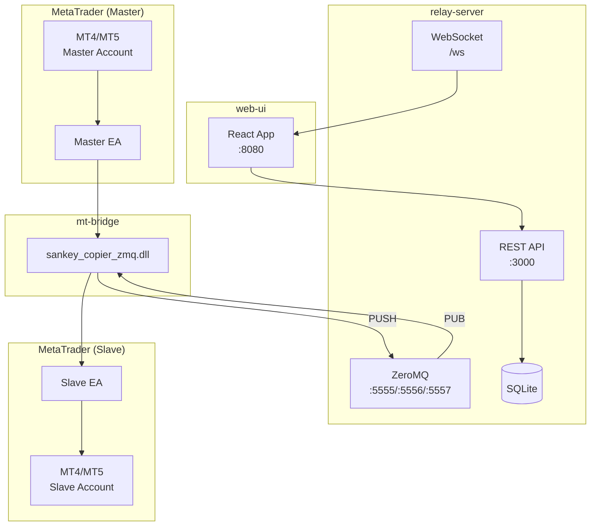
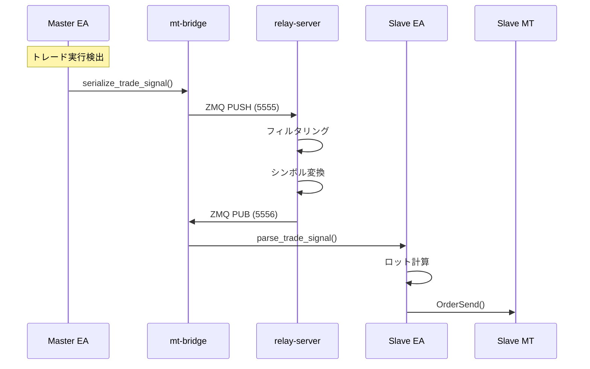
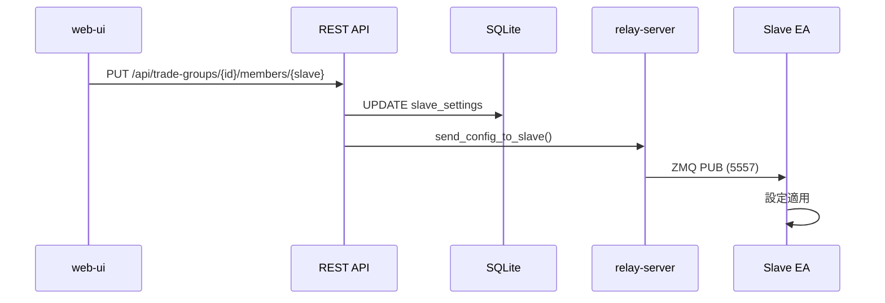
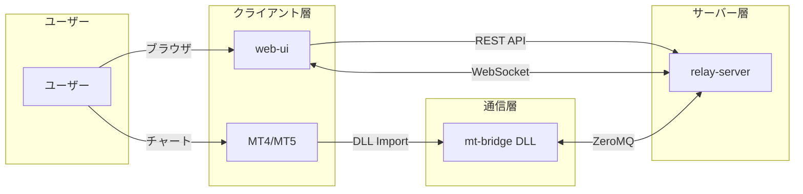
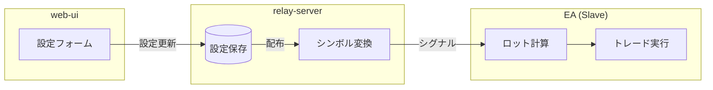

# SANKEY Copier ドキュメント

MT4/MT5間でトレードをコピーするシステムの技術ドキュメント。

## システム概要

SANKEY Copierは、MetaTrader 4/5のアカウント間でトレードをリアルタイムにコピーするシステムです。



## コンポーネント

| コンポーネント | 説明 | 技術 |
|---------------|------|------|
| [relay-server](./relay-server.md) | 中継サーバー | Rust, Axum, ZeroMQ, SQLite |
| [mt-bridge](./mt-bridge.md) | EA-サーバー通信DLL | Rust, ZeroMQ, MessagePack |
| [mt-advisors](./mt-advisors.md) | MT4/MT5用EA | MQL4/MQL5 |
| [web-ui](./web-ui.md) | 設定・監視UI | Next.js, React, TypeScript |

## 通信フロー

### トレードコピーの流れ



### 設定更新の流れ



## コンポーネント関連図



## 設定処理の分担

### relay-serverが処理

- 設定のDB保存・永続化
- 設定のEAへの配布
- シンボル変換（prefix/suffix/mapping）
- ステータス管理

### EA側が処理

- ロット計算 (`lot_multiplier`, `margin_ratio`)
- トレード実行
- リトライ制御
- スリッページ制御
- 売買方向反転



## ステータス

| 値 | 名称 | 説明 |
|----|------|------|
| 0 | DISABLED | ユーザーが無効化 |
| 1 | ENABLED | 有効だがMasterオフライン |
| 2 | CONNECTED | 完全に有効 |
| 4 | REMOVED | 削除済み |

## ポート構成

| ポート | 用途 |
|--------|------|
| 3000 | relay-server REST API (HTTPS) |
| 5555 | ZeroMQ PULL (EA→サーバー) |
| 5556 | ZeroMQ PUB (トレードシグナル) |
| 5557 | ZeroMQ PUB (設定配布) |
| 8080 | web-ui (開発時) |

## 主要な型定義

### TradeSignal

```rust
struct TradeSignal {
    action: TradeAction,      // Open, Close, Modify
    ticket: i64,
    symbol: Option<String>,
    order_type: Option<OrderType>,
    lots: Option<f64>,
    open_price: Option<f64>,
    stop_loss: Option<f64>,
    take_profit: Option<f64>,
    magic_number: Option<i32>,
    source_account: String,
    close_ratio: Option<f64>,  // 部分決済用
}
```

### SlaveSettings

```rust
struct SlaveSettings {
    lot_calculation_mode: LotCalculationMode,
    lot_multiplier: Option<f64>,
    symbol_prefix: Option<String>,
    symbol_suffix: Option<String>,
    symbol_mappings: Vec<SymbolMapping>,
    filters: TradeFilters,
    reverse_trade: bool,
    sync_mode: SyncMode,
    max_slippage: Option<i32>,
    max_retries: i32,
    max_signal_delay_ms: i32,
    config_version: u32,
}
```

## ドキュメント一覧

- [relay-server](./relay-server.md) - 中継サーバーの詳細
- [mt-bridge](./mt-bridge.md) - 通信DLLの詳細
- [mt-advisors](./mt-advisors.md) - EAの詳細
- [web-ui](./web-ui.md) - WebUIの詳細
