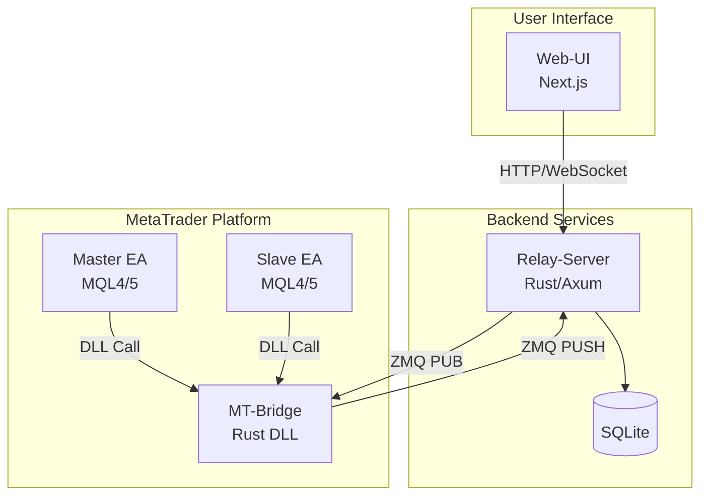
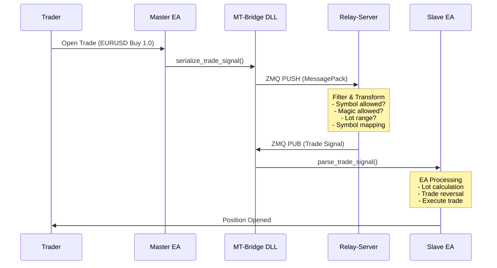
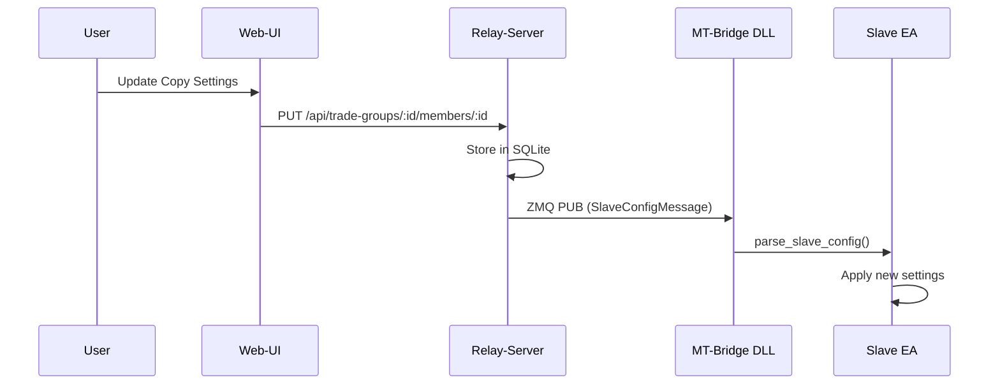
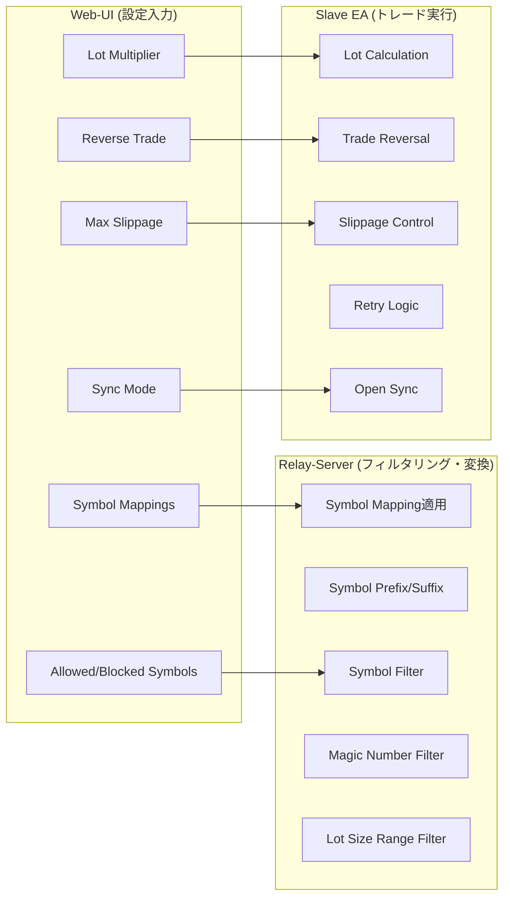

# SANKEY Copier Architecture

MetaTrader間でトレードをリアルタイムにコピーするシステム。Master EAで検出したトレードをSlave EAへ配信し、設定に応じて変換・実行する。

## System Components

```
┌─────────────┐     ┌─────────────┐     ┌─────────────┐
│   Web-UI    │────▶│Relay-Server │◀────│  MT-Bridge  │
│  (Next.js)  │     │   (Rust)    │     │    (DLL)    │
└─────────────┘     └─────────────┘     └─────────────┘
                           ▲                   ▲
                           │                   │
                    ┌──────┴──────┐    ┌───────┴───────┐
                    │   SQLite    │    │  MT-Advisors  │
                    │     DB      │    │   (MQL4/5)    │
                    └─────────────┘    └───────────────┘
```

| Component | Technology | Responsibility |
|-----------|------------|----------------|
| [Web-UI](./web-ui.md) | Next.js 16 / React 19 | 設定UI、接続管理、リアルタイム監視 |
| [Relay-Server](./relay-server.md) | Rust / Axum / ZeroMQ | メッセージルーティング、フィルタリング、シンボル変換 |
| [MT-Bridge](./mt-bridge.md) | Rust DLL | ZeroMQ通信、MessagePackシリアライズ |
| [MT-Advisors](./mt-advisors.md) | MQL4/MQL5 | トレード検出・実行、ロット計算、方向反転 |

## Architecture Overview



## Data Flow

### Trade Signal Flow



### Configuration Flow



## Copy Settings: Processing Location

コピー設定は**Relay-Server**と**Slave EA**で分担して処理される。



### Relay-Server Responsibilities

| Setting | Processing |
|---------|------------|
| `symbol_mappings` | マッピング適用 (EURUSD → GOLD) |
| `symbol_prefix/suffix` | Master側を削除、Slave側を追加 |
| `allowed_symbols` / `blocked_symbols` | シグナルのフィルタリング |
| `allowed_magic_numbers` / `blocked_magic_numbers` | シグナルのフィルタリング |
| `source_lot_min` / `source_lot_max` | シグナルのフィルタリング |
| `copy_pending_orders` | ペンディングオーダーのフィルタリング |

### Slave EA Responsibilities

| Setting | Processing |
|---------|------------|
| `lot_calculation_mode` | ロット計算モード選択 |
| `lot_multiplier` | 固定倍率でロット計算 |
| `reverse_trade` | Buy↔Sell方向反転 |
| `sync_mode` | 既存ポジション同期方法 |
| `limit_order_expiry_min` | リミットオーダーの有効期限 |
| `market_sync_max_pips` | マーケット同期の許容価格差 |
| `max_slippage` | スリッページ許容値 |
| `max_retries` | リトライ回数 |
| `max_signal_delay_ms` | シグナル遅延許容値 |
| `use_pending_order_for_delayed` | 遅延時のペンディングオーダー使用 |

## Communication Protocols

### ZeroMQ Sockets

| Socket Type | Port | Direction | Purpose |
|-------------|------|-----------|---------|
| PULL | 5555 | EA → Server | Heartbeat, Trade Signal, Config Request |
| PUB | 5556 | Server → EA | Trade Signals (by trade_group_id topic) |
| PUB | 5557 | Server → EA | Configuration (by account_id topic) |

### Message Format

すべてのメッセージはMessagePackでシリアライズされる。

```
[Topic][Payload]
  │       │
  │       └─ MessagePack binary data
  └─ account_id or trade_group_id (for PUB/SUB filtering)
```

## Status Values

### Member Status (Slave Connection)

| Value | Name | Description |
|-------|------|-------------|
| 0 | DISABLED | ユーザーが無効化 |
| 1 | ENABLED | 有効だがMasterオフラインまたは取引不可 |
| 2 | CONNECTED | 有効かつMasterオンラインかつ取引可能 |
| 4 | REMOVED | 削除済み |

### Connection Status (EA)

| Value | Description |
|-------|-------------|
| Online | Heartbeat受信中 |
| Offline | 未接続 |
| Timeout | Heartbeatタイムアウト |

## Getting Started

1. **Relay-Server起動**
   ```bash
   cd relay-server
   cargo run --release
   ```

2. **Web-UI起動**
   ```bash
   cd web-ui
   npm install
   npm run dev
   ```

3. **MT4/MT5へのインストール**
   - Web-UIの「Installations」ページでMT検出
   - DLLとEAをインストール

4. **接続設定**
   - Web-UIの「Connections」ページで設定作成
   - Master EA、Slave EAをチャートに適用

## Related Documentation

- [Relay-Server](./relay-server.md) - バックエンドサーバーの詳細
- [MT-Bridge](./mt-bridge.md) - DLLの詳細
- [MT-Advisors](./mt-advisors.md) - EAの詳細
- [Web-UI](./web-ui.md) - フロントエンドの詳細
