# SANKEY Copier ドキュメント

MT4/MT5間でトレードをコピーするシステムの技術ドキュメント。

## システム概要

SANKEY Copierは、MetaTrader 4/5のアカウント間でトレードをリアルタイムにコピーするシステムです。

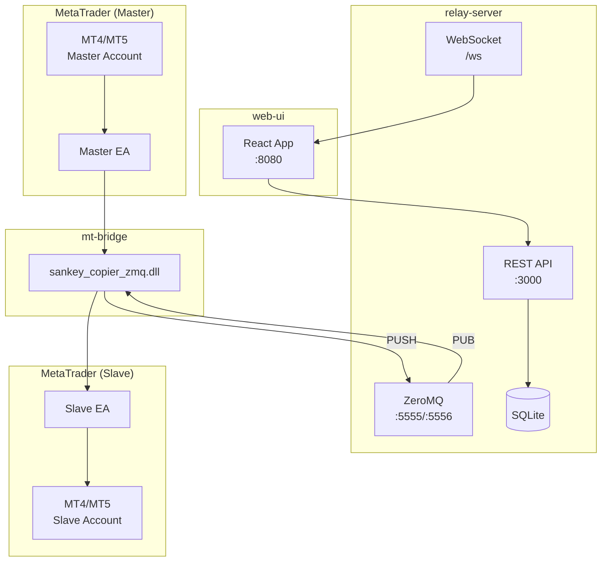

## コンポーネント

| コンポーネント | 説明 | 技術 |
|---------------|------|------|
| [relay-server](./relay-server.md) | 中継サーバー | Rust, Axum, ZeroMQ, SQLite |
| [mt-bridge](./mt-bridge.md) | EA-サーバー通信DLL | Rust, ZeroMQ, MessagePack |
| [mt-advisors](./mt-advisors.md) | MT4/MT5用EA | MQL4/MQL5 |
| [web-ui](./web-ui.md) | 設定・監視UI | Next.js, React, TypeScript |

## 詳細データフロー図（複数Master/Slave構成）

実運用では複数のMasterから複数のSlaveにトレードをコピーする構成が一般的です。

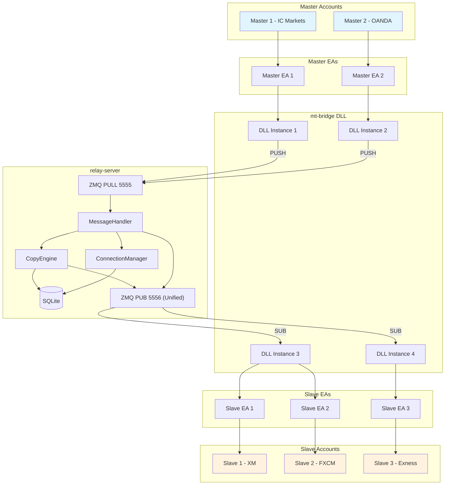

### データフローの説明

| フロー | 説明 |
|--------|------|
| Master → PULL | 各MasterがHeartbeat、TradeSignalをPUSH送信 |
| MessageHandler | メッセージタイプを判定し適切なハンドラーに振り分け |
| CopyEngine | フィルタリング・シンボル変換後、対象Slaveを特定 |
| PUB (Unified) | トピックベースでトレードシグナル(trade_group_id)と設定(account_id)を配信 |

## 通信フロー

### トレードコピーの流れ

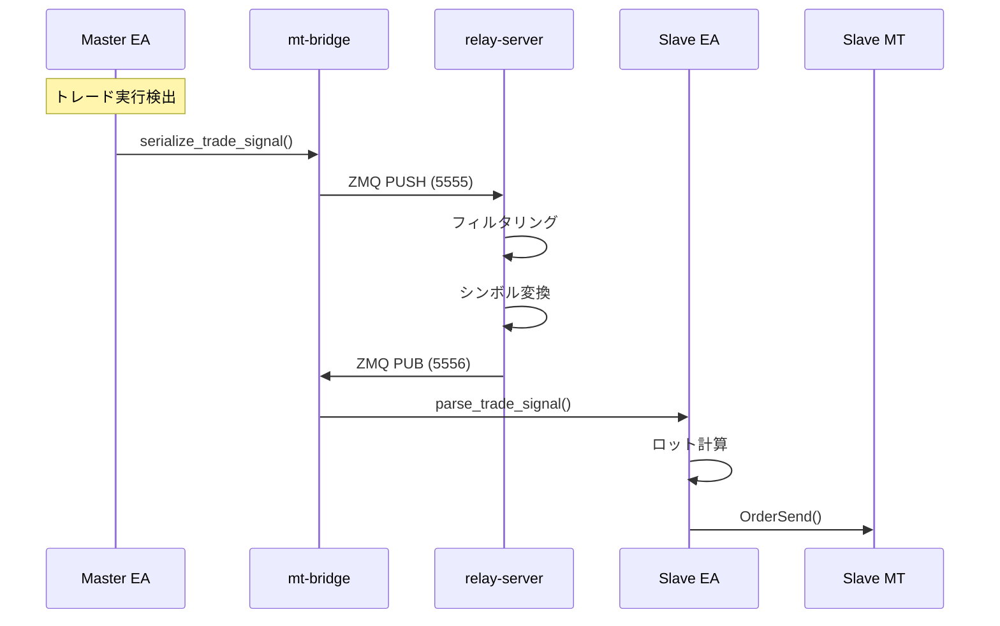

### 設定更新の流れ

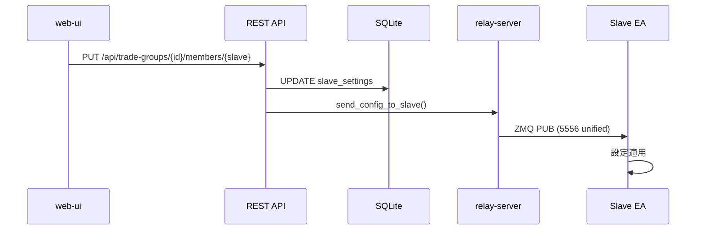

## コンポーネント関連図

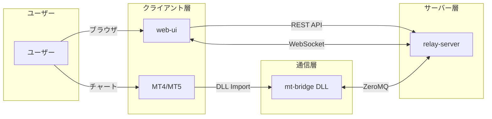

## 内部モジュール構成図

各コンポーネントの内部構造を示します。

### relay-server 内部構成

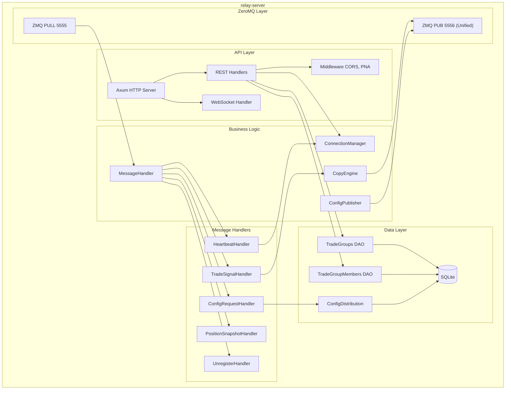

### mt-bridge 内部構成

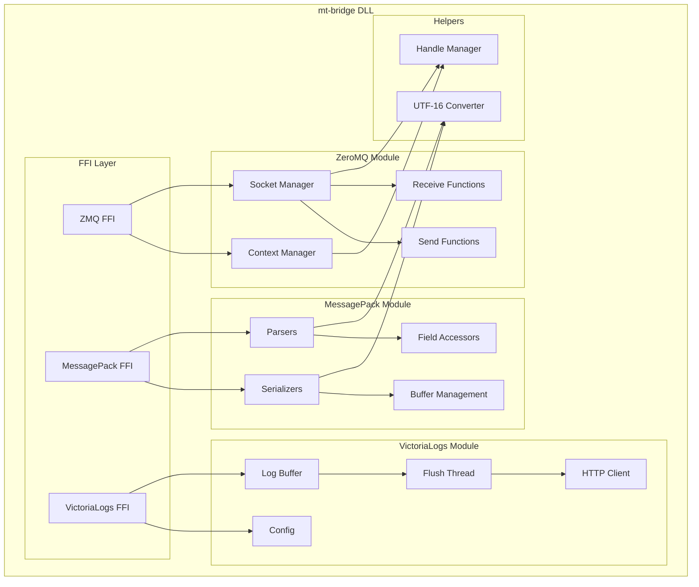

### mt-advisors 内部構成

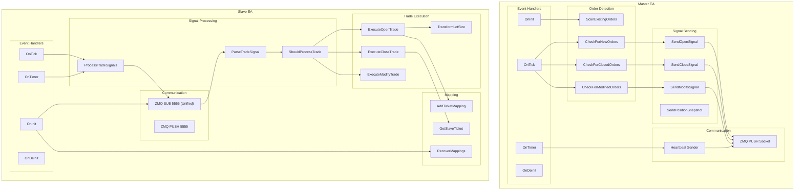

### web-ui 内部構成

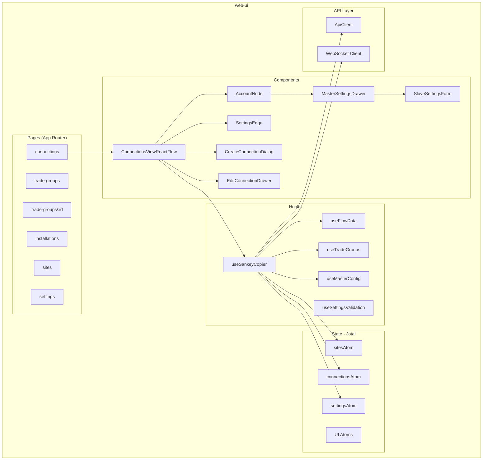

## 設定処理の分担

### relay-serverが処理

- 設定のDB保存・永続化
- 設定のEAへの配布
- シンボル変換（prefix/suffix/mapping）
- ステータス管理

### EA側が処理

- ロット計算 (`lot_multiplier`, `margin_ratio`)
- トレード実行
- リトライ制御
- スリッページ制御
- 売買方向反転

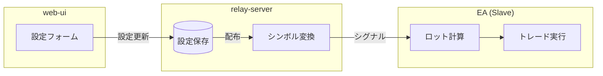

## ステータス

| 値 | 名称 | 説明 |
|----|------|------|
| 0 | DISABLED | ユーザーが無効化 |
| 1 | ENABLED | 有効だがMasterオフライン |
| 2 | CONNECTED | 完全に有効 |
| 4 | REMOVED | 削除済み |

## ポート構成

2ポートアーキテクチャ: Receiver (PULL) と Publisher (統合PUB) のみ使用。

| ポート | 用途 |
|--------|------|
| 3000 | relay-server REST API (HTTPS) |
| 5555 | ZeroMQ PULL (EA→サーバー) |
| 5556 | ZeroMQ PUB (トレードシグナル + 設定配布 統合) |
| 8080 | web-ui (開発時) |

## 主要な型定義

### TradeSignal

```rust
struct TradeSignal {
    action: TradeAction,      // Open, Close, Modify
    ticket: i64,
    symbol: Option<String>,
    order_type: Option<OrderType>,
    lots: Option<f64>,
    open_price: Option<f64>,
    stop_loss: Option<f64>,
    take_profit: Option<f64>,
    magic_number: Option<i32>,
    source_account: String,
    close_ratio: Option<f64>,  // 部分決済用
}
```

### SlaveSettings

```rust
struct SlaveSettings {
    lot_calculation_mode: LotCalculationMode,
    lot_multiplier: Option<f64>,
    symbol_prefix: Option<String>,
    symbol_suffix: Option<String>,
    symbol_mappings: Vec<SymbolMapping>,
    filters: TradeFilters,
    reverse_trade: bool,
    sync_mode: SyncMode,
    max_slippage: Option<i32>,
    max_retries: i32,
    max_signal_delay_ms: i32,
    config_version: u32,
}
```

## デプロイメント図

### 実行環境構成

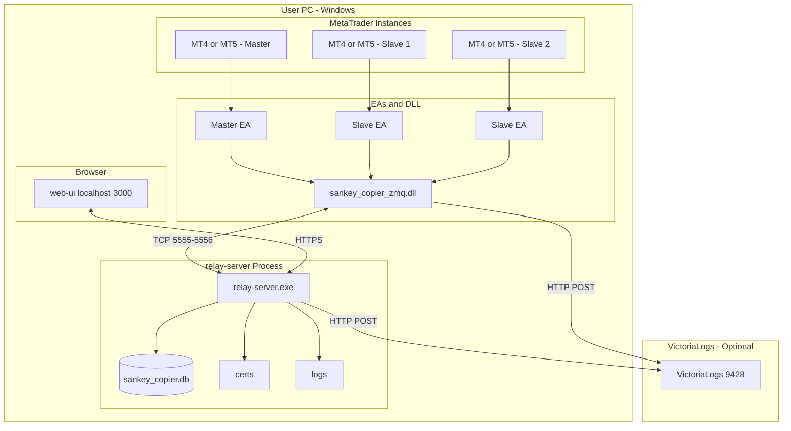

### ポート構成詳細

2ポートアーキテクチャ: トレードシグナルと設定配布を統合PUBポートで配信。

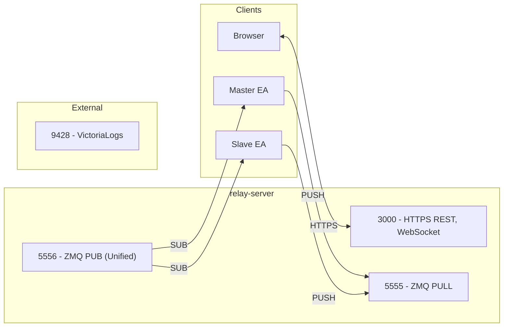

### ファイル配置

```
C:\Users\{User}\
├── AppData\Roaming\MetaQuotes\Terminal\{ID}\
│   └── MQL5\
│       ├── Experts\
│       │   ├── SankeyCopierMaster.ex5
│       │   └── SankeyCopierSlave.ex5
│       ├── Libraries\
│       │   └── sankey_copier_zmq.dll
│       └── Include\
│           └── SankeyCopier\
│               ├── Common.mqh
│               ├── Zmq.mqh
│               └── ...
│
└── SANKEY-Copier\  (または任意のディレクトリ)
    ├── relay-server.exe
    ├── config.toml
    ├── sankey_copier.db
    ├── certs\
    │   ├── server.pem
    │   └── server-key.pem
    └── logs\
        └── sankey-copier-server.YYYY-MM-DD.log
```

### 通信プロトコル

| 通信路 | プロトコル | 暗号化 | 用途 |
|--------|-----------|--------|------|
| Browser ↔ relay-server | HTTPS (REST/WS) | TLS 1.3 | 設定管理・監視 |
| EA ↔ relay-server | ZeroMQ/TCP | なし (localhost) | トレードシグナル |
| relay-server → VictoriaLogs | HTTP POST | なし/TLS | ログ送信 |

### プロセス起動順序

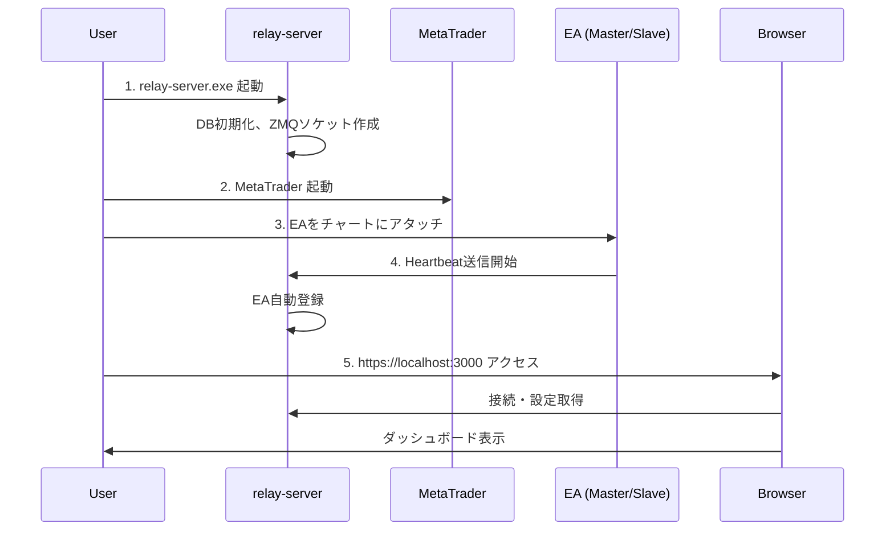

## ドキュメント一覧

- [relay-server](./relay-server.md) - 中継サーバーの詳細
- [mt-bridge](./mt-bridge.md) - 通信DLLの詳細
- [mt-advisors](./mt-advisors.md) - EAの詳細
- [web-ui](./web-ui.md) - WebUIの詳細
