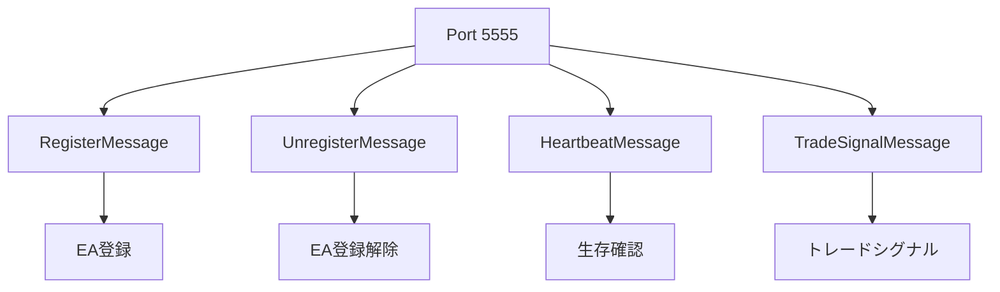
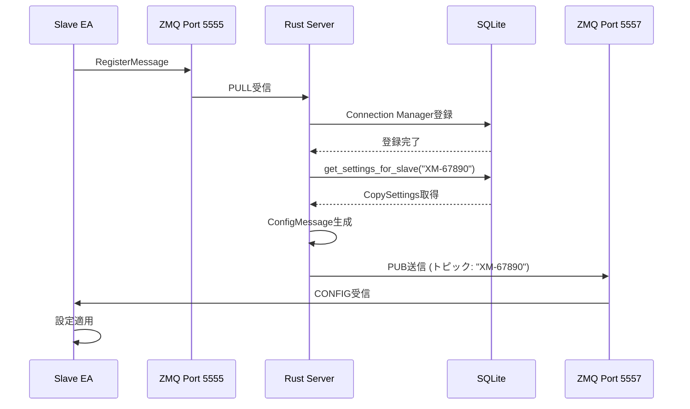
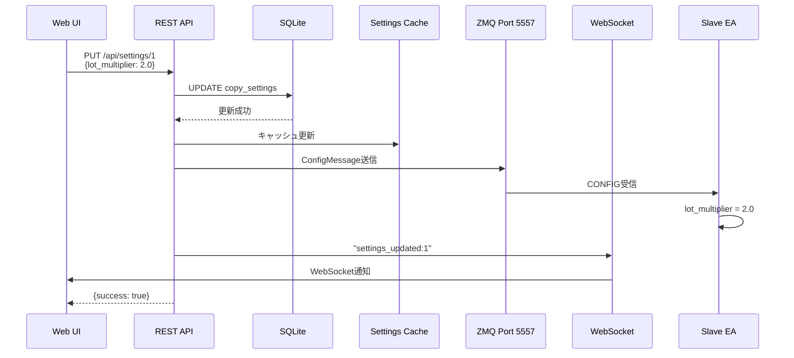
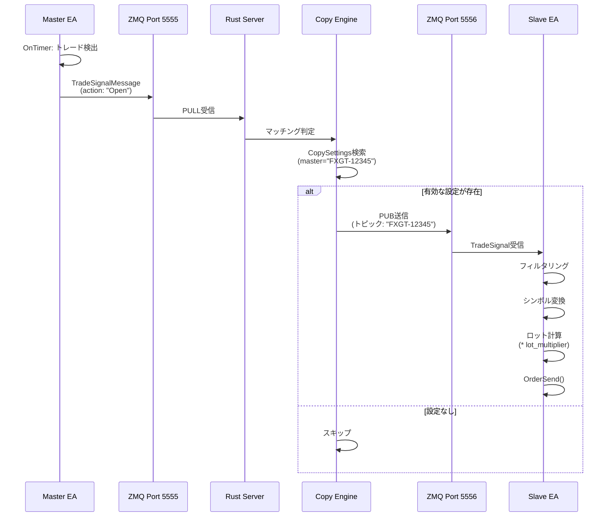

# SANKEY Copier API仕様書

## 目次

1. [概要](#概要)
2. [REST API](#rest-api)
3. [WebSocket API](#websocket-api)
4. [ZeroMQ メッセージング API](#zeromq-メッセージング-api)
5. [MessagePack フォーマット](#messagepack-フォーマット)
6. [APIシーケンス](#apiシーケンス)
7. [エラーハンドリング](#エラーハンドリング)

---

## 概要

SANKEY Copierは、3種類のAPIを提供します：

| API種別 | プロトコル | 用途 | ポート |
|---------|----------|------|--------|
| **REST API** | HTTP/HTTPS | 設定管理、接続情報取得 | 8080 |
| **WebSocket API** | WebSocket | リアルタイム更新通知 | 8080 |
| **ZeroMQ API** | ZeroMQ (TCP) | EA ↔ Server 通信 | 5555/5556/5557 |

### ベースURL

```
REST API:     http://localhost:8080/api
WebSocket:    ws://localhost:8080/ws
ZeroMQ:       tcp://localhost:5555 (PULL)
              tcp://localhost:5556 (PUB - トレード)
              tcp://localhost:5557 (PUB - 設定)
```

---

## REST API

### 共通仕様

#### レスポンス形式

すべてのレスポンスは以下の共通フォーマットを使用します：

```typescript
interface ApiResponse<T> {
  success: boolean;      // 処理成功フラグ
  data?: T;              // 成功時のデータ
  error?: string;        // エラー時のメッセージ
}
```

#### ヘッダー

```http
Content-Type: application/json
Accept: application/json
```

#### CORS

すべてのオリジンを許可（開発環境用）：

```
Access-Control-Allow-Origin: *
Access-Control-Allow-Methods: GET, POST, PUT, DELETE
Access-Control-Allow-Headers: *
```

---

### エンドポイント一覧

```mermaid
graph LR
    A[/api] --> B[/settings]
    A --> C[/connections]
    A --> D[/logs]

    B --> E[GET: 一覧取得]
    B --> F[POST: 新規作成]
    B --> G[/:id]

    G --> H[GET: 詳細取得]
    G --> I[PUT: 更新]
    G --> J[DELETE: 削除]
    G --> K[/toggle]

    K --> L[POST: 有効/無効切替]

    C --> M[GET: 一覧取得]
    C --> N[/:id]
    N --> O[GET: 詳細取得]

    D --> P[GET: ログ取得]
```

---

### 設定管理 API

#### 1. 設定一覧取得

```http
GET /api/settings
```

**レスポンス** (`200 OK`):

```json
{
  "success": true,
  "data": [
    {
      "id": 1,
      "enabled": true,
      "master_account": "FXGT-12345",
      "slave_account": "XM-67890",
      "lot_multiplier": 1.5,
      "reverse_trade": false,
      "symbol_mappings": [
        {
          "source_symbol": "EURUSD",
          "target_symbol": "EURUSD.raw"
        }
      ],
      "filters": {
        "allowed_symbols": ["EURUSD", "GBPUSD"],
        "blocked_symbols": null,
        "allowed_magic_numbers": [0, 123],
        "blocked_magic_numbers": null
      }
    }
  ]
}
```

---

#### 2. 設定詳細取得

```http
GET /api/settings/:id
```

**パラメータ**:

| 名前 | 型 | 必須 | 説明 |
|------|------|------|------|
| `id` | integer | ✅ | 設定ID |

**レスポンス** (`200 OK`):

```json
{
  "success": true,
  "data": {
    "id": 1,
    "enabled": true,
    "master_account": "FXGT-12345",
    "slave_account": "XM-67890",
    "lot_multiplier": 1.5,
    "reverse_trade": false,
    "symbol_mappings": [],
    "filters": {
      "allowed_symbols": null,
      "blocked_symbols": null,
      "allowed_magic_numbers": null,
      "blocked_magic_numbers": null
    }
  }
}
```

**エラーレスポンス** (`200 OK` - エラー情報を含む):

```json
{
  "success": false,
  "error": "Settings not found"
}
```

---

#### 3. 設定新規作成

```http
POST /api/settings
```

**リクエストボディ**:

```json
{
  "master_account": "FXGT-12345",
  "slave_account": "XM-67890",
  "lot_multiplier": 1.5,
  "reverse_trade": false
}
```

**レスポンス** (`200 OK`):

```json
{
  "success": true,
  "data": 1  // 新規作成された設定のID
}
```

**副作用**:

1. データベースに設定を保存
2. 設定キャッシュを更新
3. Slave EAに `ConfigMessage` を送信 (ZeroMQ Port 5557)
4. WebSocket経由で `settings_updated:1` を通知

**エラーレスポンス** (UNIQUE制約違反):

```json
{
  "success": false,
  "error": "この組み合わせの接続設定は既に存在します。同じマスターとスレーブのペアは1つのみ登録できます。"
}
```

---

#### 4. 設定更新

```http
PUT /api/settings/:id
```

**パラメータ**:

| 名前 | 型 | 必須 | 説明 |
|------|------|------|------|
| `id` | integer | ✅ | 設定ID |

**リクエストボディ**:

```json
{
  "id": 1,
  "enabled": true,
  "master_account": "FXGT-12345",
  "slave_account": "XM-67890",
  "lot_multiplier": 2.0,
  "reverse_trade": true,
  "symbol_mappings": [
    {
      "source_symbol": "EURUSD",
      "target_symbol": "EURUSD.fx"
    }
  ],
  "filters": {
    "allowed_symbols": ["EURUSD"],
    "blocked_symbols": null,
    "allowed_magic_numbers": null,
    "blocked_magic_numbers": null
  }
}
```

**レスポンス** (`200 OK`):

```json
{
  "success": true,
  "data": null
}
```

**副作用**:

1. データベース更新
2. 設定キャッシュ更新
3. Slave EAに `ConfigMessage` 送信
4. WebSocket通知 `settings_updated:1`

---

#### 5. 設定有効/無効切替

```http
POST /api/settings/:id/toggle
```

**リクエストボディ**:

```json
{
  "enabled": true
}
```

**レスポンス** (`200 OK`):

```json
{
  "success": true,
  "data": null
}
```

**副作用**:

1. データベース更新
2. 設定キャッシュ更新
3. WebSocket通知 `settings_toggled:1:true`

---

#### 6. 設定削除

```http
DELETE /api/settings/:id
```

**レスポンス** (`200 OK`):

```json
{
  "success": true,
  "data": null
}
```

**副作用**:

1. データベースから削除（CASCADE）
2. 設定キャッシュ更新
3. WebSocket通知 `settings_deleted:1`

---

### 接続管理 API

#### 7. EA接続一覧取得

```http
GET /api/connections
```

**レスポンス** (`200 OK`):

```json
{
  "success": true,
  "data": [
    {
      "account_id": "FXGT-12345",
      "ea_type": "Master",
      "platform": "MT5",
      "account_number": 12345,
      "broker": "FXGT",
      "account_name": "Demo Account",
      "server": "FXGT-Server",
      "balance": 10000.50,
      "equity": 10050.25,
      "currency": "USD",
      "leverage": 500,
      "last_heartbeat": "2025-11-10T10:30:45.123Z",
      "status": "Online",
      "connected_at": "2025-11-10T10:00:00.000Z"
    }
  ]
}
```

---

#### 8. EA接続詳細取得

```http
GET /api/connections/:id
```

**パラメータ**:

| 名前 | 型 | 必須 | 説明 |
|------|------|------|------|
| `id` | string | ✅ | アカウントID (例: `FXGT-12345`) |

**レスポンス** (`200 OK`):

```json
{
  "success": true,
  "data": {
    "account_id": "FXGT-12345",
    "ea_type": "Master",
    "platform": "MT5",
    // ... 同上
  }
}
```

---

### ログ取得 API

#### 9. サーバーログ取得

```http
GET /api/logs
```

**レスポンス** (`200 OK`):

```json
{
  "success": true,
  "data": [
    {
      "timestamp": "2025-11-10T10:30:00.000Z",
      "level": "INFO",
      "message": "EA registered: FXGT-12345",
      "target": "sankey_copier_server::message_handler"
    }
  ]
}
```

---

## WebSocket API

### 接続

```
ws://localhost:8080/ws
```

### イベント

サーバーからクライアントへの一方向通信（テキストメッセージ）。

#### イベント形式

```
<event_type>:<param1>:<param2>...
```

#### イベント一覧

| イベント | フォーマット | 説明 |
|----------|--------------|------|
| **設定更新** | `settings_updated:<id>` | 設定が作成または更新された |
| **設定切替** | `settings_toggled:<id>:<enabled>` | 設定の有効/無効が切り替えられた |
| **設定削除** | `settings_deleted:<id>` | 設定が削除された |

#### 使用例 (JavaScript)

```javascript
const ws = new WebSocket('ws://localhost:8080/ws');

ws.onmessage = (event) => {
  const message = event.data;
  console.log('Received:', message);

  if (message.startsWith('settings_updated:')) {
    const id = message.split(':')[1];
    // 設定を再読み込み
    fetchSettings();
  } else if (message.startsWith('settings_toggled:')) {
    const [_, id, enabled] = message.split(':');
    // UI更新
    updateSettingStatus(id, enabled === 'true');
  } else if (message.startsWith('settings_deleted:')) {
    const id = message.split(':')[1];
    // UI から削除
    removeSettingFromUI(id);
  }
};

ws.onerror = (error) => {
  console.error('WebSocket error:', error);
};

ws.onclose = () => {
  console.log('WebSocket closed, reconnecting...');
  setTimeout(() => connectWebSocket(), 3000);
};
```

---

## ZeroMQ メッセージング API

### ポート構成

| ポート | パターン | 方向 | バインド先 |
|--------|----------|------|-----------|
| **5555** | PULL | EA → Server | `tcp://*:5555` |
| **5556** | PUB | Server → Slave EA | `tcp://*:5556` |
| **5557** | PUB | Server → Slave EA | `tcp://*:5557` |

---

### Port 5555: 制御チャンネル (EA → Server)

EAがサーバーに送信するメッセージ。すべて **MessagePack** 形式。

#### メッセージ種別



---

#### 1. RegisterMessage

EA起動時に送信する登録メッセージ。

**MessagePack構造**:

```json
{
  "message_type": "Register",
  "account_id": "FXGT-12345",
  "ea_type": "Master",
  "platform": "MT5",
  "account_number": 12345,
  "broker": "FXGT",
  "account_name": "Demo Account",
  "server": "FXGT-Server",
  "balance": 10000.50,
  "equity": 10050.25,
  "currency": "USD",
  "leverage": 500,
  "timestamp": "2025-11-10T10:00:00.000Z"
}
```

**フィールド**:

| フィールド | 型 | 必須 | 説明 |
|-----------|------|------|------|
| `message_type` | string | ✅ | `"Register"` 固定 |
| `account_id` | string | ✅ | アカウントID（自動生成: `ブローカー名-口座番号`） |
| `ea_type` | string | ✅ | `"Master"` または `"Slave"` |
| `platform` | string | ✅ | `"MT4"` または `"MT5"` |
| `account_number` | i64 | ✅ | MT口座番号 |
| `broker` | string | ✅ | ブローカー名 |
| `account_name` | string | ✅ | 口座名 |
| `server` | string | ✅ | サーバー名 |
| `balance` | f64 | ✅ | 残高 |
| `equity` | f64 | ✅ | 有効証拠金 |
| `currency` | string | ✅ | 通貨 (例: `"USD"`) |
| `leverage` | i64 | ✅ | レバレッジ |
| `timestamp` | string | ✅ | ISO 8601形式のタイムスタンプ |

**サーバー側処理**:

1. Connection Managerに登録
2. Slave EAの場合、設定を検索してConfigMessage送信
3. WebSocket通知

---

#### 2. UnregisterMessage

EA終了時に送信する登録解除メッセージ。

**MessagePack構造**:

```json
{
  "message_type": "Unregister",
  "account_id": "FXGT-12345",
  "timestamp": "2025-11-10T10:30:00.000Z"
}
```

**サーバー側処理**:

1. Connection Managerから削除
2. WebSocket通知

---

#### 3. HeartbeatMessage

定期的（30秒ごと）に送信する生存確認メッセージ。

**MessagePack構造**:

```json
{
  "message_type": "Heartbeat",
  "account_id": "FXGT-12345",
  "balance": 10050.75,
  "equity": 10100.25,
  "open_positions": 3,
  "timestamp": "2025-11-10T10:30:00.000Z",
  "version_git": "a748f63"
}
```

**フィールド**:

| フィールド | 型 | 必須 | 説明 |
|-----------|------|------|------|
| `version_git` | string | ✅ | EAビルド時のGitコミットハッシュ |
| `open_positions` | i32 | ✅ | 現在のオープンポジション数 |

**サーバー側処理**:

1. `last_heartbeat` を現在時刻に更新
2. `balance`, `equity` を更新

**タイムアウト**:

- デフォルト: 30秒
- タイムアウト時、`status` を `Timeout` に変更

---

#### 4. TradeSignalMessage

トレード発生時に送信するシグナルメッセージ（Masterのみ）。

**MessagePack構造** (Open):

```json
{
  "action": "Open",
  "ticket": 123456,
  "symbol": "EURUSD",
  "order_type": "Buy",
  "lots": 0.1,
  "open_price": 1.0850,
  "stop_loss": 1.0800,
  "take_profit": 1.0900,
  "magic_number": 0,
  "comment": "Test trade",
  "timestamp": "2025-11-10T10:30:00.000Z",
  "source_account": "FXGT-12345"
}
```

**MessagePack構造** (Close):

```json
{
  "action": "Close",
  "ticket": 123456,
  "symbol": null,
  "order_type": null,
  "lots": null,
  "open_price": null,
  "stop_loss": null,
  "take_profit": null,
  "magic_number": null,
  "comment": null,
  "timestamp": "2025-11-10T10:30:00.000Z",
  "source_account": "FXGT-12345"
}
```

**フィールド**:

| フィールド | 型 | 必須 | 説明 |
|-----------|------|------|------|
| `action` | string | ✅ | `"Open"`, `"Close"`, `"Modify"` |
| `ticket` | i64 | ✅ | チケット番号 |
| `symbol` | string | - | シンボル名 (Open/Modifyのみ) |
| `order_type` | string | - | 注文タイプ (Open/Modifyのみ) |
| `lots` | f64 | - | ロット数 (Open/Modifyのみ) |
| `open_price` | f64 | - | 約定価格 (Open/Modifyのみ) |
| `stop_loss` | f64 | - | ストップロス (Openのみ、0可) |
| `take_profit` | f64 | - | テイクプロフィット (Openのみ、0可) |
| `magic_number` | i64 | - | マジックナンバー (Openのみ) |
| `comment` | string | - | コメント (Openのみ) |
| `timestamp` | string | ✅ | ISO 8601形式 |
| `source_account` | string | ✅ | 送信元アカウントID |

**サーバー側処理**:

1. Copy Engineで設定マッチング
2. Port 5556 でSlave EAに配信 (PUB)

---

### Port 5556: トレード配信チャンネル (Server → Slave EA)

サーバーがSlave EAにトレードシグナルを配信。

**パターン**: PUB/SUB
**トピック**: `master_account` (例: `"FXGT-12345"`)

**メッセージフォーマット**:

```
[トピック] + [スペース] + [MessagePack(TradeSignalMessage)]
```

**例**:

```
"FXGT-12345 " + <MessagePack binary data>
```

**Slave EA側の処理**:

```mql5
// トピック購読
zmq_socket_subscribe(tradeSocket, master_account);

// メッセージ受信
int recv_len = zmq_socket_receive(tradeSocket, buffer, BUFFER_SIZE);
if (recv_len > 0) {
    // トピック部分をスキップ
    int payload_start = FindSpaceIndex(buffer) + 1;

    // MessagePack解析
    handle = parse_trade_signal(buffer + payload_start, recv_len - payload_start);

    // フィールド取得
    string action = trade_signal_get_string(handle, "action");
    long ticket = trade_signal_get_int(handle, "ticket");
    string symbol = trade_signal_get_string(handle, "symbol");

    // フィルタリング・実行
    if (ShouldExecuteTrade(symbol, magic_number)) {
        ExecuteTrade(action, symbol, lots, ...);
    }

    trade_signal_free(handle);
}
```

---

### Port 5557: 設定配信チャンネル (Server → Slave EA)

サーバーがSlave EAに設定を配信。

**パターン**: PUB/SUB
**トピック**: `slave_account` (例: `"XM-67890"`)

**メッセージフォーマット**:

```
[トピック] + [スペース] + [MessagePack(ConfigMessage)]
```

**ConfigMessage構造**:

```json
{
  "account_id": "XM-67890",
  "master_account": "FXGT-12345",
  "trade_group_id": "FXGT-12345",
  "timestamp": "2025-11-10T10:30:00.000Z",
  "enabled": true,
  "lot_multiplier": 1.5,
  "reverse_trade": false,
  "symbol_mappings": [
    {
      "source_symbol": "EURUSD",
      "target_symbol": "EURUSD.fx"
    }
  ],
  "filters": {
    "allowed_symbols": ["EURUSD", "GBPUSD"],
    "blocked_symbols": null,
    "allowed_magic_numbers": [0, 123],
    "blocked_magic_numbers": null
  },
  "config_version": 1
}
```

**フィールド**:

| フィールド | 型 | 必須 | 説明 |
|-----------|------|------|------|
| `account_id` | string | ✅ | Slave EA のアカウントID |
| `master_account` | string | ✅ | コピー元マスターアカウントID |
| `trade_group_id` | string | ✅ | トレードグループID（= master_account） |
| `timestamp` | string | ✅ | 設定生成時刻 (ISO 8601) |
| `enabled` | bool | ✅ | コピー有効フラグ |
| `lot_multiplier` | f64 | - | ロット倍率 (nullの場合1.0) |
| `reverse_trade` | bool | ✅ | リバーストレード |
| `symbol_mappings` | array | ✅ | シンボルマッピング配列 |
| `filters` | object | ✅ | フィルター設定 |
| `config_version` | u32 | ✅ | 設定バージョン |

**Slave EA側の処理**:

```mql5
// トピック購読
zmq_socket_subscribe(configSocket, slave_account);

// メッセージ受信
int recv_len = zmq_socket_receive(configSocket, buffer, BUFFER_SIZE);
if (recv_len > 0) {
    int payload_start = FindSpaceIndex(buffer) + 1;

    // MessagePack解析
    handle = parse_message(buffer + payload_start, recv_len - payload_start);

    // 設定取得
    string master = config_get_string(handle, "master_account");
    double lot_mult = config_get_double(handle, "lot_multiplier");
    bool enabled = config_get_bool(handle, "enabled");
    bool reverse = config_get_bool(handle, "reverse_trade");

    // 設定適用
    current_config.master_account = master;
    current_config.lot_multiplier = lot_mult;
    current_config.enabled = enabled;
    current_config.reverse_trade = reverse;

    Print("CONFIG received: enabled=", enabled, ", lot_mult=", lot_mult);

    config_free(handle);
}
```

---

## MessagePack フォーマット

### 特徴

- **バイナリ形式**: JSONより30-50%小さい
- **高速**: シリアライゼーション/デシリアライゼーションが高速
- **型安全**: 厳密な型情報を保持
- **スキーマレス**: 動的な構造に対応

### サイズ比較

| メッセージ種別 | JSON | MessagePack | 削減率 |
|---------------|------|-------------|--------|
| RegisterMessage | ~400 bytes | ~280 bytes | 30% |
| HeartbeatMessage | ~200 bytes | ~140 bytes | 30% |
| TradeSignal (Open) | ~350 bytes | ~245 bytes | 30% |
| TradeSignal (Close) | ~150 bytes | ~70 bytes | 53% |
| ConfigMessage (フル) | ~1200 bytes | ~840 bytes | 30% |

### 使用ライブラリ

- **Rust**: `rmp-serde` 1.3
- **MQL (via DLL)**: カスタムRust実装

---

## APIシーケンス

### 1. EA登録とConfig配信



### 2. 設定変更とリアルタイム反映



### 3. トレードコピー



---

## エラーハンドリング

### HTTPステータスコード

| コード | 意味 | 使用場面 |
|--------|------|----------|
| `200 OK` | 成功 | すべてのレスポンス（エラー情報も含む） |

**注意**: このAPIは、エラー時も `200 OK` を返し、レスポンスボディの `success` フィールドで成功/失敗を判定します。

### エラーメッセージ一覧

| エラー | メッセージ | 原因 |
|--------|----------|------|
| **設定未検出** | `"Settings not found"` | 指定IDの設定が存在しない |
| **UNIQUE制約違反** | `"この組み合わせの接続設定は既に存在します..."` | 同じmaster/slaveペアが既に登録済み |
| **接続未検出** | `"Connection not found: <account_id>"` | 指定アカウントIDのEA接続が存在しない |
| **データベースエラー** | `<SQLエラーメッセージ>` | SQLite操作失敗 |

### ZeroMQエラー

ZeroMQ通信エラーは、サーバーログに記録されます：

```
[ERROR] Failed to send ZMQ message: <error>
[ERROR] Failed to deserialize TradeSignal: <error>
[ERROR] Failed to send config message to XM-67890: <error>
```

**対処法**:

1. EA側でZeroMQソケットが正しく接続されているか確認
2. ファイアウォール設定を確認
3. サーバーログを確認してエラー詳細を特定

### MessagePackデシリアライゼーションエラー

不正なMessagePackデータを受信した場合：

```
[ERROR] Failed to deserialize message discriminator: <error>
[DEBUG] Raw message bytes (first 100): [...]
```

**対処法**:

1. EA側のMessagePackシリアライゼーションコードを確認
2. DLLバージョンが一致しているか確認
3. 送信データのバイト列をログで確認

---

## まとめ

SANKEY Copier APIは、3種類の通信プロトコルを組み合わせて、高速・低遅延・リアルタイムのトレードコピーシステムを実現しています。

**設計の特徴**:

1. ✅ **REST API**: 設定管理の標準的なCRUD操作
2. ✅ **WebSocket**: リアルタイム更新通知
3. ✅ **ZeroMQ**: 低遅延EA通信
4. ✅ **MessagePack**: 効率的なバイナリシリアライゼーション
5. ✅ **トピックベースPUB/SUB**: 効率的なルーティング

この設計により、WebUIからの設定変更が即座にEAに反映され、トレードシグナルが最小限の遅延で配信されます。
