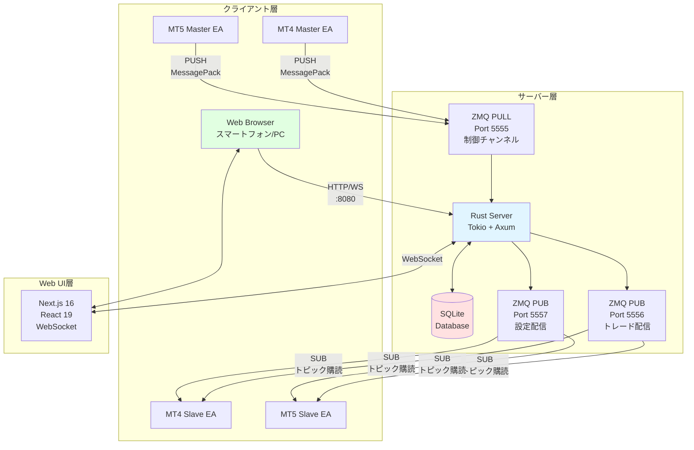
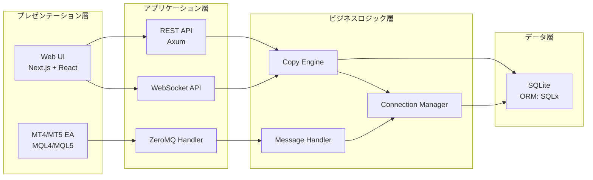
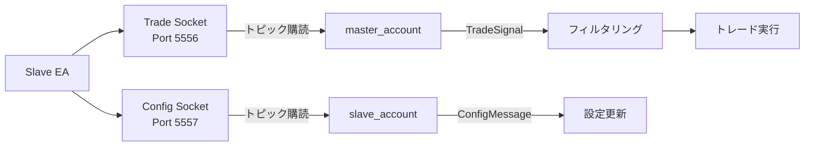
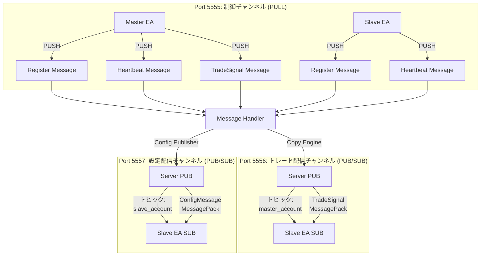
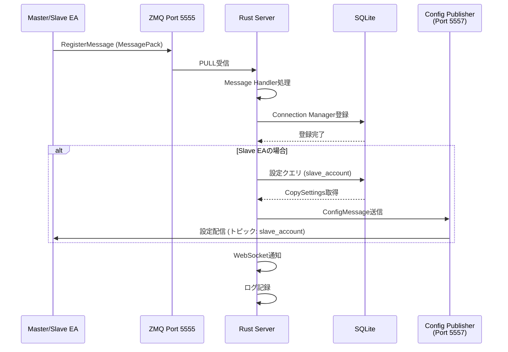
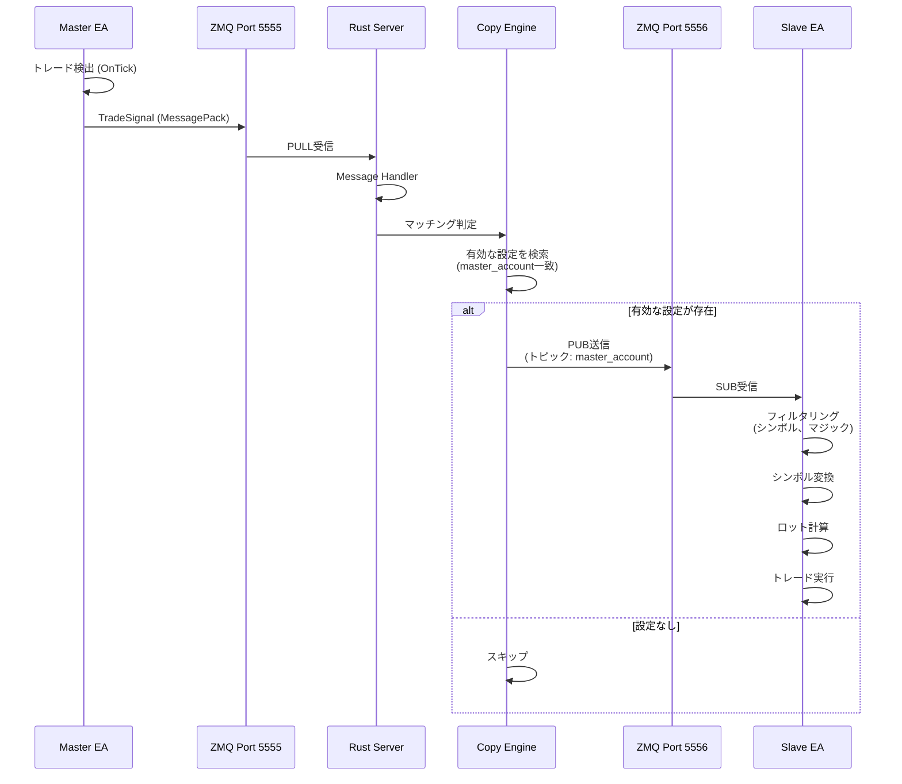
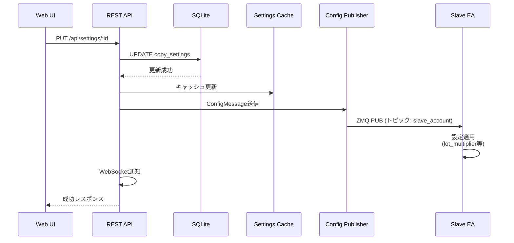
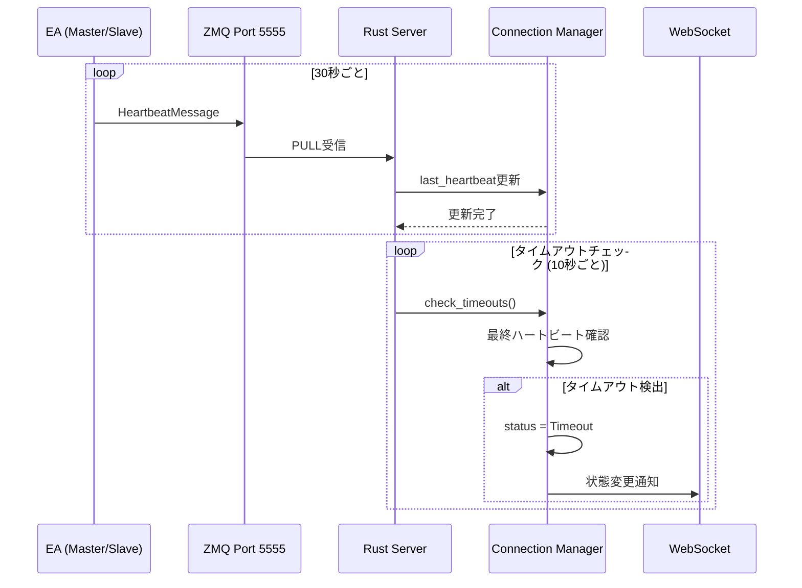

# SANKEY Copier システムアーキテクチャ仕様書

## 目次

1. [システム概要](#システム概要)
2. [設計思想](#設計思想)
3. [システム構成](#システム構成)
4. [コンポーネント詳細](#コンポーネント詳細)
5. [通信アーキテクチャ](#通信アーキテクチャ)
6. [データフロー](#データフロー)
7. [技術スタック](#技術スタック)
8. [アーキテクチャの特徴](#アーキテクチャの特徴)

---

## システム概要

SANKEY Copierは、MT4/MT5プラットフォーム間でトレードを高速・低遅延でコピーするシステムです。ローカルネットワークでの運用を想定し、ZeroMQ通信による最小限の遅延を実現しています。

### 主な機能

- **双方向対応**: MT4↔MT5、MT4↔MT4、MT5↔MT5のすべての組み合わせに対応
- **低遅延通信**: ZeroMQによるローカル通信（サブミリ秒レベル）
- **リアルタイム設定配信**: WebUIからの設定変更を即座にEAに反映
- **柔軟なフィルタリング**: シンボル、マジックナンバー、ロット倍率などの高度な設定
- **シンボル変換**: ブローカー間のシンボル名の差異を自動変換
- **WebUI監視**: スマートフォンを含む任意のブラウザからリアルタイム監視

---

## 設計思想

### 1. **サーバーマスター原則**

SQLiteデータベースを「唯一の真実の源（Single Source of Truth）」として、すべての設定をサーバー側で管理します。これにより：

- 設定の一貫性保証
- EA再起動時の自動復元
- 複数デバイスからの統一的な管理
- 設定競合の防止

### 2. **非同期・イベント駆動アーキテクチャ**

Tokio非同期ランタイムを採用し、以下を実現：

- 複数のEA接続を効率的に処理
- ブロッキングI/Oによる遅延の排除
- スケーラブルな接続管理
- リソース効率的な動作

### 3. **型安全性とコンパイル時検証**

Rustの強力な型システムを活用：

- コンパイル時のエラー検出
- メモリ安全性の保証
- データ競合の防止
- 明示的なエラーハンドリング

### 4. **疎結合設計**

各コンポーネントを独立させることで：

- 個別のテスト容易性
- メンテナンス性向上
- 段階的なアップグレード
- 拡張性の確保

---

## システム構成

### 全体構成図



**Web UI (Next.js) の役割**:

Web UIは、Rustサーバーとは **独立したプロセス** として動作し、以下の方法でサーバーと通信します：

1. **REST API**: 設定のCRUD操作（作成/読み取り/更新/削除）
2. **WebSocket**: リアルタイムイベント通知（設定変更、EA接続状態変更など）

```
Web UI (Port 5173) ←→ HTTP/WS ←→ Rust Server (Port 8080)
```

**開発環境**:
- Web UIとRustサーバーは別々のポートで起動
- Web UI: `http://localhost:5173` (Next.js Dev Server)
- Rust Server: `http://localhost:8080` (Axum)

**本番環境**:
- 両方とも同じサーバーにデプロイ可能
- Nginx等のリバースプロキシで統合可能

### レイヤー構成



---

## コンポーネント詳細

### 1. Rustサーバー

**役割**: システムの中核として、すべての通信と設定を管理

**主要モジュール**:

```
rust-server/
├── src/
│   ├── main.rs                 # エントリポイント
│   ├── api/
│   │   └── mod.rs             # REST/WebSocket API (Axum)
│   ├── zeromq/
│   │   ├── mod.rs             # ZeroMQ通信基盤
│   │   └── config_publisher.rs # 設定配信専用パブリッシャー
│   ├── db/
│   │   └── mod.rs             # SQLite データベース層 (SQLx)
│   ├── engine/
│   │   └── mod.rs             # トレードコピーエンジン
│   ├── models/
│   │   ├── mod.rs             # データモデル定義
│   │   └── connection.rs       # EA接続情報
│   ├── connection_manager.rs   # EA接続管理
│   ├── message_handler.rs      # ZeroMQメッセージ処理
│   ├── log_buffer.rs          # ログバッファ
│   └── config.rs              # 設定ファイル管理
```

**依存関係** (`Cargo.toml`):

- `tokio` (1.42): 非同期ランタイム
- `axum` (0.7): Webフレームワーク
- `zmq` (0.10): ZeroMQ バインディング
- `sqlx` (0.8): SQLite ORM
- `serde` / `serde_json` / `rmp-serde`: シリアライゼーション
- `tracing` / `tracing-subscriber`: ログ記録

### 2. Web UI

**役割**: ユーザーインターフェース、設定管理、リアルタイム監視

**技術スタック**:

- **フレームワーク**: Next.js 16.0.1 (App Router)
- **UI**: React 19.0.0
- **多言語化**: Intlayer 7.0.7 (英語/日本語)
- **スタイリング**: Tailwind CSS 3.4.17
- **グラフ描画**: @xyflow/react 12.9.2 (React Flow)
- **リアルタイム通信**: WebSocket (ネイティブ)

**主要コンポーネント**:

```
web-ui/src/
├── app/                        # Next.js App Router
│   ├── [locale]/              # 多言語対応ルート
│   └── api/                   # API Routes
├── components/
│   ├── ConnectionsView.tsx    # メイン接続ビュー
│   ├── MasterAccountSidebar.tsx # サイドバーフィルター
│   ├── AccountCard.tsx        # アカウントカード
│   └── SettingsDialog.tsx     # 設定ダイアログ
├── hooks/
│   ├── useMasterFilter.ts     # マスターフィルタリング
│   ├── useConnectionHighlight.ts # 接続ハイライト
│   └── useSVGConnections.ts   # SVG接続線描画
└── types/
    └── index.ts               # TypeScript型定義
```

**特徴**:

- レスポンシブデザイン（デスクトップ/タブレット/モバイル対応）
- ダークモード対応
- リアルタイムWebSocket更新
- ドラッグ可能なノードベースUI

### 3. MT4/MT5 EA

**役割**: MetaTraderプラットフォームとサーバー間のブリッジ

**構成**:

```
mql/
├── MT4/
│   ├── Master/SankeyCopierMaster.mq4  # MT4マスターEA
│   ├── Slave/SankeyCopierSlave.mq4    # MT4スレーブEA (916行)
│   └── Libraries/sankey_copier_zmq.dll # 32-bit ZeroMQ DLL
└── MT5/
    ├── Master/SankeyCopierMaster.mq5  # MT5マスターEA
    ├── Slave/SankeyCopierSlave.mq5    # MT5スレーブEA
    └── Libraries/sankey_copier_zmq.dll # 32/64-bit ZeroMQ DLL
```

**主要機能**:

- **Master EA**:
  - **OnTick**: トレード状態の監視（100ms間隔スキャン）
  - **OnTimer**: ハートビート送信（30秒ごと）
  - **MT5のみ**: OnTradeTransaction() イベントによる即座の検出
  - 新規/決済/変更イベントの検出
  - MessagePackシリアライゼーション
  - ZeroMQ PUSH通信

- **Slave EA**:
  - ZeroMQ SUB通信（2チャンネル）
    - Port 5556: トレードシグナル受信
    - Port 5557: 設定受信
  - MessagePackデシリアライゼーション
  - フィルタリング（シンボル、マジックナンバー）
  - トレード実行（新規/決済/変更）
  - シンボル変換
  - ロット計算
  - リバーストレード

**デュアルソケットアーキテクチャ** (Slave EA):



### 4. ZeroMQ DLL

**役割**: MQL4/MQL5からZeroMQ通信を可能にするブリッジ

**実装**: Rust (`mql-zmq-dll/`)

**主要機能**:

- ZeroMQコンテキスト/ソケット管理
- UTF-16文字列変換 (MQL ↔ Rust)
- MessagePackシリアライゼーション/デシリアライゼーション
- ハンドルベースAPI（メモリ安全性確保）

**ビルドターゲット**:

- 32-bit: `i686-pc-windows-msvc` (MT4, 一部MT5)
- 64-bit: `x86_64-pc-windows-msvc` (MT5)

**公開API**:

```rust
// Context/Socket管理
zmq_context_create() -> i32
zmq_context_destroy(handle: i32)
zmq_socket_create(ctx: i32, type: i32) -> i32
zmq_socket_destroy(handle: i32)
zmq_socket_connect(sock: i32, addr: *const u16) -> i32
zmq_socket_bind(sock: i32, addr: *const u16) -> i32

// 送受信
zmq_socket_send(sock: i32, msg: *const u16) -> i32
zmq_socket_send_binary(sock: i32, data: *const u8, len: i32) -> i32
zmq_socket_receive(sock: i32, buf: *mut c_char, size: i32) -> i32

// SUBソケット
zmq_socket_subscribe(sock: i32, topic: *const u16) -> i32
zmq_socket_subscribe_all(sock: i32) -> i32

// MessagePack
serialize_register(...) -> i32
serialize_heartbeat(...) -> i32
serialize_trade_signal(...) -> i32
parse_message(data: *const u8, len: i32) -> *mut ConfigMessage
config_get_string(handle: *const ConfigMessage, field: *const u16) -> *const u16
config_get_double/bool/int(...)
```

---

## 通信アーキテクチャ

### ZeroMQ 3ポート設計

SANKEY Copierは、ZeroMQの3つの独立したチャンネルを使用します：



### ポート詳細

| ポート | パターン | 方向 | 用途 | メッセージ形式 |
|--------|----------|------|------|----------------|
| **5555** | PULL | EA → Server | 制御メッセージ受信 | MessagePack |
| **5556** | PUB/SUB | Server → Slave EA | トレードシグナル配信 | MessagePack (トピック付き) |
| **5557** | PUB/SUB | Server → Slave EA | 設定配信 | MessagePack (トピック付き) |

### トピックベースPUB/SUB

**トレード配信 (Port 5556)**:

- トピック: `master_account` (例: `"FXGT-12345"`)
- Slave EAは対応するマスターアカウントのトピックを購読
- 1つのマスターに対して複数のスレーブが購読可能

**設定配信 (Port 5557)**:

- トピック: `slave_account` (例: `"XM-67890"`)
- Slave EAは自身のアカウントIDをトピックとして購読
- ユニキャスト配信を実現

### メッセージフォーマット

すべてのメッセージは **MessagePack** 形式でシリアライズされます。

**利点**:
- JSONより30-50%小さいサイズ
- バイナリ形式で高速
- 型安全性
- MQL4/MQL5からも扱いやすい

**メッセージ構造例**:

```
[トピック] + [スペース] + [MessagePackデータ]
↓
"FXGT-12345 " + <MessagePack binary data>
```

---

## データフロー

### 1. EA登録フロー



### 2. トレードコピーフロー



### 3. 設定変更フロー



### 4. ハートビート監視フロー



---

## 技術スタック

### サーバー側 (Rust)

| カテゴリ | 技術 | バージョン | 用途 |
|----------|------|-----------|------|
| **言語** | Rust | 1.70+ | システム全体 |
| **非同期ランタイム** | Tokio | 1.42 | 非同期I/O |
| **Webフレームワーク** | Axum | 0.7 | REST/WebSocket API |
| **データベース** | SQLite + SQLx | 0.8 | 設定永続化 |
| **メッセージング** | ZeroMQ | 0.10 | EA通信 |
| **シリアライゼーション** | MessagePack (rmp-serde) | 1.3 | バイナリメッセージ |
| **ロギング** | tracing + tracing-subscriber | 0.1/0.3 | 構造化ログ |
| **HTTPミドルウェア** | tower-http | 0.6 | CORS, 静的ファイル |

### クライアント側 (Web UI)

| カテゴリ | 技術 | バージョン | 用途 |
|----------|------|-----------|------|
| **フレームワーク** | Next.js | 16.0.1 | React SSR/SSG |
| **UI ライブラリ** | React | 19.0.0 | コンポーネント |
| **言語** | TypeScript | 5.7.2 | 型安全性 |
| **スタイリング** | Tailwind CSS | 3.4.17 | ユーティリティCSS |
| **多言語化** | Intlayer | 7.0.7 | i18n (EN/JA) |
| **グラフ描画** | React Flow (@xyflow/react) | 12.9.2 | フローチャート |
| **UIコンポーネント** | Radix UI | 2.x | アクセシブルUI |
| **テーマ** | next-themes | 0.4.6 | ダークモード |
| **E2Eテスト** | Playwright | 1.48.2 | 自動テスト |

### EA側 (MQL)

| カテゴリ | 技術 | 用途 |
|----------|------|------|
| **言語** | MQL4 / MQL5 | EA実装 |
| **ZeroMQ DLL** | Rust (i686/x86_64) | ZeroMQ通信 |
| **メッセージング** | MessagePack | シリアライゼーション |

---

## アーキテクチャの特徴

### 1. **高速・低遅延**

- **ZeroMQローカル通信**: サブミリ秒レベルの遅延
- **MessagePackフォーマット**: JSON比で30-50%小さく高速
- **非同期処理**: ブロッキングI/Oの排除
- **トピックベースフィルタリング**: 不要なメッセージの排除

### 2. **スケーラビリティ**

- **PUB/SUBパターン**: 1対多の効率的な配信
- **非同期アーキテクチャ**: 多数のEA接続を効率的に処理
- **接続プール不要**: ZeroMQの接続管理

### 3. **信頼性**

- **ハートビート監視**: 自動タイムアウト検出
- **設定永続化**: SQLiteによる設定保存
- **自動再配信**: EA登録時の設定自動配信
- **エラーハンドリング**: 明示的なResult型

### 4. **保守性**

- **型安全性**: Rust/TypeScriptの強力な型システム
- **モジュール分離**: 各コンポーネントの独立性
- **包括的テスト**: 46 Rustテスト + 15 E2Eテスト
- **ログ記録**: 構造化ログによるデバッグ容易性

### 5. **拡張性**

- **プラグイン可能な設計**: 新しいフィルター、変換ロジックの追加容易
- **バージョニング**: ConfigMessage.config_version
- **多言語対応**: Intlayerによる国際化
- **API駆動**: RESTful API設計

### 6. **セキュリティ**

- **ローカルのみ**: 外部公開を想定しない設計
- **メモリ安全性**: Rustによる保証
- **DLL署名**: ビルド時のバージョン埋め込み
- **入力検証**: すべてのAPI入力を検証

---

## パフォーマンス特性

### レイテンシ

| 処理 | 典型的な時間 |
|------|-------------|
| トレード検出 (Master EA) | MT4: 最大100ms (OnTick定期スキャン)<br/>MT5: < 10ms (OnTradeTransaction イベント) |
| ZeroMQ送信 | < 1ms |
| サーバー処理 | < 1ms |
| ZeroMQ配信 | < 1ms |
| Slave EA受信・処理 | < 10ms |
| **合計 (トレード → 実行)** | **MT4: 最大120ms / MT5: < 25ms** |

### スループット

- **最大トレード/秒**: 1000+ (ベンチマーク測定値)
- **同時EA接続**: 100+ (理論値)
- **WebSocket同時接続**: 50+ (実測値)

### メモリ使用量

- **Rustサーバー**: ~20MB (起動時)
- **Web UI**: ~50MB (ブラウザ)
- **MT4 EA**: ~2MB
- **MT5 EA**: ~3MB
- **ZeroMQ DLL**: 608KB (32-bit)

---

## まとめ

SANKEY Copierは、現代的な技術スタック（Rust + Next.js + ZeroMQ）を活用し、高速・低遅延・高信頼性のトレードコピーシステムを実現しています。

**主な設計上の決定**:

1. ✅ **サーバーマスターアーキテクチャ**: SQLite中心設計
2. ✅ **3ポートZeroMQ**: 制御/トレード/設定の分離
3. ✅ **MessagePack**: 効率的なバイナリシリアライゼーション
4. ✅ **トピックベースPUB/SUB**: 効率的なルーティング
5. ✅ **非同期Rust**: 高パフォーマンス・スケーラビリティ
6. ✅ **型安全性**: Rust + TypeScriptの組み合わせ

このアーキテクチャにより、本番環境での安定稼働とメンテナンス性を両立しています。
