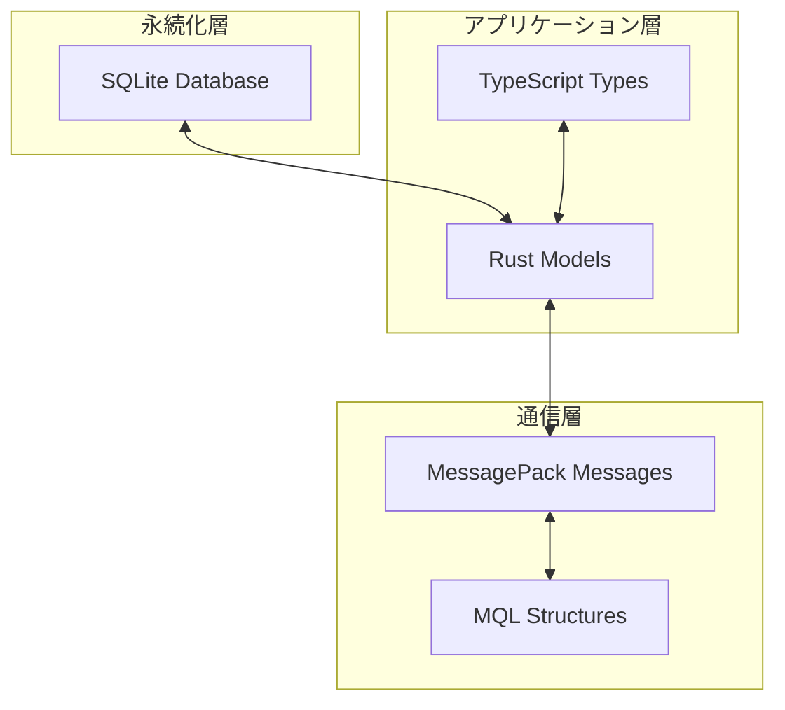
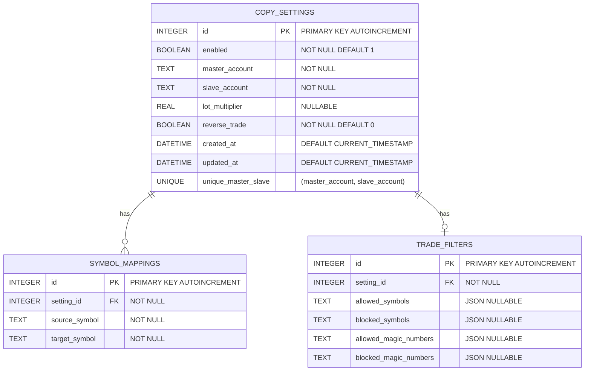
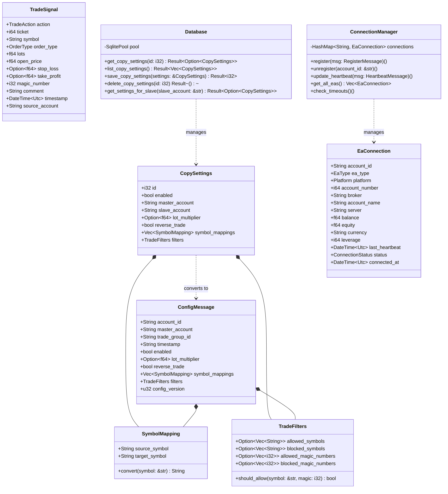
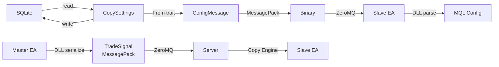

# SANKEY Copier データモデル仕様書

## 目次

1. [概要](#概要)
2. [データベーススキーマ](#データベーススキーマ)
3. [Rustデータモデル](#rustデータモデル)
4. [TypeScriptデータモデル](#typescriptデータモデル)
5. [MQLデータ構造](#mqlデータ構造)
6. [メッセージ構造](#メッセージ構造)
7. [データ変換ロジック](#データ変換ロジック)
8. [クラス図](#クラス図)

---

## 概要

SANKEY Copierのデータモデルは、以下の3つの層で構成されます：



---

## データベーススキーマ

### ER図



### テーブル定義

#### 1. copy_settings

コピー設定のメインテーブル。

```sql
CREATE TABLE IF NOT EXISTS copy_settings (
    id INTEGER PRIMARY KEY AUTOINCREMENT,
    enabled BOOLEAN NOT NULL DEFAULT 1,
    master_account TEXT NOT NULL,
    slave_account TEXT NOT NULL,
    lot_multiplier REAL,
    reverse_trade BOOLEAN NOT NULL DEFAULT 0,
    created_at DATETIME DEFAULT CURRENT_TIMESTAMP,
    updated_at DATETIME DEFAULT CURRENT_TIMESTAMP,
    UNIQUE(master_account, slave_account)
);
```

**フィールド説明**:

| フィールド | 型 | 制約 | 説明 |
|-----------|------|------|------|
| `id` | INTEGER | PK, AUTO_INCREMENT | 設定ID |
| `enabled` | BOOLEAN | NOT NULL, DEFAULT 1 | コピー有効フラグ |
| `master_account` | TEXT | NOT NULL | マスターアカウントID |
| `slave_account` | TEXT | NOT NULL | スレーブアカウントID |
| `lot_multiplier` | REAL | NULLABLE | ロット倍率（nullの場合1.0） |
| `reverse_trade` | BOOLEAN | NOT NULL, DEFAULT 0 | リバーストレード |
| `created_at` | DATETIME | DEFAULT NOW | 作成日時 |
| `updated_at` | DATETIME | DEFAULT NOW | 更新日時 |

**制約**:

- `UNIQUE(master_account, slave_account)`: 同じマスター・スレーブペアは1つのみ

---

#### 2. symbol_mappings

シンボル変換マッピングテーブル。

```sql
CREATE TABLE IF NOT EXISTS symbol_mappings (
    id INTEGER PRIMARY KEY AUTOINCREMENT,
    setting_id INTEGER NOT NULL,
    source_symbol TEXT NOT NULL,
    target_symbol TEXT NOT NULL,
    FOREIGN KEY (setting_id) REFERENCES copy_settings(id) ON DELETE CASCADE
);
```

**フィールド説明**:

| フィールド | 型 | 制約 | 説明 |
|-----------|------|------|------|
| `id` | INTEGER | PK, AUTO_INCREMENT | マッピングID |
| `setting_id` | INTEGER | FK, NOT NULL | 親設定ID |
| `source_symbol` | TEXT | NOT NULL | 変換元シンボル |
| `target_symbol` | TEXT | NOT NULL | 変換先シンボル |

**外部キー**:

- `ON DELETE CASCADE`: 親設定削除時に自動削除

---

#### 3. trade_filters

トレードフィルター設定テーブル。

```sql
CREATE TABLE IF NOT EXISTS trade_filters (
    id INTEGER PRIMARY KEY AUTOINCREMENT,
    setting_id INTEGER NOT NULL,
    allowed_symbols TEXT,
    blocked_symbols TEXT,
    allowed_magic_numbers TEXT,
    blocked_magic_numbers TEXT,
    FOREIGN KEY (setting_id) REFERENCES copy_settings(id) ON DELETE CASCADE
);
```

**フィールド説明**:

| フィールド | 型 | 制約 | 説明 |
|-----------|------|------|------|
| `id` | INTEGER | PK, AUTO_INCREMENT | フィルターID |
| `setting_id` | INTEGER | FK, NOT NULL | 親設定ID |
| `allowed_symbols` | TEXT | NULLABLE | 許可シンボル（JSON配列） |
| `blocked_symbols` | TEXT | NULLABLE | 除外シンボル（JSON配列） |
| `allowed_magic_numbers` | TEXT | NULLABLE | 許可マジックナンバー（JSON配列） |
| `blocked_magic_numbers` | TEXT | NULLABLE | 除外マジックナンバー（JSON配列） |

**JSON形式例**:

```json
// allowed_symbols
["EURUSD", "GBPUSD", "USDJPY"]

// allowed_magic_numbers
[0, 123, 456]
```

---

## Rustデータモデル

### モデル構成

```
relay-server/src/models/
├── mod.rs              # メインモデル定義
└── connection.rs       # EA接続情報
```

### 主要構造体

#### 1. CopySettings

```rust
#[derive(Debug, Clone, Serialize, Deserialize)]
pub struct CopySettings {
    pub id: i32,
    pub enabled: bool,
    pub master_account: String,
    pub slave_account: String,
    pub lot_multiplier: Option<f64>,
    pub reverse_trade: bool,
    pub symbol_mappings: Vec<SymbolMapping>,
    pub filters: TradeFilters,
}
```

**変換**:

- SQLiteからの読み込み時、関連テーブル（symbol_mappings, trade_filters）を結合
- `lot_multiplier` がnullの場合、Slave EAで1.0として扱う

---

#### 2. SymbolMapping

```rust
#[derive(Debug, Clone, Serialize, Deserialize)]
pub struct SymbolMapping {
    pub source_symbol: String,
    pub target_symbol: String,
}
```

**用途**:

- ブローカー間のシンボル名の差異を吸収
- 例: `EURUSD` → `EURUSD.raw`

---

#### 3. TradeFilters

```rust
#[derive(Debug, Clone, Serialize, Deserialize)]
pub struct TradeFilters {
    #[serde(default)]
    pub allowed_symbols: Option<Vec<String>>,
    #[serde(default)]
    pub blocked_symbols: Option<Vec<String>>,
    #[serde(default)]
    pub allowed_magic_numbers: Option<Vec<i32>>,
    #[serde(default)]
    pub blocked_magic_numbers: Option<Vec<i32>>,
}
```

**フィルタリングロジック**:

1. `allowed_symbols` が設定されている場合、リストにあるシンボルのみコピー
2. `blocked_symbols` が設定されている場合、リストにあるシンボルは除外
3. `allowed_magic_numbers` / `blocked_magic_numbers` も同様

---

#### 4. TradeSignal

```rust
#[derive(Debug, Clone, Serialize, Deserialize)]
pub struct TradeSignal {
    pub action: TradeAction,
    pub ticket: i64,
    pub symbol: String,
    pub order_type: OrderType,
    pub lots: f64,
    pub open_price: f64,
    pub stop_loss: Option<f64>,
    pub take_profit: Option<f64>,
    pub magic_number: i32,
    pub comment: String,
    pub timestamp: DateTime<Utc>,
    pub source_account: String,
}
```

**列挙型**:

```rust
#[derive(Debug, Clone, Serialize, Deserialize)]
pub enum TradeAction {
    Open,
    Close,
    Modify,
}

#[derive(Debug, Clone, Serialize, Deserialize)]
pub enum OrderType {
    Buy,
    Sell,
    BuyLimit,
    SellLimit,
    BuyStop,
    SellStop,
}
```

---

#### 5. EaConnection

```rust
#[derive(Debug, Clone, Serialize, Deserialize)]
pub struct EaConnection {
    pub account_id: String,
    pub ea_type: EaType,
    pub platform: Platform,
    pub account_number: i64,
    pub broker: String,
    pub account_name: String,
    pub server: String,
    pub balance: f64,
    pub equity: f64,
    pub currency: String,
    pub leverage: i64,
    pub last_heartbeat: DateTime<Utc>,
    pub status: ConnectionStatus,
    pub connected_at: DateTime<Utc>,
}
```

**列挙型**:

```rust
#[derive(Debug, Clone, Copy, PartialEq, Eq, Serialize, Deserialize)]
#[serde(rename_all = "PascalCase")]
pub enum EaType {
    Master,
    Slave,
}

#[derive(Debug, Clone, Copy, PartialEq, Eq, Serialize, Deserialize)]
pub enum Platform {
    MT4,
    MT5,
}

#[derive(Debug, Clone, Copy, PartialEq, Eq, Serialize, Deserialize)]
#[serde(rename_all = "PascalCase")]
pub enum ConnectionStatus {
    Online,
    Offline,
    Timeout,
}
```

---

#### 6. ConfigMessage

```rust
#[derive(Debug, Clone, Serialize, Deserialize)]
pub struct ConfigMessage {
    pub account_id: String,
    pub master_account: String,
    pub trade_group_id: String,
    pub timestamp: String,  // ISO 8601
    pub enabled: bool,
    #[serde(default)]
    pub lot_multiplier: Option<f64>,
    pub reverse_trade: bool,
    pub symbol_mappings: Vec<SymbolMapping>,
    pub filters: TradeFilters,
    pub config_version: u32,
}
```

**変換実装**:

```rust
impl From<CopySettings> for ConfigMessage {
    fn from(settings: CopySettings) -> Self {
        Self {
            account_id: settings.slave_account.clone(),
            master_account: settings.master_account.clone(),
            trade_group_id: settings.master_account,
            timestamp: chrono::Utc::now().to_rfc3339(),
            enabled: settings.enabled,
            lot_multiplier: settings.lot_multiplier,
            reverse_trade: settings.reverse_trade,
            symbol_mappings: settings.symbol_mappings,
            filters: settings.filters,
            config_version: 1,
        }
    }
}
```

---

## TypeScriptデータモデル

### 主要インターフェース

#### 1. CopySettings

```typescript
interface CopySettings {
  id: number;
  enabled: boolean;
  master_account: string;
  slave_account: string;
  lot_multiplier: number | null;
  reverse_trade: boolean;
  symbol_mappings: SymbolMapping[];
  filters: TradeFilters;
}
```

---

#### 2. SymbolMapping

```typescript
interface SymbolMapping {
  source_symbol: string;
  target_symbol: string;
}
```

---

#### 3. TradeFilters

```typescript
interface TradeFilters {
  allowed_symbols: string[] | null;
  blocked_symbols: string[] | null;
  allowed_magic_numbers: number[] | null;
  blocked_magic_numbers: number[] | null;
}
```

---

#### 4. EaConnection

```typescript
interface EaConnection {
  account_id: string;
  ea_type: 'Master' | 'Slave';
  platform: 'MT4' | 'MT5';
  account_number: number;
  broker: string;
  account_name: string;
  server: string;
  balance: number;
  equity: number;
  currency: string;
  leverage: number;
  last_heartbeat: string;  // ISO 8601
  status: 'Online' | 'Offline' | 'Timeout';
  connected_at: string;    // ISO 8601
}
```

---

## MQLデータ構造

### MT4/MT5共通構造

#### 1. トレード情報

```mql5
struct TradeInfo {
    string action;          // "Open", "Close", "Modify"
    long ticket;
    string symbol;
    string order_type;      // "Buy", "Sell", etc.
    double lots;
    double open_price;
    double stop_loss;
    double take_profit;
    long magic_number;
    string comment;
    string timestamp;       // ISO 8601
    string source_account;
};
```

---

#### 2. 設定情報

```mql5
struct ConfigInfo {
    string account_id;
    string master_account;
    string trade_group_id;
    string timestamp;
    bool enabled;
    double lot_multiplier;
    bool reverse_trade;
    int config_version;
};
```

---

## メッセージ構造

### MessagePack共通定義

すべてのメッセージは `mt-bridge/src/msgpack.rs` で定義されています。

#### 1. UnregisterMessage

```rust
#[derive(Debug, Clone, Serialize, Deserialize)]
pub struct UnregisterMessage {
    pub message_type: String,  // "Unregister"
    pub account_id: String,
    pub timestamp: String,
}
```

**サイズ**: 約60 bytes (MessagePack)

---

#### 2. HeartbeatMessage

定期的（30秒ごと）に送信する生存確認メッセージ。**初回送信時に自動的にEA登録も行います**。

```rust
#[derive(Debug, Clone, Serialize, Deserialize)]
pub struct HeartbeatMessage {
    pub message_type: String,  // "Heartbeat"
    pub account_id: String,
    pub balance: f64,
    pub equity: f64,
    pub open_positions: i32,
    pub timestamp: String,
    pub ea_type: String,       // "Master" | "Slave"
    pub platform: String,      // "MT4" | "MT5"
    pub account_number: i64,
    pub broker: String,
    pub account_name: String,
    pub server: String,
    pub currency: String,
    pub leverage: i64,
}
```

**サイズ**: 約280 bytes (MessagePack)

**自動登録機能**:
- 初回Heartbeat受信時、サーバーは自動的にEAをConnection Managerに登録します
- RegisterMessageが廃止され、HeartbeatMessageに登録機能が統合されました

---

#### 3. RequestConfigMessage

Slave EAが初回Heartbeat成功後に送信する設定要求メッセージ。

```rust
#[derive(Debug, Clone, Serialize, Deserialize)]
pub struct RequestConfigMessage {
    pub message_type: String,  // "RequestConfig"
    pub account_id: String,
    pub timestamp: String,     // ISO 8601
}
```

**サイズ**: 約50 bytes (MessagePack)

**用途**:
- Slave EAは初回Heartbeat送信に成功した後、このメッセージを送信して設定を要求します
- サーバーはこのメッセージを受信すると、該当するSlave EAの設定を検索してConfigMessageを配信します

---

#### 4. TradeSignalMessage

```rust
#[derive(Debug, Clone, Serialize, Deserialize)]
pub struct TradeSignalMessage {
    pub action: String,
    pub ticket: i64,
    #[serde(default, skip_serializing_if = "Option::is_none")]
    pub symbol: Option<String>,
    #[serde(default, skip_serializing_if = "Option::is_none")]
    pub order_type: Option<String>,
    #[serde(default, skip_serializing_if = "Option::is_none")]
    pub lots: Option<f64>,
    #[serde(default, skip_serializing_if = "Option::is_none")]
    pub open_price: Option<f64>,
    #[serde(default, skip_serializing_if = "Option::is_none")]
    pub stop_loss: Option<f64>,
    #[serde(default, skip_serializing_if = "Option::is_none")]
    pub take_profit: Option<f64>,
    #[serde(default, skip_serializing_if = "Option::is_none")]
    pub magic_number: Option<i64>,
    #[serde(default, skip_serializing_if = "Option::is_none")]
    pub comment: Option<String>,
    pub timestamp: String,
    pub source_account: String,
}
```

**サイズ**:

- Open: 約245 bytes
- Close: 約70 bytes (オプションフィールド省略)

**最適化**:

- `skip_serializing_if = "Option::is_none"` により、nullフィールドを省略

---

#### 5. ConfigMessage

```rust
#[derive(Debug, Clone, Serialize, Deserialize)]
pub struct ConfigMessage {
    pub account_id: String,
    pub master_account: String,
    pub trade_group_id: String,
    pub timestamp: String,
    pub enabled: bool,
    #[serde(default)]
    pub lot_multiplier: Option<f64>,
    pub reverse_trade: bool,
    pub symbol_mappings: Vec<SymbolMapping>,
    pub filters: TradeFilters,
    pub config_version: u32,
}
```

**サイズ**: 約840 bytes (フルデータ時)

---

## データ変換ロジック

### 1. SQLite ↔ Rust

#### 読み込み (Database → CopySettings)

```rust
pub async fn get_copy_settings(&self, id: i32) -> Result<Option<CopySettings>> {
    // 1. メインレコード取得
    let row = sqlx::query("SELECT id, enabled, master_account, ... FROM copy_settings WHERE id = ?")
        .bind(id)
        .fetch_optional(&self.pool)
        .await?;

    if let Some(row) = row {
        let setting_id: i32 = row.get("id");

        // 2. シンボルマッピング取得
        let mappings = sqlx::query_as::<_, (String, String)>(
            "SELECT source_symbol, target_symbol FROM symbol_mappings WHERE setting_id = ?"
        )
        .bind(setting_id)
        .fetch_all(&self.pool)
        .await?
        .into_iter()
        .map(|(source, target)| SymbolMapping { source_symbol: source, target_symbol: target })
        .collect();

        // 3. フィルター取得
        let filter_row = sqlx::query(
            "SELECT allowed_symbols, ... FROM trade_filters WHERE setting_id = ?"
        )
        .bind(setting_id)
        .fetch_optional(&self.pool)
        .await?;

        let filters = if let Some(f) = filter_row {
            TradeFilters {
                allowed_symbols: f.get::<Option<String>, _>("allowed_symbols")
                    .and_then(|s| serde_json::from_str(&s).ok()),
                // ...
            }
        } else {
            TradeFilters::default()
        };

        Ok(Some(CopySettings {
            id: row.get("id"),
            enabled: row.get("enabled"),
            // ...
            symbol_mappings: mappings,
            filters,
        }))
    } else {
        Ok(None)
    }
}
```

#### 書き込み (CopySettings → Database)

```rust
pub async fn save_copy_settings(&self, settings: &CopySettings) -> Result<i32> {
    // 1. メインレコード保存
    let id = if settings.id == 0 {
        // INSERT
        let result = sqlx::query("INSERT INTO copy_settings (...) VALUES (...)")
            .bind(settings.enabled)
            // ...
            .execute(&self.pool)
            .await?;
        result.last_insert_rowid() as i32
    } else {
        // UPDATE
        sqlx::query("UPDATE copy_settings SET ... WHERE id = ?")
            .bind(settings.id)
            .execute(&self.pool)
            .await?;
        settings.id
    };

    // 2. シンボルマッピング削除・再挿入
    sqlx::query("DELETE FROM symbol_mappings WHERE setting_id = ?")
        .bind(id)
        .execute(&self.pool)
        .await?;

    for mapping in &settings.symbol_mappings {
        sqlx::query("INSERT INTO symbol_mappings (...) VALUES (...)")
            .bind(id)
            .bind(&mapping.source_symbol)
            .bind(&mapping.target_symbol)
            .execute(&self.pool)
            .await?;
    }

    // 3. フィルター削除・再挿入
    sqlx::query("DELETE FROM trade_filters WHERE setting_id = ?")
        .bind(id)
        .execute(&self.pool)
        .await?;

    sqlx::query("INSERT INTO trade_filters (...) VALUES (...)")
        .bind(id)
        .bind(serde_json::to_string(&settings.filters.allowed_symbols)?)
        // ...
        .execute(&self.pool)
        .await?;

    Ok(id)
}
```

---

### 2. Rust ↔ MessagePack

#### シリアライゼーション (Rust → MessagePack)

```rust
let config: ConfigMessage = settings.into();
let msgpack_bytes = rmp_serde::to_vec_named(&config)?;

// ZeroMQ送信
let mut message = config.account_id.as_bytes().to_vec();
message.push(b' ');
message.extend_from_slice(&msgpack_bytes);
socket.send(&message, 0)?;
```

#### デシリアライゼーション (MessagePack → Rust)

```rust
let bytes = socket.recv_bytes(0)?;

// トピック部分をスキップ
let space_pos = bytes.iter().position(|&b| b == b' ').unwrap();
let payload = &bytes[space_pos + 1..];

// MessagePack解析
let config: ConfigMessage = rmp_serde::from_slice(payload)?;
```

---

### 3. MQL ↔ MessagePack (via DLL)

#### シリアライゼーション (MQL → MessagePack)

```mql5
// Rust DLL関数呼び出し - Heartbeat (自動登録情報含む)
int msg_len = serialize_heartbeat(
    "Heartbeat",
    account_id,
    AccountInfoDouble(ACCOUNT_BALANCE),
    AccountInfoDouble(ACCOUNT_EQUITY),
    CountOpenPositions(),
    timestamp,
    "Master",                          // ea_type
    "MT5",                             // platform
    AccountInfoInteger(ACCOUNT_LOGIN), // account_number
    AccountInfoString(ACCOUNT_COMPANY),// broker
    AccountInfoString(ACCOUNT_NAME),   // account_name
    AccountInfoString(ACCOUNT_SERVER), // server
    AccountInfoString(ACCOUNT_CURRENCY),// currency
    AccountInfoInteger(ACCOUNT_LEVERAGE) // leverage
);

// シリアライズされたバッファを取得
uchar buffer[];
ArrayResize(buffer, msg_len);
copy_serialized_buffer(buffer, msg_len);

// ZeroMQ送信
zmq_socket_send_binary(socket, buffer, msg_len);
```

#### デシリアライゼーション (MessagePack → MQL)

```mql5
// ZeroMQ受信
char buffer[4096];
int recv_len = zmq_socket_receive(configSocket, buffer, 4096);

if (recv_len > 0) {
    // トピック部分をスキップ
    int payload_start = FindSpaceIndex(buffer) + 1;

    // MessagePack解析（DLL呼び出し）
    long handle = parse_message(buffer + payload_start, recv_len - payload_start);

    if (handle != 0) {
        // フィールド取得
        string master = config_get_string(handle, "master_account");
        double lot_mult = config_get_double(handle, "lot_multiplier");
        bool enabled = config_get_bool(handle, "enabled");

        // 設定適用
        current_master_account = master;
        current_lot_multiplier = lot_mult;
        current_enabled = enabled;

        // メモリ解放
        config_free(handle);
    }
}
```

---

## クラス図

### Rustサーバー側



---

### データ変換フロー



---

## まとめ

SANKEY Copierのデータモデルは、以下の特徴を持ちます：

1. ✅ **正規化されたDB設計**: 3NF準拠、外部キーによる整合性保証
2. ✅ **型安全性**: Rust/TypeScriptの強力な型システム
3. ✅ **効率的なシリアライゼーション**: MessagePackによる30-50%サイズ削減
4. ✅ **柔軟なフィルタリング**: 許可/除外リストの組み合わせ
5. ✅ **拡張性**: バージョニング（config_version）による互換性保証
6. ✅ **明示的な変換**: `From` trait / DLL API による安全な変換

このデータモデルにより、高速・低遅延・型安全なトレードコピーシステムが実現されています。
