# MT-Advisors

MetaTrader上で動作するExpert Advisor。Master EAがトレードを検出し、Slave EAがコピー実行する。

## Responsibilities

### Master EA
- **トレード検出**: ポジション/オーダーの開始・決済・変更を検出
- **シグナル送信**: TradeSignalをRelay-Serverへ送信
- **ポジション同期**: SyncRequestに応じてPositionSnapshotを送信
- **Heartbeat**: 30秒ごとに状態を報告

### Slave EA
- **シグナル受信**: TradeSignalを受信して実行
- **ロット計算**: 倍率またはマージン比率で計算
- **方向反転**: 設定に応じてBuy↔Sell反転
- **同期処理**: 既存ポジションの同期実行
- **チケットマッピング**: Master→Slaveチケット対応管理

## Architecture

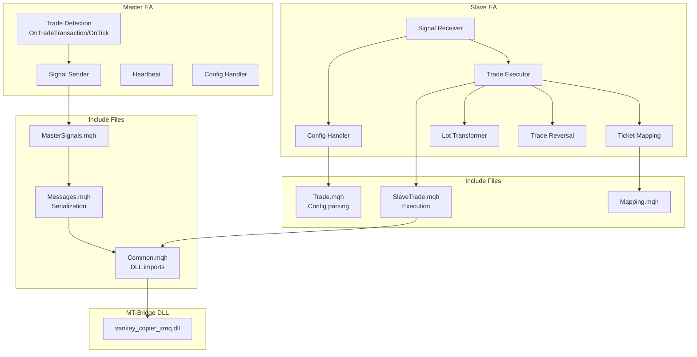

## Project Structure

```
mt-advisors/
├── MT5/
│   ├── SankeyCopierMaster.mq5     # Master EA (MT5)
│   └── SankeyCopierSlave.mq5      # Slave EA (MT5)
├── MT4/
│   ├── SankeyCopierMaster.mq4     # Master EA (MT4)
│   └── SankeyCopierSlave.mq4      # Slave EA (MT4)
└── Include/
    └── SankeyCopier/
        ├── Common.mqh             # DLL imports, constants
        ├── Zmq.mqh                # ZMQ initialization
        ├── Messages.mqh           # Message serialization
        ├── MessageParsing.mqh     # Message parsing utilities
        ├── MasterSignals.mqh      # Master signal functions
        ├── Trade.mqh              # Config parsing, lot transform
        ├── SlaveTrade.mqh         # Trade execution
        ├── SlaveTypes.mqh         # Slave type definitions
        ├── Mapping.mqh            # Ticket mapping
        ├── GridPanel.mqh          # UI panel
        └── Logging.mqh            # VictoriaLogs integration
```

## Master EA

### Input Parameters

```mql5
input string RelayServerAddress = "tcp://localhost:5555";   // PUSH endpoint
input string ConfigSourceAddress = "tcp://localhost:5557";  // SUB endpoint
input int    ScanInterval = 100;                            // ms
input bool   ShowConfigPanel = true;
input int    PanelWidth = 280;
```

### Trade Detection

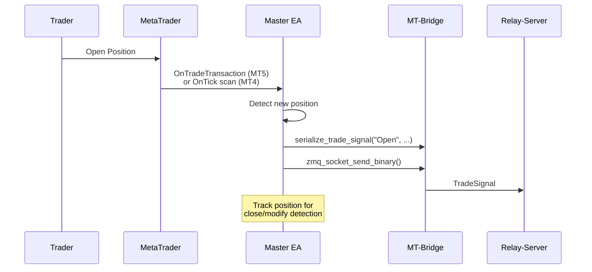

#### MT5: Event-Driven (OnTradeTransaction)

```mql5
void OnTradeTransaction(
    const MqlTradeTransaction& trans,
    const MqlTradeRequest& request,
    const MqlTradeResult& result)
{
    switch(trans.type) {
        case TRADE_TRANSACTION_DEAL_ADD:
            // Position opened
            SendPositionOpenSignal(ticket, symbol, type, lots, ...);
            break;

        case TRADE_TRANSACTION_HISTORY_ADD:
            // Position closed
            SendPositionCloseSignal(ticket, close_ratio);
            break;

        case TRADE_TRANSACTION_ORDER_ADD:
            // Pending order created
            SendOrderOpenSignal(...);
            break;

        case TRADE_TRANSACTION_ORDER_DELETE:
            // Pending order deleted
            SendOrderCloseSignal(...);
            break;

        case TRADE_TRANSACTION_ORDER_UPDATE:
            // Order modified
            SendOrderModifySignal(...);
            break;
    }
}
```

**Code Reference**: `SankeyCopierMaster.mq5:445-534`

#### MT4: Polling (OnTick)

```mql5
void OnTick() {
    CheckForNewOrders();      // New positions/orders
    CheckForModifiedOrders(); // SL/TP changes
    CheckForPartialCloses();  // Volume changes
    CheckForClosedOrders();   // Closed positions
}
```

**Code Reference**: `SankeyCopierMaster.mq4:381-544`

### Partial Close Detection

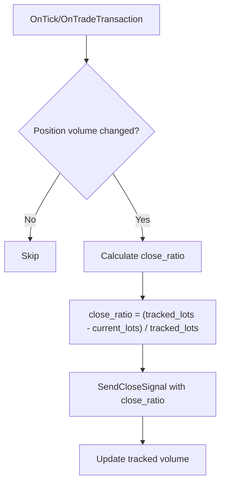

**Code Reference**: `SankeyCopierMaster.mq5:611-637`

### Heartbeat

30秒ごとにOnTimerから送信。

```mql5
// HeartbeatMessage contents:
- account_id
- balance, equity
- open_positions count
- ea_type: "Master"
- platform: "MT4" or "MT5"
- account_number, broker, server
- is_trade_allowed
- symbol_prefix, symbol_suffix
- version (BUILD_INFO)
```

**Code Reference**: `SankeyCopierMaster.mq5:175-306`, `Messages.mqh:131-187`

### Position Snapshot

SyncRequest受信時、またはMaster起動時に送信。

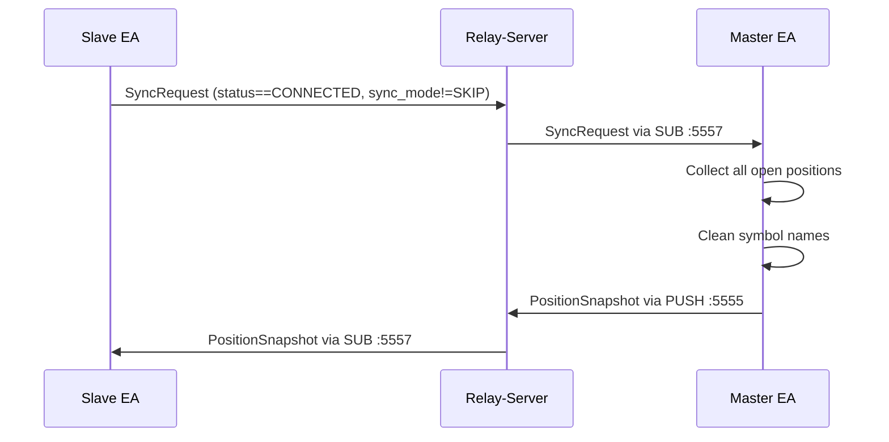

**Code Reference**: `MasterSignals.mqh:124-228`

## Slave EA

### Input Parameters

```mql5
input string RelayServerAddress = "tcp://localhost:5555";       // PUSH endpoint
input string TradeSignalSourceAddress = "tcp://localhost:5556"; // Trade SUB
input string ConfigSourceAddress = "tcp://localhost:5557";      // Config SUB
input bool   ShowConfigPanel = true;
input int    PanelWidth = 280;
```

### Configuration Structure

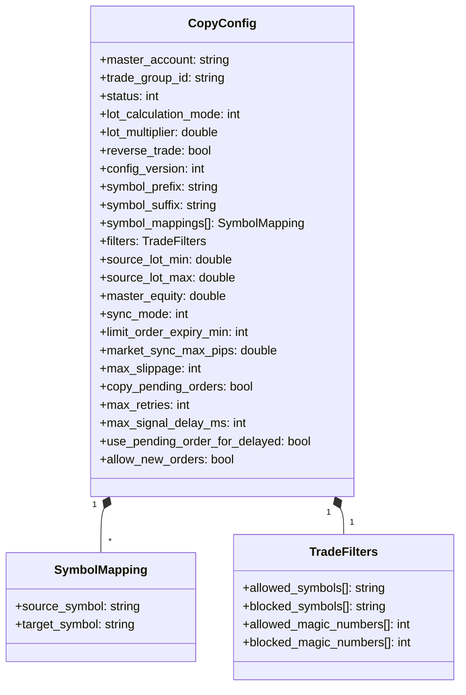

**Code Reference**: `SlaveTypes.mqh:36-63`

### Trade Signal Processing

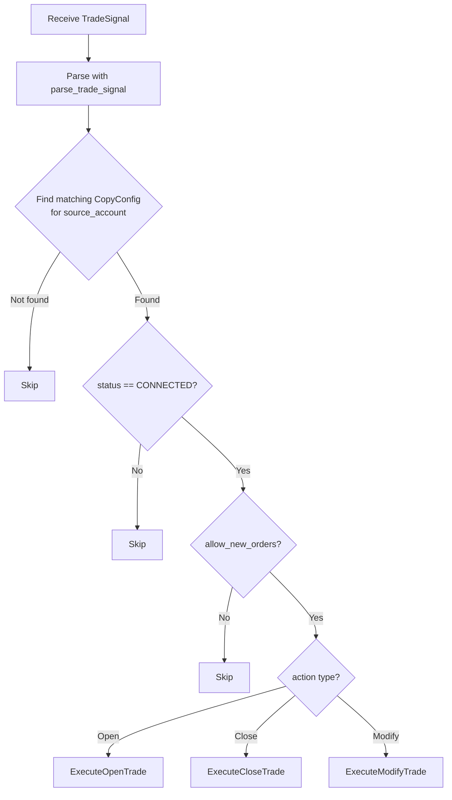

**Code Reference**: `SankeyCopierSlave.mq5:482-581`

### Lot Calculation

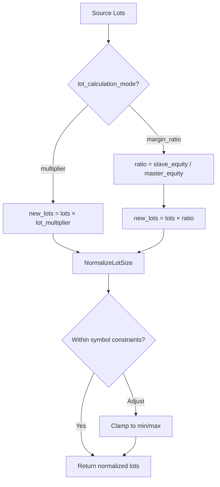

**Code Reference**: `Trade.mqh:529-559`

#### Multiplier Mode

```
Input: lots=1.0, lot_multiplier=2.5
Output: 1.0 × 2.5 = 2.5 lots
```

#### Margin Ratio Mode

```
Input: lots=1.0, slave_equity=50000, master_equity=25000
Ratio: 50000 / 25000 = 2.0
Output: 1.0 × 2.0 = 2.0 lots
```

### Trade Reversal

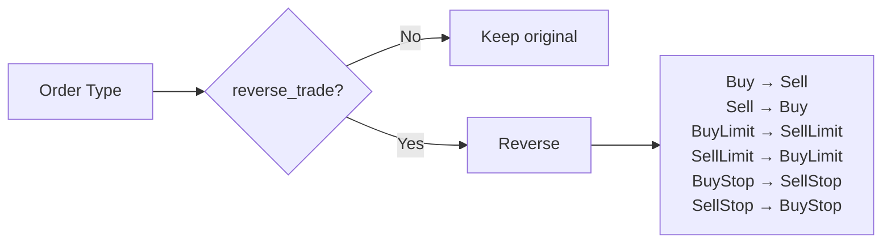

**Code Reference**: `Trade.mqh:574-586`

### Trade Execution

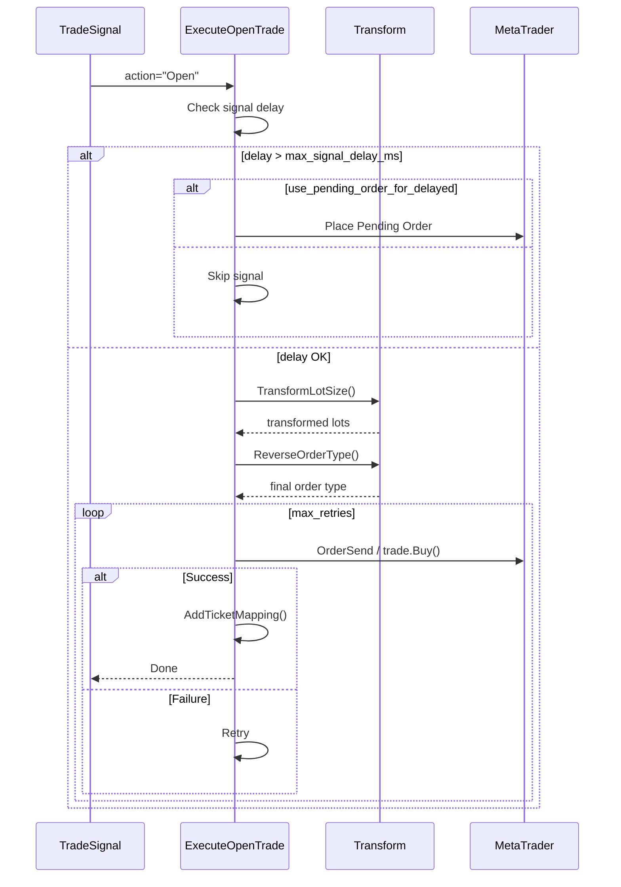

**Code Reference**: `SlaveTrade.mqh:101-173` (MT5), `SlaveTrade.mqh:475-557` (MT4)

### Partial Close Handling

```mql5
void ExecuteCloseTrade(long master_ticket, double close_ratio) {
    long slave_ticket = GetSlaveTicketFromMapping(master_ticket);

    if (close_ratio > 0 && close_ratio < 1.0) {
        // Partial close
        double current_lots = PositionGetDouble(POSITION_VOLUME);
        double close_lots = current_lots * close_ratio;
        trade.PositionClosePartial(slave_ticket, close_lots);
        // Keep mapping (position still open)
    } else {
        // Full close
        trade.PositionClose(slave_ticket);
        RemoveTicketMapping(master_ticket);
    }
}
```

**Code Reference**: `SlaveTrade.mqh:179-242`

### Open Sync (Position Synchronization)

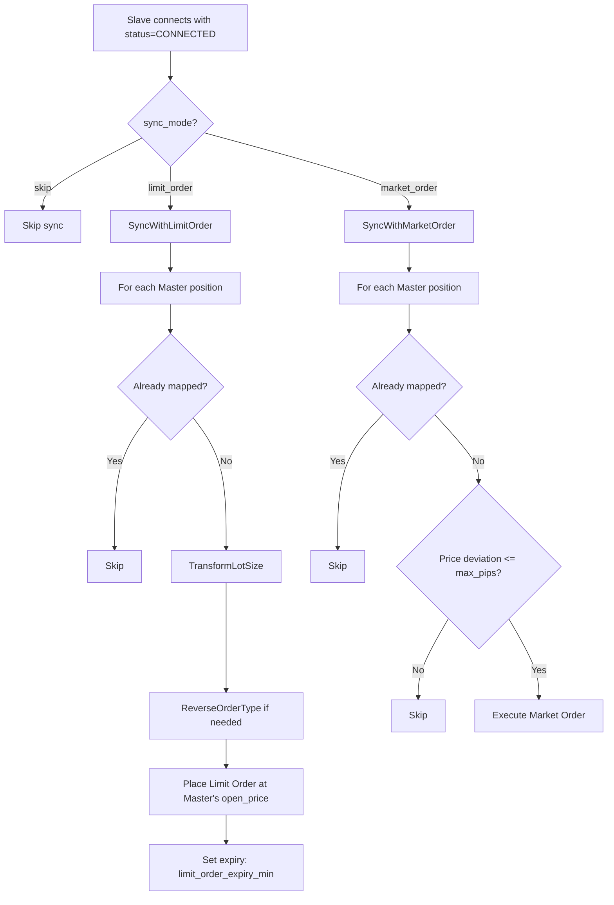

**Code Reference**: `SankeyCopierSlave.mq5:587-719`

### Ticket Mapping

Master/Slaveチケットの対応を管理し、再起動後も復元可能。

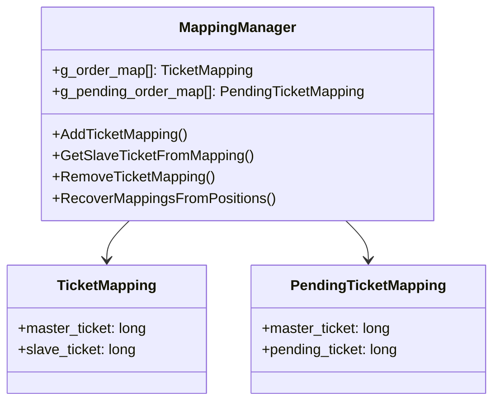

#### Comment Format

```
M{master_ticket}  # Market order, e.g., "M1234567890"
P{master_ticket}  # Pending order, e.g., "P1234567890"
```

最大21文字（MT5の31文字制限内）

**Code Reference**: `Mapping.mqh:208-221`

#### Recovery from Restart

```mql5
void RecoverMappingsFromPositions() {
    // Scan all open positions
    for (int i = 0; i < PositionsTotal(); i++) {
        string comment = PositionGetString(POSITION_COMMENT);

        // Parse "M{ticket}" or "P{ticket}"
        if (StringSubstr(comment, 0, 1) == "M") {
            long master_ticket = StringToInteger(StringSubstr(comment, 1));
            AddTicketMapping(master_ticket, PositionGetInteger(POSITION_TICKET));
        }
    }

    // Scan pending orders too
    for (int i = 0; i < OrdersTotal(); i++) {
        string comment = OrderGetString(ORDER_COMMENT);
        // ...similar parsing
    }
}
```

**Code Reference**: `Mapping.mqh:286-404`

## ZMQ Communication

### Socket Configuration

| EA | Socket Type | Port | Purpose |
|----|-------------|------|---------|
| Master | PUSH | 5555 | Heartbeat, TradeSignal, PositionSnapshot |
| Master | SUB | 5557 | MasterConfig, SyncRequest |
| Slave | PUSH | 5555 | Heartbeat, RequestConfig, SyncRequest |
| Slave | SUB | 5556 | TradeSignal (topic: trade_group_id) |
| Slave | SUB | 5557 | SlaveConfig (topic: account_id) |

### Message Flow

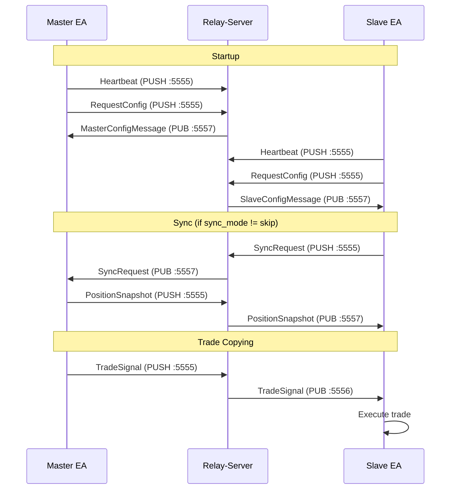

## Configuration Sources

### EA-Side Only (Input Parameters)

設定変更にはEA再起動が必要。

| Setting | Master | Slave | Description |
|---------|--------|-------|-------------|
| RelayServerAddress | ✓ | ✓ | PUSH endpoint |
| ConfigSourceAddress | ✓ | ✓ | Config SUB endpoint |
| TradeSignalSourceAddress | - | ✓ | Trade SUB endpoint |
| ScanInterval | ✓ | - | Position scan interval (ms) |
| ShowConfigPanel | ✓ | ✓ | UI panel display |

### From Relay-Server (Web-UI経由)

リアルタイムで更新される。

| Setting | Master | Slave | Description |
|---------|--------|-------|-------------|
| symbol_prefix | ✓ | - | 削除するプレフィックス |
| symbol_suffix | ✓ | - | 削除するサフィックス |
| lot_calculation_mode | - | ✓ | 計算モード |
| lot_multiplier | - | ✓ | ロット倍率 |
| reverse_trade | - | ✓ | 方向反転 |
| sync_mode | - | ✓ | 同期モード |
| limit_order_expiry_min | - | ✓ | リミット有効期限 |
| market_sync_max_pips | - | ✓ | マーケット同期許容差 |
| max_slippage | - | ✓ | スリッページ許容値 |
| max_retries | - | ✓ | リトライ回数 |
| max_signal_delay_ms | - | ✓ | シグナル遅延許容値 |
| use_pending_order_for_delayed | - | ✓ | 遅延時ペンディング使用 |
| copy_pending_orders | - | ✓ | ペンディングコピー |

## Platform Differences (MT4 vs MT5)

| Feature | MT4 | MT5 |
|---------|-----|-----|
| Trade Detection | OnTick polling | OnTradeTransaction event |
| Position Access | OrderSelect() | PositionSelectByTicket() |
| Order Types | OP_BUY, OP_SELL | ORDER_TYPE_BUY, etc. |
| Trade Execution | OrderSend() | CTrade class |
| Pending Fill Detection | OnTick polling | OnTradeTransaction |
| Ticket Type | int | long |

## Status Values

### Member Status

| Value | Name | Description |
|-------|------|-------------|
| 0 | DISABLED | ユーザーが無効化 |
| 1 | ENABLED | 有効だがMasterオフライン |
| 2 | CONNECTED | 有効かつMasterオンライン |
| 4 | REMOVED | 削除済み |

### Sync Mode

| Value | Name | Description |
|-------|------|-------------|
| 0 | SKIP | 同期しない |
| 1 | LIMIT_ORDER | Masterの価格でリミット注文 |
| 2 | MARKET_ORDER | 価格許容範囲内でマーケット注文 |

### Lot Calculation Mode

| Value | Name | Description |
|-------|------|-------------|
| 0 | MULTIPLIER | 固定倍率 |
| 1 | MARGIN_RATIO | エクイティ比率 |

## Key Files Reference

| File | Lines | Purpose |
|------|-------|---------|
| `Common.mqh` | 50-148 | DLL imports |
| `Messages.mqh` | 131-187 | Heartbeat serialization |
| `MasterSignals.mqh` | 22-228 | Signal sending functions |
| `Trade.mqh` | 109-352 | Config parsing |
| `Trade.mqh` | 529-586 | Lot transform, reversal |
| `SlaveTrade.mqh` | 101-312 | MT5 trade execution |
| `SlaveTrade.mqh` | 475-857 | MT4 trade execution |
| `Mapping.mqh` | 286-404 | Ticket recovery |
| `SankeyCopierMaster.mq5` | 445-534 | OnTradeTransaction |
| `SankeyCopierSlave.mq5` | 482-581 | ProcessTradeSignal |
| `SankeyCopierSlave.mq5` | 587-719 | ProcessPositionSnapshot |

## Defaults

```mql5
#define DEFAULT_SLIPPAGE              30      // points
#define DEFAULT_MAX_RETRIES           3       // attempts
#define DEFAULT_MAX_SIGNAL_DELAY_MS   5000    // 5 seconds
```

設定がRelay-Serverから届くまでこれらの値が使用される。
