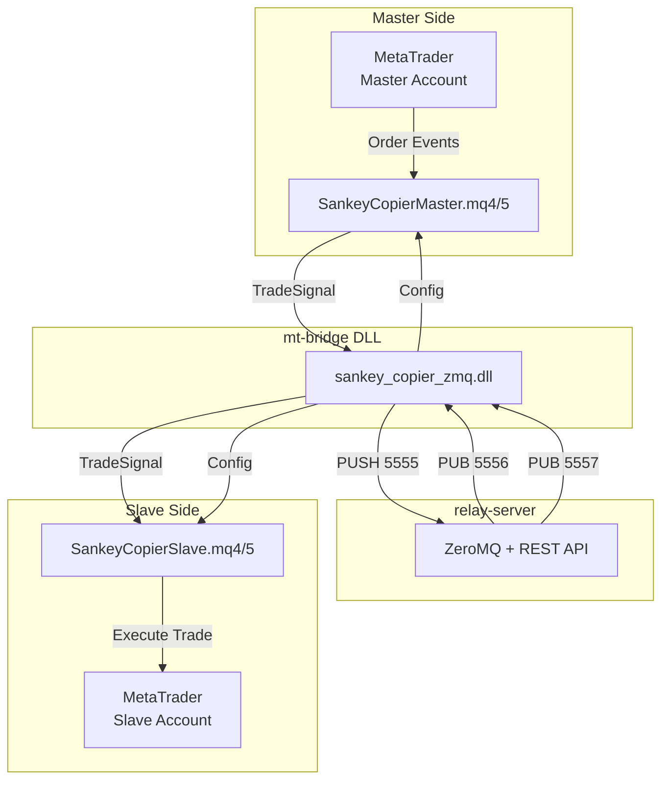
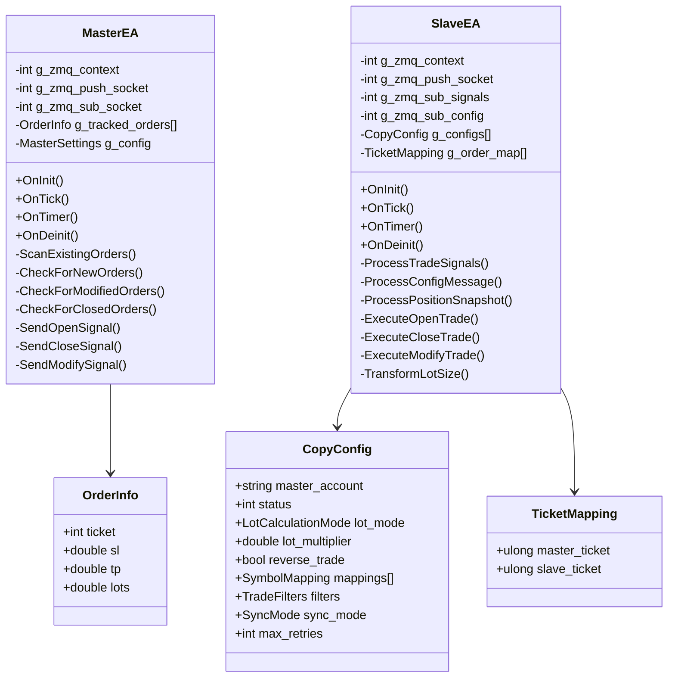
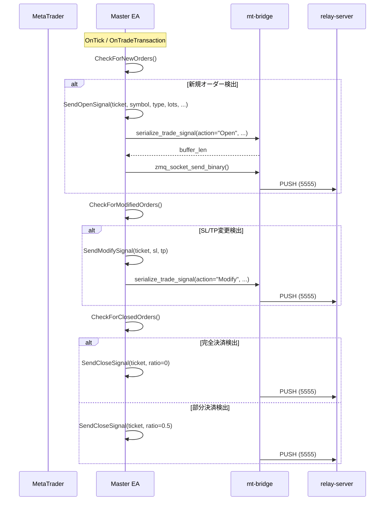
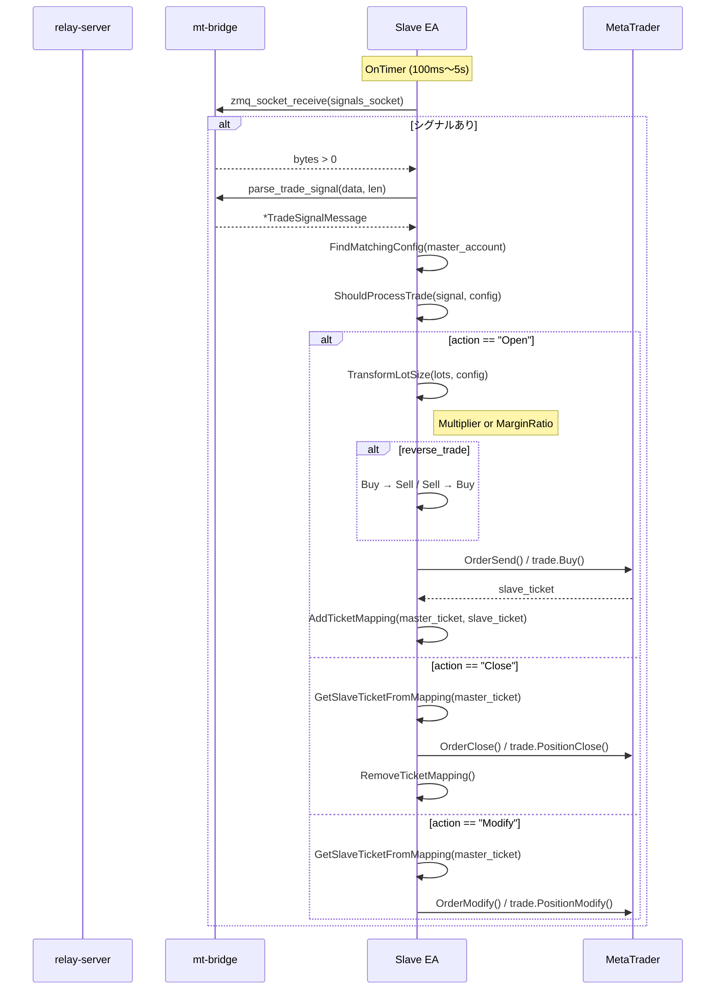
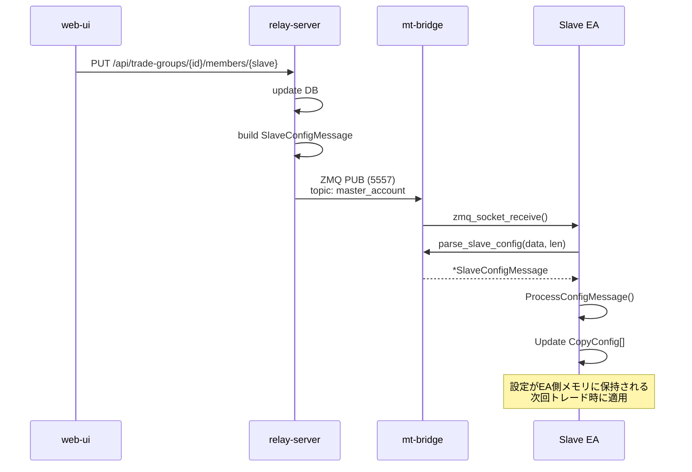
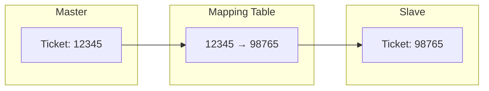
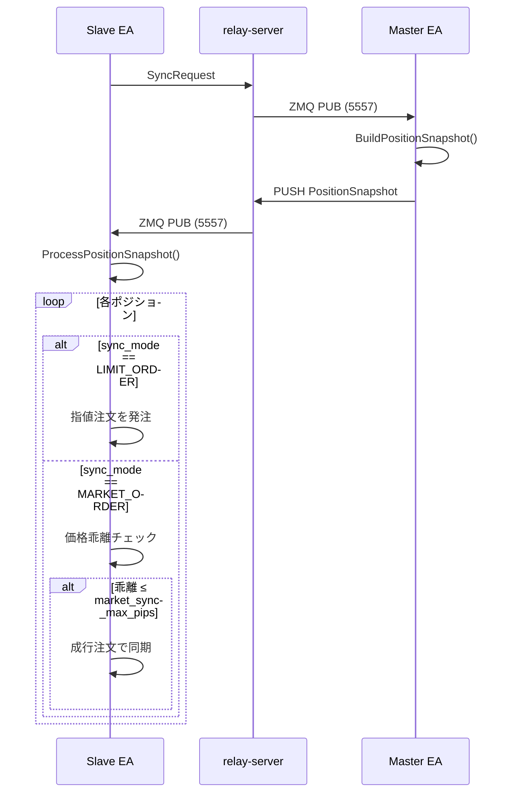

# mt-advisors

MT4/MT5用のExpert Advisor (EA)。MasterとSlaveの2種類があり、トレードコピーの送受信を行う。

## 責務

### Master EA
1. **オーダー監視**: 新規・変更・決済を検出
2. **シグナル送信**: トレードシグナルをrelay-serverに送信
3. **Heartbeat送信**: 接続状態とアカウント情報を定期送信
4. **ポジションスナップショット**: Slave同期用に現在ポジションを送信

### Slave EA
1. **シグナル受信**: Masterからのトレードシグナルを受信
2. **トレード実行**: 設定に基づいてロット変換・フィルタリング後に取引実行
3. **チケットマッピング**: Master↔Slaveのチケット対応管理
4. **ポジション同期**: 初回接続時のポジション同期

## アーキテクチャ



## ディレクトリ構造

```
mt-advisors/
├── MT4/
│   ├── SankeyCopierMaster.mq4    # Master EA for MT4
│   ├── SankeyCopierSlave.mq4     # Slave EA for MT4
│   └── app.ico
├── MT5/
│   ├── SankeyCopierMaster.mq5    # Master EA for MT5
│   ├── SankeyCopierSlave.mq5     # Slave EA for MT5
│   └── app.ico
└── Include/
    └── SankeyCopier/
        ├── Common.mqh            # 共通定義、ZMQインポート
        ├── Zmq.mqh               # ZMQ初期化・接続
        ├── Messages.mqh          # メッセージ送信ユーティリティ
        ├── MasterSignals.mqh     # Master固有シグナル送信
        ├── MessageParsing.mqh    # ZMQメッセージ解析
        ├── Mapping.mqh           # チケットマッピング管理
        ├── SlaveTrade.mqh        # Slave取引実行関数
        ├── Trade.mqh             # フィルタリング・変換
        ├── SlaveTypes.mqh        # Slave型定義
        ├── GridPanel.mqh         # UIパネル表示
        ├── Logging.mqh           # VictoriaLogs統合
        ├── InitBase.mqh          # 初期化ヘルパー
        ├── CleanupBase.mqh       # クリーンアップ
        └── TimerHandling.mqh     # タイマー処理
```

## EA構造



## 処理フロー

### Master: オーダー検出とシグナル送信



### Slave: シグナル受信とトレード実行



### 設定配布フロー



## ロット計算モード

| モード | 計算式 | 用途 |
|--------|--------|------|
| `MULTIPLIER` | `slave_lot = master_lot × multiplier` | 固定倍率 |
| `MARGIN_RATIO` | `slave_lot = master_lot × (slave_equity / master_equity)` | 資金比例 |

```mql5
double TransformLotSize(double master_lots, CopyConfig &config) {
    double result;

    if (config.lot_calculation_mode == LOT_CALC_MODE_MULTIPLIER) {
        result = master_lots * config.lot_multiplier;
    } else {  // MARGIN_RATIO
        double ratio = AccountInfoDouble(ACCOUNT_EQUITY) / config.master_equity;
        result = master_lots * ratio;
    }

    // ブローカーのロット制限に正規化
    return NormalizeDouble(result, 2);
}
```

## フィルタリング (EA側で処理)

### relay-serverが処理
- シンボルマッピング (`symbol_mappings`)
- プレフィックス/サフィックスの変換

### EA側が処理
- `source_lot_min` / `source_lot_max`: ソースロットの範囲チェック
- `lot_multiplier` / `margin_ratio`: ロット計算
- `reverse_trade`: 売買方向の反転
- `max_signal_delay_ms`: シグナル遅延チェック
- `max_retries`: リトライ回数
- `max_slippage`: スリッページ許容

## チケットマッピング



マッピングはメモリ上の配列で管理。EA再起動時は、ポジションのコメントから復旧:
- コメント形式: `M{master_ticket}` (例: `M12345`)
- 待機中オーダー: `P{master_ticket}` (例: `P12345`)

```mql5
void RecoverMappingsFromPositions() {
    for (int i = PositionsTotal() - 1; i >= 0; i--) {
        if (PositionSelectByTicket(PositionGetTicket(i))) {
            string comment = PositionGetString(POSITION_COMMENT);
            if (StringFind(comment, "M") == 0) {
                ulong master_ticket = (ulong)StringSubstr(comment, 1);
                AddTicketMapping(master_ticket, PositionGetTicket(i));
            }
        }
    }
}
```

## ポジション同期

Slave接続時に既存ポジションを同期する機能。

### 同期モード

| モード | 説明 |
|--------|------|
| `SKIP` | 同期しない |
| `LIMIT_ORDER` | 指値注文でMaster価格に合わせる |
| `MARKET_ORDER` | 成行注文で即時同期（価格乖離チェックあり） |



## UIパネル (GridPanel)

チャート上に動的なステータスパネルを表示。

### Master表示項目
- Status: CONNECTED / WAITING / NO_CONFIG
- Server: localhost:5555
- Tracked Orders: 15
- Symbol Prefix/Suffix

### Slave表示項目
- Status: CONNECTED / ENABLED / DISABLED
- Server: localhost:5555
- Master: IC_Markets_123... (複数Master対応)
- Lot Mode: Multiplier / MarginRatio
- Lot Multiplier: 2.0
- Reverse: Yes / No
- Sync Mode: Skip / LimitOrder / MarketOrder

## ステータス値

| 値 | 名称 | 説明 |
|----|------|------|
| 0 | DISABLED | ユーザーが無効化 |
| 1 | ENABLED | 有効だがMasterオフライン |
| 2 | CONNECTED | 完全に有効 |

`allow_new_orders`フラグ:
- `status == 2` かつ Masterの`is_trade_allowed == true`の場合のみ新規注文を実行

## Heartbeat

30秒間隔でrelay-serverに送信。Masterの`is_trade_allowed`変更時は即時送信。

```mql5
struct HeartbeatMessage {
    string account_id;      // "BrokerName_AccountNumber"
    string ea_type;         // "Master" or "Slave"
    string platform;        // "MT4" or "MT5"
    int    account_number;
    string broker;
    string server;
    double balance;
    double equity;
    string currency;
    int    leverage;
    bool   is_trade_allowed;  // 自動売買ボタンの状態
    string symbol_prefix;     // Master only
    string symbol_suffix;     // Master only
};
```

## MT4 vs MT5の違い

| 機能 | MT4 | MT5 |
|------|-----|-----|
| イベント検出 | OnTick + ポーリング | OnTradeTransaction |
| 取引API | OrderSend/Close/Modify | CTrade class |
| ポジション管理 | Orders | Positions + Orders |
| 待機注文充填検出 | OnTick | OnTradeTransaction |

MT5の`OnTradeTransaction`により、より高速で確実なイベント検出が可能。

## VictoriaLogsログ

```mql5
// ログカテゴリ
#define CAT_TRADE   "Trade"
#define CAT_CONFIG  "Config"
#define CAT_SYNC    "Sync"
#define CAT_SYSTEM  "System"
#define CAT_ORDER   "Order"

// 使用例
LogInfo(CAT_TRADE, "Trade opened: " + symbol + " " + DoubleToString(lots, 2));
LogWarn(CAT_CONFIG, "Config version mismatch");
LogError(CAT_ORDER, "OrderSend failed: " + IntegerToString(GetLastError()));
```

## 関連コンポーネント

- [relay-server](./relay-server.md): シグナル中継サーバー
- [mt-bridge](./mt-bridge.md): ZMQ通信用DLL
- [web-ui](./web-ui.md): 設定・監視UI
