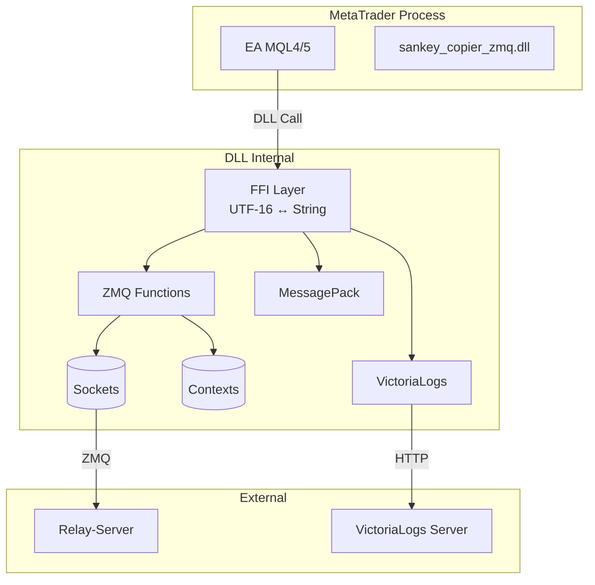
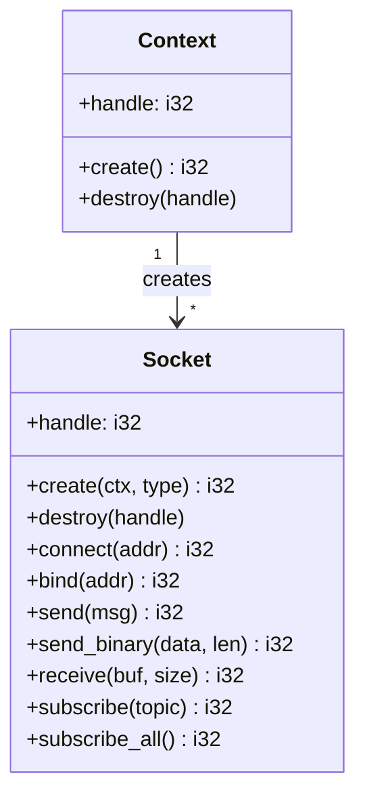
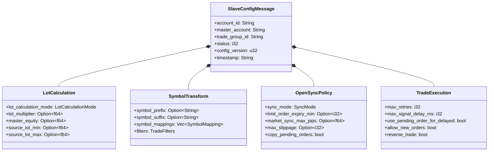
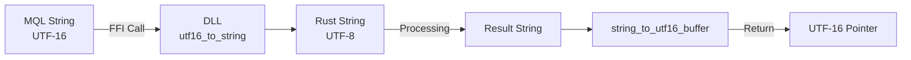
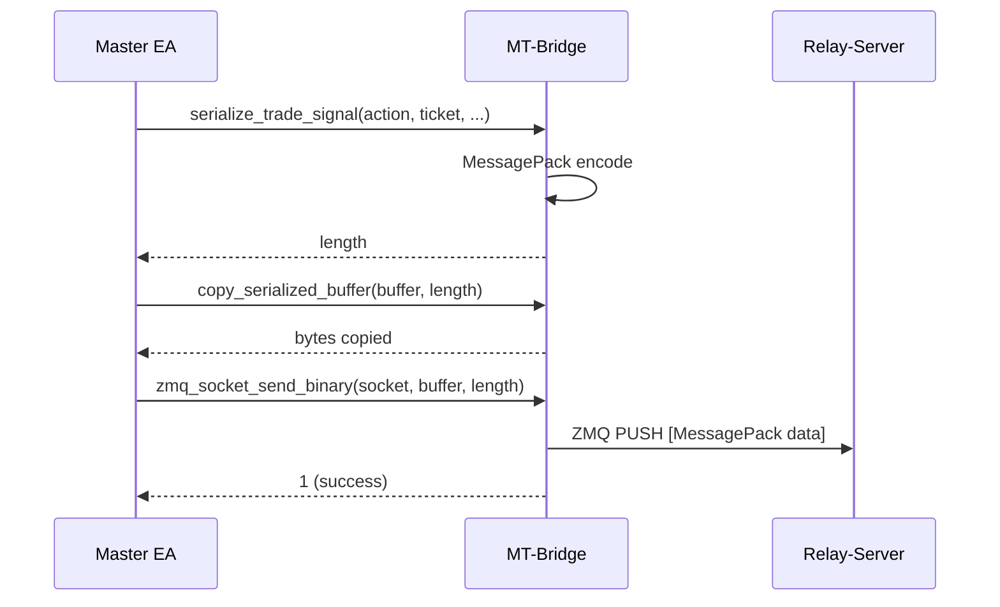
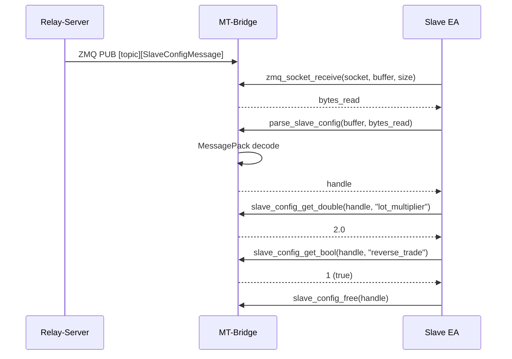

# MT-Bridge

MetaTrader EAとRelay-Server間のZeroMQ通信を担うRust製DLL。

## Responsibilities

- **ZeroMQ通信**: Context/Socket管理、メッセージ送受信
- **MessagePackシリアライズ**: MQLデータのバイナリ変換
- **FFI境界**: UTF-16 (MQL) ↔ Rust String変換
- **VictoriaLogs**: HTTPログ送信

## Architecture



## Project Structure

```
mt-bridge/
├── Cargo.toml              # Package definition
├── build.rs                # Windows resource embedding
└── src/
    ├── lib.rs              # ZMQ functions
    ├── victoria_logs.rs    # VictoriaLogs HTTP client
    └── msgpack/
        ├── mod.rs          # Module exports
        ├── types.rs        # Message type definitions
        ├── traits.rs       # ConfigMessage trait
        ├── ffi.rs          # FFI implementations
        ├── serialization.rs # Serialize functions
        └── helpers.rs      # UTF-16 conversion
```

## DLL Exports (59 Functions)

### ZMQ Context/Socket Management



| Function | Signature | Purpose |
|----------|-----------|---------|
| `zmq_context_create` | `() -> i32` | コンテキスト作成、ハンドル返却 |
| `zmq_context_destroy` | `(handle: i32)` | コンテキスト破棄 |
| `zmq_socket_create` | `(ctx: i32, type: i32) -> i32` | ソケット作成 (PUSH/PULL/PUB/SUB) |
| `zmq_socket_destroy` | `(handle: i32)` | ソケット破棄 |
| `zmq_socket_connect` | `(sock: i32, addr: *u16) -> i32` | エンドポイント接続 |
| `zmq_socket_bind` | `(sock: i32, addr: *u16) -> i32` | エンドポイントバインド |
| `zmq_socket_send` | `(sock: i32, msg: *u16) -> i32` | テキスト送信 (UTF-16) |
| `zmq_socket_send_binary` | `(sock: i32, data: *u8, len: i32) -> i32` | バイナリ送信 |
| `zmq_socket_receive` | `(sock: i32, buf: *u8, size: i32) -> i32` | 受信 (non-blocking) |
| `zmq_socket_subscribe` | `(sock: i32, topic: *u16) -> i32` | トピック購読 |
| `zmq_socket_subscribe_all` | `(sock: i32) -> i32` | 全トピック購読 |

### Socket Types

```c
#define ZMQ_PUSH  8  // EA → Server (Trade signals, Heartbeat)
#define ZMQ_PULL  7  // Server ← EA
#define ZMQ_PUB   1  // Server → EA broadcast
#define ZMQ_SUB   2  // EA subscribes to topics
```

### MessagePack Serialization

| Function | Purpose |
|----------|---------|
| `serialize_heartbeat(...)` | Heartbeatメッセージ作成 |
| `serialize_trade_signal(...)` | TradeSignal作成 |
| `serialize_request_config(...)` | RequestConfig作成 |
| `serialize_unregister(...)` | Unregister作成 |
| `get_serialized_buffer()` | シリアライズバッファポインタ取得 |
| `copy_serialized_buffer(dest, len)` | バッファコピー |

### Configuration Parsing

**Master Config:**
| Function | Purpose |
|----------|---------|
| `parse_master_config(data, len)` | MasterConfigMessage解析 |
| `master_config_get_string(handle, field)` | 文字列フィールド取得 |
| `master_config_get_int(handle, field)` | 整数フィールド取得 |
| `master_config_free(handle)` | ハンドル解放 |

**Slave Config:**
| Function | Purpose |
|----------|---------|
| `parse_slave_config(data, len)` | SlaveConfigMessage解析 |
| `slave_config_get_string(handle, field)` | 文字列取得 |
| `slave_config_get_double(handle, field)` | 実数取得 |
| `slave_config_get_bool(handle, field)` | ブール取得 |
| `slave_config_get_int(handle, field)` | 整数取得 |
| `slave_config_get_symbol_mappings_count(handle)` | マッピング数 |
| `slave_config_get_symbol_mapping_source(handle, idx)` | マッピング元 |
| `slave_config_get_symbol_mapping_target(handle, idx)` | マッピング先 |
| `slave_config_get_allowed_magic_count(handle)` | 許可マジック数 |
| `slave_config_get_allowed_magic_at(handle, idx)` | 許可マジック取得 |
| `slave_config_free(handle)` | ハンドル解放 |

**Trade Signal:**
| Function | Purpose |
|----------|---------|
| `parse_trade_signal(data, len)` | TradeSignalMessage解析 |
| `trade_signal_get_string(handle, field)` | 文字列取得 |
| `trade_signal_get_double(handle, field)` | 実数取得 |
| `trade_signal_get_int(handle, field)` | 整数取得 |
| `trade_signal_free(handle)` | ハンドル解放 |

**Position Snapshot:**
| Function | Purpose |
|----------|---------|
| `create_position_snapshot_builder(account)` | ビルダー作成 |
| `position_snapshot_builder_add_position(...)` | ポジション追加 |
| `position_snapshot_builder_serialize(handle, buf, len)` | シリアライズ |
| `position_snapshot_builder_free(handle)` | ハンドル解放 |
| `parse_position_snapshot(data, len)` | スナップショット解析 |
| `position_snapshot_get_positions_count(handle)` | ポジション数 |
| `position_snapshot_get_position_string(handle, idx, field)` | 文字列取得 |
| `position_snapshot_get_position_double(handle, idx, field)` | 実数取得 |
| `position_snapshot_get_position_int(handle, idx, field)` | 整数取得 |
| `position_snapshot_free(handle)` | ハンドル解放 |

**Sync Request:**
| Function | Purpose |
|----------|---------|
| `create_sync_request(slave, master, buf, len)` | SyncRequest作成 |
| `parse_sync_request(data, len)` | SyncRequest解析 |
| `sync_request_get_string(handle, field)` | 文字列取得 |
| `sync_request_free(handle)` | ハンドル解放 |

**VictoriaLogs Config:**
| Function | Purpose |
|----------|---------|
| `parse_vlogs_config(data, len)` | VLogsConfig解析 |
| `vlogs_config_get_string(handle, field)` | 文字列取得 |
| `vlogs_config_get_bool(handle, field)` | ブール取得 |
| `vlogs_config_get_int(handle, field)` | 整数取得 |
| `vlogs_config_free(handle)` | ハンドル解放 |

### VictoriaLogs Functions

| Function | Signature | Purpose |
|----------|-----------|---------|
| `vlogs_configure` | `(endpoint, source) -> i32` | エンドポイント設定 |
| `vlogs_disable` | `() -> i32` | ログ無効化 |
| `vlogs_add_entry` | `(level, category, msg, ctx) -> i32` | エントリ追加 |
| `vlogs_flush` | `() -> i32` | バッファ送信 |
| `vlogs_buffer_size` | `() -> i32` | バッファサイズ取得 |

## Message Types

### SlaveConfigMessage



### TradeSignalMessage

```rust
struct TradeSignalMessage {
    action: String,           // "Open" | "Close" | "Modify"
    ticket: i64,
    symbol: Option<String>,
    order_type: Option<String>, // "Buy", "Sell", "BuyLimit", etc.
    lots: Option<f64>,
    open_price: Option<f64>,
    stop_loss: Option<f64>,
    take_profit: Option<f64>,
    magic_number: Option<i64>,
    comment: Option<String>,
    timestamp: String,
    source_account: String,
    close_ratio: Option<f64>, // 0.0-1.0 for partial close
}
```

### HeartbeatMessage

```rust
struct HeartbeatMessage {
    message_type: String,      // "Heartbeat"
    account_id: String,
    balance: f64,
    equity: f64,
    open_positions: i32,
    timestamp: String,
    version: String,           // BUILD_INFO
    ea_type: String,           // "Master" | "Slave"
    platform: String,          // "MT4" | "MT5"
    account_number: i64,
    broker: String,
    account_name: String,
    server: String,
    currency: String,
    leverage: i64,
    is_trade_allowed: bool,
    symbol_prefix: Option<String>,
    symbol_suffix: Option<String>,
    symbol_map: Option<String>, // CSV format
}
```

### PositionSnapshotMessage

```rust
struct PositionSnapshotMessage {
    message_type: String,      // "PositionSnapshot"
    source_account: String,
    positions: Vec<PositionInfo>,
    timestamp: String,
}

struct PositionInfo {
    ticket: i64,
    symbol: String,
    order_type: String,
    lots: f64,
    open_price: f64,
    open_time: String,
    stop_loss: Option<f64>,
    take_profit: Option<f64>,
    magic_number: Option<i64>,
    comment: Option<String>,
}
```

## FFI Design

### UTF-16 Handling

MQLはUTF-16文字列を使用するため、DLLは境界で変換を行う。



**Code Reference**: `msgpack/helpers.rs:21-69`

### Handle-Based API

直接ポインタの代わりにハンドル（i32インデックス）を使用してメモリ安全性を確保。

```rust
static CONTEXTS: LazyLock<Mutex<Vec<Option<Box<zmq::Context>>>>> = ...;
static SOCKETS: LazyLock<Mutex<Vec<Option<Box<zmq::Socket>>>>> = ...;
```

- `create`: 空きスロットにオブジェクト格納、インデックス返却
- `destroy`: スロットをNoneに設定
- 破棄されたスロットは再利用される

**Code Reference**: `lib.rs:53-56, 74-79, 180-185`

### Round-Robin String Buffers

UTF-16文字列返却用に4つのバッファをローテーション使用。

```rust
static STRING_BUFFER_1-4: Mutex<Vec<u16>>;  // 各512文字
static BUFFER_INDEX: Mutex<usize>;          // ローテーションカウンタ
```

**注意**: EAは5回目のFFI呼び出し前に返却文字列をコピーする必要がある。

**Code Reference**: `msgpack/helpers.rs:9-19, 50-70`

### Error Return Values

| Category | Success | Failure |
|----------|---------|---------|
| Context/Socket create | handle >= 0 | -1 |
| Socket operations | 1 | 0 |
| Receive | bytes >= 0 | 0 (no data) or -1 (error) |
| Parse functions | valid pointer | null |
| Serialize | bytes >= 0 | 0 |
| VictoriaLogs | 1 | 0 or -1 |

## Communication Flow

### Trade Signal Flow



### Config Reception Flow



## MQL Usage Examples

### Master EA - Send Heartbeat

```mql5
// Heartbeatシリアライズ
int length = serialize_heartbeat(
    "Heartbeat",
    account_id,
    balance, equity, open_positions,
    timestamp, "Master", "MT5",
    account_number, broker, account_name, server,
    currency, leverage, is_trade_allowed,
    symbol_prefix, symbol_suffix, symbol_map
);

// バッファにコピー
uchar buffer[];
ArrayResize(buffer, length);
copy_serialized_buffer(buffer, length);

// ZMQ送信
zmq_socket_send_binary(push_socket, buffer, length);
```

### Slave EA - Receive Config

```mql5
// 受信
uchar data[];
ArrayResize(data, 8192);
int bytes = zmq_socket_receive(sub_socket, data, ArraySize(data));

if (bytes > 0) {
    // パース
    HANDLE_TYPE handle = parse_slave_config(data, bytes);

    // フィールド取得
    double multiplier = slave_config_get_double(handle, "lot_multiplier");
    int reverse = slave_config_get_bool(handle, "reverse_trade");
    string mode = slave_config_get_string(handle, "lot_calculation_mode");

    // ハンドル解放
    slave_config_free(handle);
}
```

### Slave EA - Receive Trade Signal

```mql5
// 受信
uchar data[];
int bytes = zmq_socket_receive(trade_sub_socket, data, ArraySize(data));

if (bytes > 0) {
    HANDLE_TYPE handle = parse_trade_signal(data, bytes);

    string action = trade_signal_get_string(handle, "action");
    long ticket = trade_signal_get_int(handle, "ticket");
    string symbol = trade_signal_get_string(handle, "symbol");
    double lots = trade_signal_get_double(handle, "lots");

    trade_signal_free(handle);

    // Execute trade...
}
```

## Build System

### Cargo Configuration

```toml
[lib]
name = "sankey_copier_zmq"
crate-type = ["cdylib", "rlib"]  # cdylib for DLL

[dependencies]
zmq = "0.10"
serde = { version = "1.0", features = ["derive"] }
rmp-serde = "1.3"
chrono = "0.4"
reqwest = { version = "0.12", features = ["blocking"] }

[build-dependencies]
winres = "0.1"
```

### Build Script (build.rs)

- Windows version resourceを埋め込み
- Advapi32.libをリンク
- Gitからバージョン情報取得
- BUILD_INFO環境変数設定

```rust
// Version embedding
FileVersionInfo {
    ProductName: "SANKEY Copier ZMQ DLL",
    FileDescription: "ZeroMQ communication library...",
    FileVersion: from git tags + commit count,
}
```

## Thread Safety

### Global State Protection

```rust
// Mutexで保護されたグローバル状態
static CONTEXTS: LazyLock<Mutex<Vec<...>>>;
static SOCKETS: LazyLock<Mutex<Vec<...>>>;
static STRING_BUFFER_*: Mutex<Vec<u16>>;
static SERIALIZE_BUFFER: LazyLock<Mutex<Vec<u8>>>;
```

### Concurrent Access

- 各関数呼び出しはMutexロックを取得
- 短時間ロック、デッドロック防止設計
- EAは通常シングルスレッドで動作

## Key Files Reference

| File | Purpose |
|------|---------|
| `lib.rs` | ZMQ context/socket functions (660+ lines) |
| `msgpack/types.rs` | All message type definitions |
| `msgpack/ffi.rs` | FFI getter functions (1100+ lines) |
| `msgpack/serialization.rs` | Serialize functions |
| `msgpack/helpers.rs` | UTF-16 conversion utilities |
| `victoria_logs.rs` | HTTP logging client |
| `build.rs` | Version resource embedding |

## Dependencies

| Crate | Version | Purpose |
|-------|---------|---------|
| zmq | 0.10 | ZeroMQ Rust bindings |
| serde | 1.0 | Serialization framework |
| serde_json | 1.0 | JSON (for context data) |
| rmp-serde | 1.3 | MessagePack with serde |
| chrono | 0.4 | Timestamps |
| reqwest | 0.12 (blocking) | HTTP for VictoriaLogs |
