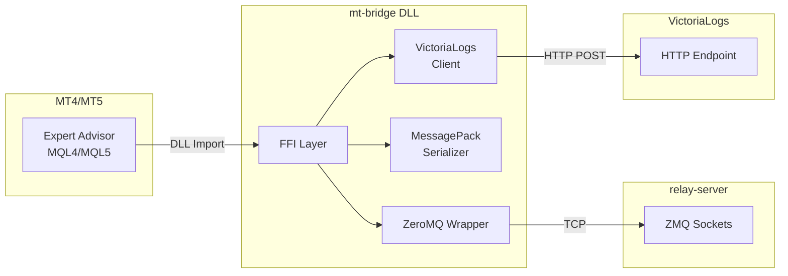
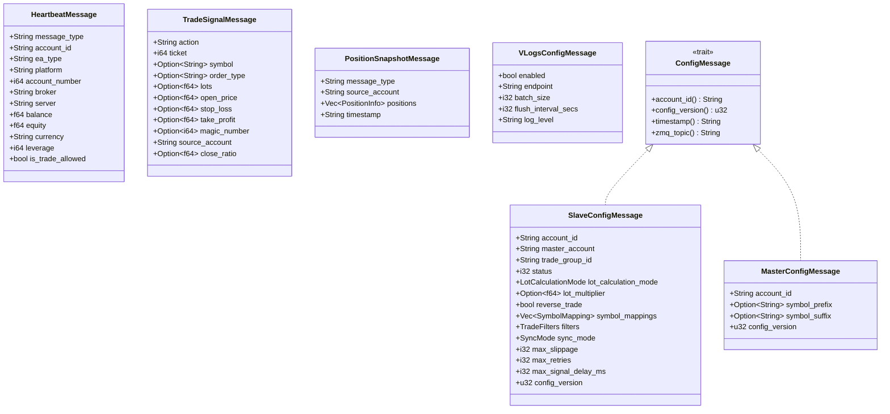
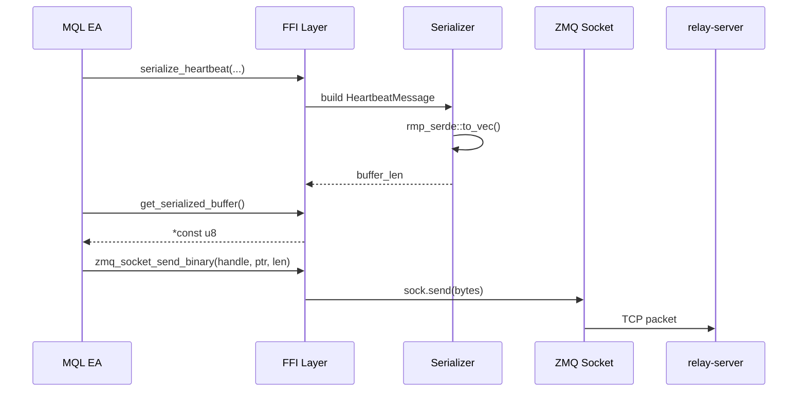
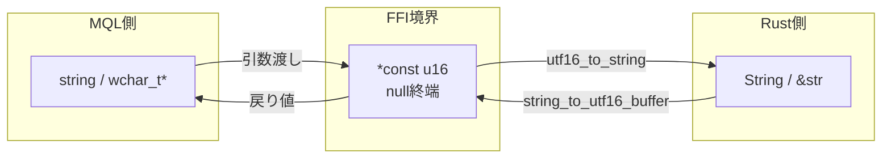
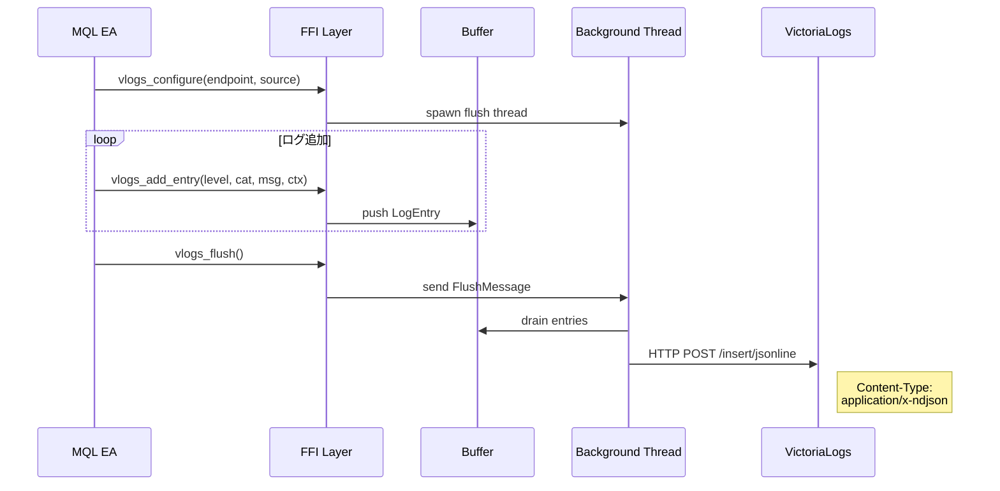

# mt-bridge

MT4/MT5のEAとrelay-server間の通信を担うRust製DLL。ZeroMQによる高速メッセージングとMessagePackによる効率的なシリアライズを提供する。

## 責務

1. **ZeroMQ通信**: PUSH/PULL/PUB/SUBソケットの管理
2. **MessagePackシリアライズ**: メッセージの効率的なバイナリ変換
3. **FFIインターフェース**: MQL4/MQL5から呼び出し可能なC API提供
4. **VictoriaLogsクライアント**: HTTP経由のログ送信

## アーキテクチャ



## ディレクトリ構造

```
mt-bridge/
├── src/
│   ├── lib.rs                    # ZMQ FFIラッパー (メインエントリ)
│   ├── ffi.rs                    # ZMQ/MessagePack 統合FFI
│   ├── ffi_helpers.rs            # UTF-16変換・ハンドル管理ヘルパー
│   ├── types.rs                  # メッセージ型定義
│   ├── traits.rs                 # ConfigMessageトレイト
│   ├── victoria_logs.rs          # VictoriaLogsクライアント
│   ├── symbol_filter_tests.rs    # シンボルフィルターテスト
│   └── msgpack/
│       ├── mod.rs                # モジュール定義
│       ├── serialization.rs      # シリアライズ関数
│       └── tests/                # シリアライズテスト
├── build.rs                      # バージョン埋め込み
└── Cargo.toml
```

## ビルド成果物

| ファイル | 説明 |
|---------|------|
| `sankey_copier_zmq.dll` | Windows DLL (32-bit/64-bit) |

DLLにはWindowsリソース情報が埋め込まれる:
- ProductName: SANKEY Copier ZMQ DLL
- バージョン: Gitタグから自動取得

## データモデル



## FFI関数一覧

### ZMQ基本操作 (lib.rs)

| 関数 | 説明 | 戻り値 |
|------|------|--------|
| `zmq_context_create()` | コンテキスト作成 | handle (≥0) / -1 |
| `zmq_context_destroy(handle)` | コンテキスト破棄 | 0 / -1 |
| `zmq_socket_create(ctx, type)` | ソケット作成 | handle / -1 |
| `zmq_socket_destroy(handle)` | ソケット破棄 | 0 / -1 |
| `zmq_socket_bind(handle, endpoint)` | バインド | 0 / -1 |
| `zmq_socket_connect(handle, endpoint)` | 接続 | 0 / -1 |
| `zmq_socket_send(handle, msg)` | テキスト送信 | 0 / -1 |
| `zmq_socket_send_binary(handle, data, len)` | バイナリ送信 | 0 / -1 |
| `zmq_socket_receive(handle, buf, size)` | 受信 | bytes / 0 / -1 |
| `zmq_socket_subscribe_all(handle)` | 全トピック購読 | 0 / -1 |
| `zmq_socket_subscribe(handle, topic)` | トピック購読 | 0 / -1 |

### トピックヘルパー (constants.rs / ffi.rs)

| 関数 | 説明 | 戻り値 |
|------|------|--------|
| `build_sync_topic_ffi(master, slave)` | sync/トピック生成 | UTF-16文字列 |
| `get_sync_topic_prefix()` | sync/プレフィックス取得 | UTF-16文字列 |

**トピック形式**:
- Config: `config/{account_id}`
- Trade: `trade/{master_id}/{slave_id}`
- Sync: `sync/{master_id}/{slave_id}`

注: 同一の PUB ソケット (unified PUB) で複数のトピックを配信する方式を採っています。トピックは論理的なルーティング文字列です。

ソケットタイプ:
- `ZMQ_PUB` = 1
- `ZMQ_SUB` = 2
- `ZMQ_PULL` = 7
- `ZMQ_PUSH` = 8

### MessagePackシリアライズ (ffi.rs)

| 関数 | 説明 |
|------|------|
| `serialize_heartbeat(...)` | Heartbeatをシリアライズ |
| `serialize_request_config(...)` | ConfigRequestをシリアライズ |
| `serialize_trade_signal(...)` | TradeSignalをシリアライズ |
| `serialize_unregister(...)` | Unregisterをシリアライズ |
| `get_serialized_buffer()` | シリアライズ結果のポインタ取得 |
| `copy_serialized_buffer(dest, len)` | シリアライズ結果をコピー |

### MessagePackパース (ffi.rs)

| 関数群 | 説明 |
|--------|------|
| `parse_slave_config(data, len)` → `slave_config_free(ptr)` | Slave設定パース |
| `parse_master_config(data, len)` → `master_config_free(ptr)` | Master設定パース |
| `parse_trade_signal(data, len)` → `trade_signal_free(ptr)` | トレードシグナルパース |
| `parse_position_snapshot(data, len)` → `position_snapshot_free(ptr)` | ポジションスナップショットパース |
| `parse_vlogs_config(data, len)` → `vlogs_config_free(ptr)` | VLogs設定パース |

### フィールドアクセサ (ffi.rs)

```c
// Slave Config
slave_config_get_string(ptr, field) → *const u16
slave_config_get_double(ptr, field) → f64
slave_config_get_int(ptr, field) → i32
slave_config_get_bool(ptr, field) → bool

// Symbol Mappings
slave_config_get_symbol_mappings_count(ptr) → i32
slave_config_get_mapping_source(ptr, idx) → *const u16
slave_config_get_mapping_target(ptr, idx) → *const u16

// Filters
slave_config_get_allowed_magic_count(ptr) → i32
slave_config_get_allowed_magic_at(ptr, idx) → i32

// Trade Signal
trade_signal_get_string(ptr, field) → *const u16
trade_signal_get_double(ptr, field) → f64
trade_signal_get_int(ptr, field) → i32

// Position Snapshot
position_snapshot_get_positions_count(ptr) → i32
position_snapshot_get_position_string(ptr, idx, field) → *const u16
position_snapshot_get_position_double(ptr, idx, field) → f64
```

### VictoriaLogs (victoria_logs.rs)

| 関数 | 説明 |
|------|------|
| `vlogs_configure(endpoint, source)` | ログ送信先設定 |
| `vlogs_disable()` | ログ送信無効化 |
| `vlogs_add_entry(level, category, msg, ctx)` | ログエントリ追加 |
| `vlogs_flush()` | バッファをフラッシュ |
| `vlogs_buffer_size()` | バッファサイズ取得 |

## 通信フロー

### EA → relay-server (送信)



### relay-server → EA (受信)

```mermaid
sequenceDiagram
    participant RS as relay-server
    participant ZMQ as ZMQ Socket
    participant FFI as FFI Layer
    participant PAR as Parser
    participant EA as MQL EA

    RS->>ZMQ: PUB message
    EA->>FFI: zmq_socket_receive(handle, buf, size)
    FFI->>ZMQ: sock.recv_bytes(DONTWAIT)

    alt メッセージあり
        ZMQ-->>FFI: bytes
        FFI-->>EA: len > 0
        EA->>FFI: parse_slave_config(data, len)
        FFI->>PAR: rmp_serde::from_slice()
        PAR-->>FFI: SlaveConfigMessage
        FFI-->>EA: *mut SlaveConfigMessage

        EA->>FFI: slave_config_get_string(ptr, "status")
        FFI-->>EA: UTF-16 string

        EA->>FFI: slave_config_free(ptr)
    else メッセージなし
        ZMQ-->>FFI: EAGAIN
        FFI-->>EA: 0
    end
```

## UTF-16文字列処理

MQL5はUTF-16文字列を使用するため、Rust側で変換処理を行う。



戻り値用のバッファはラウンドロビン方式で4スロットを使用:
```rust
static STRING_BUFFER_1: [u16; 512]
static STRING_BUFFER_2: [u16; 512]
static STRING_BUFFER_3: [u16; 512]
static STRING_BUFFER_4: [u16; 512]
static BUFFER_INDEX: usize  // 0→1→2→3→0...
```

## VictoriaLogsクライアント



ログエントリ形式 (JSON Lines):
```json
{"_msg":"Trade opened","level":"INFO","category":"Trade","source":"ea:master:IC_Markets_123","ts":"2024-01-01T00:00:00Z"}
```

## エラーハンドリング

| 状況 | 戻り値 |
|------|--------|
| 正常終了 | 0 または有効なハンドル |
| nullポインタ | -1 または null |
| インデックス範囲外 | -1 または null |
| ZMQエラー | -1 |
| MessagePackパースエラー | null |
| UTF-16変換エラー | null |

非ブロッキング受信:
- メッセージあり: 受信バイト数 (> 0)
- メッセージなし: 0 (EAGAIN)
- エラー: -1

## MQLからの使用例

```mql5
#import "sankey_copier_zmq.dll"
    int zmq_context_create();
    int zmq_socket_create(int ctx, int type);
    int zmq_socket_connect(int sock, string endpoint);
    int zmq_socket_send_binary(int sock, uchar &data[], int len);
    int serialize_heartbeat(string account_id, double balance, ...);
    uchar get_serialized_buffer();
#import

int g_context;
int g_socket;

int OnInit() {
    g_context = zmq_context_create();
    g_socket = zmq_socket_create(g_context, 8);  // PUSH
    zmq_socket_connect(g_socket, "tcp://localhost:5555");
    return INIT_SUCCEEDED;
}

void SendHeartbeat() {
    int len = serialize_heartbeat(
        account_id, balance, equity, positions,
        timestamp, version, ea_type, platform,
        account_number, broker, account_name,
        server, currency, leverage, is_trade_allowed,
        symbol_prefix, symbol_suffix, symbol_map
    );

    if (len > 0) {
        uchar buffer[];
        ArrayResize(buffer, len);
        copy_serialized_buffer(buffer, len);
        zmq_socket_send_binary(g_socket, buffer, len);
    }
}
```

## 関連コンポーネント

- [relay-server](./relay-server.md): 通信先サーバー
- [mt-advisors](./mt-advisors.md): このDLLを使用するEA
- [web-ui](./web-ui.md): 設定・監視UI
