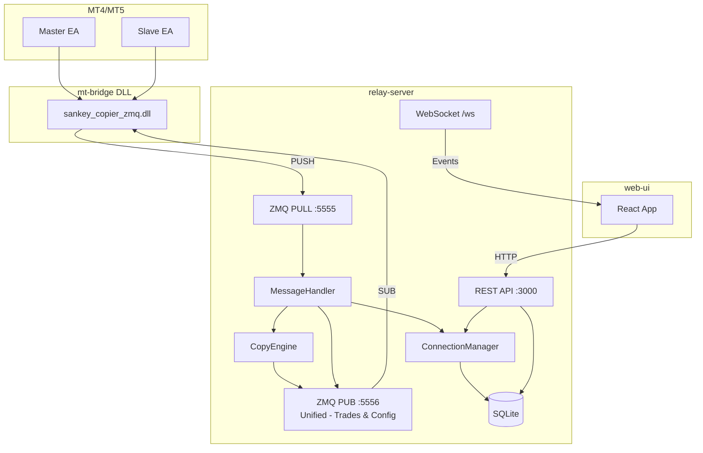
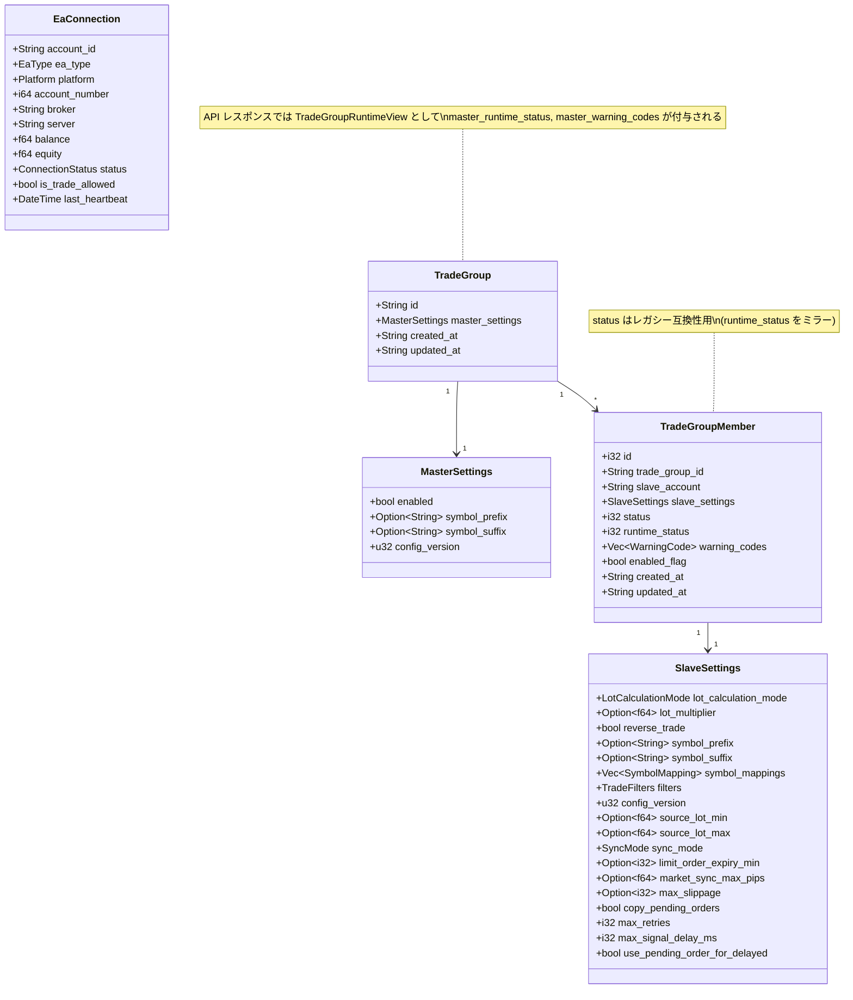
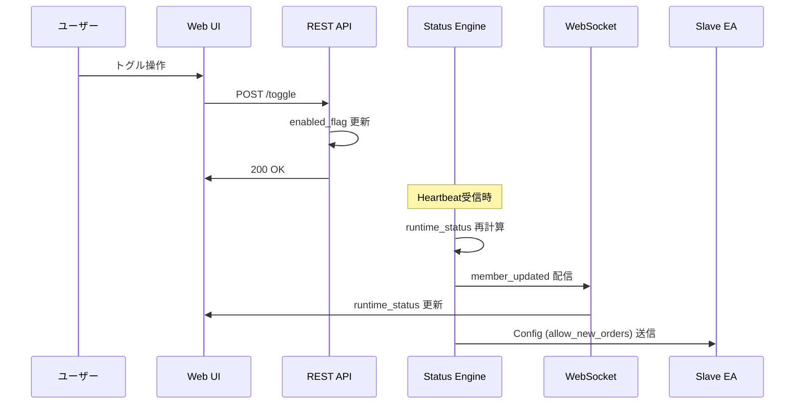
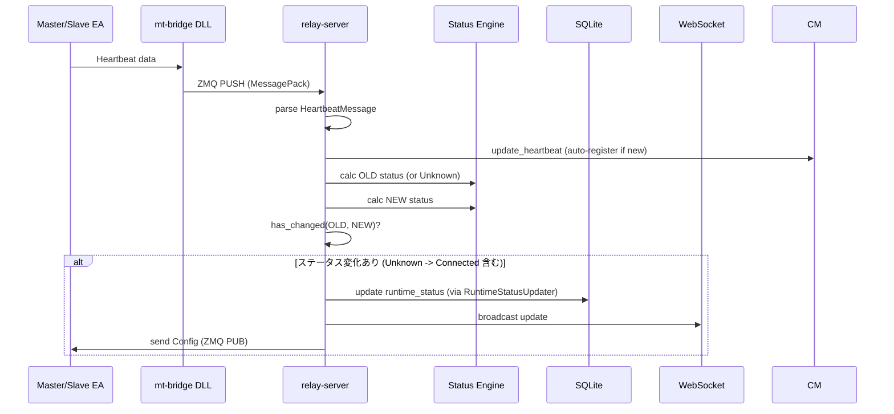
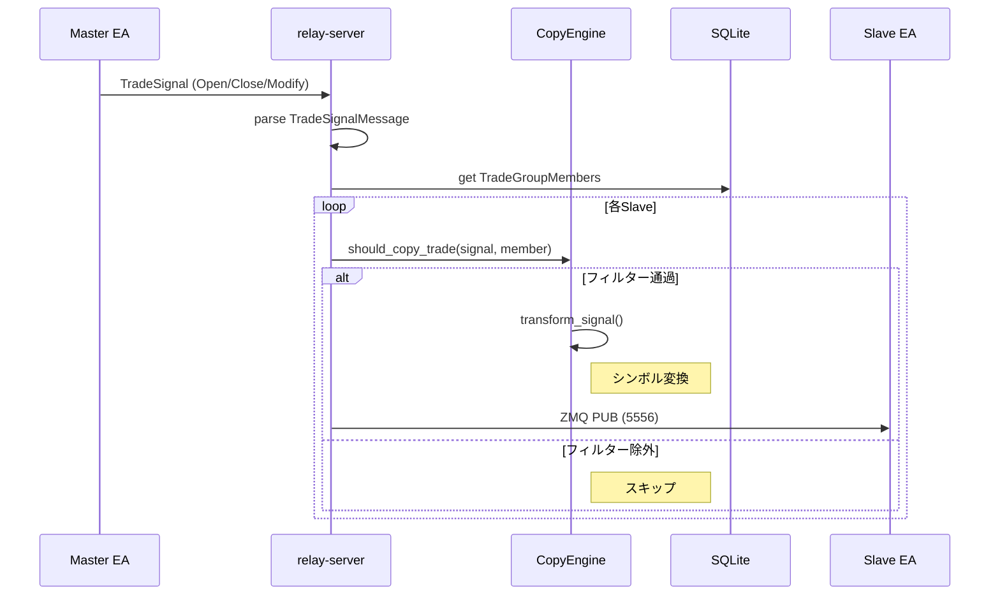
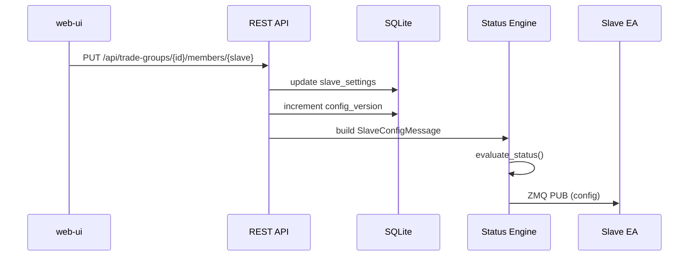

# relay-server

トレードコピーシステムの中核となるRust製サーバー。MT4/MT5のEAとweb-ui間の仲介役として、設定管理・トレードシグナルの中継・接続管理を行う。

## 1. 概要

### 1.1 責務

1. **EA接続管理**: Master/Slave EAのHeartbeatを受信し、接続状態を追跡
2. **設定配布**: web-uiからの設定変更をEAにリアルタイム配信
3. **トレードシグナル中継**: MasterからのトレードシグナルをフィルタリングしてSlaveに配信
4. **REST API提供**: web-uiへの設定・接続情報APIを提供
5. **WebSocket通知**: リアルタイムイベントをweb-uiにブロードキャスト

### 1.2 アーキテクチャ



---

## 2. ディレクトリ構造

```
relay-server/
├── src/
│   ├── main.rs                    # エントリポイント
│   ├── config.rs                  # TOML設定管理
│   ├── config_builder.rs          # ConfigMessage生成
│   ├── runtime_status_updater.rs  # Status Engine サービス
│   ├── cert.rs                    # TLS証明書管理
│   ├── api/                       # REST APIエンドポイント
│   │   ├── mod.rs                 # ルータ定義
│   │   ├── connections.rs         # EA接続情報API
│   │   ├── trade_groups.rs        # Master設定API
│   │   ├── trade_group_members.rs # Slave設定API
│   │   ├── websocket.rs           # WebSocket
│   │   └── ...
│   ├── models/                    # データモデル
│   │   ├── connection.rs          # EaConnection
│   │   ├── trade_group.rs         # TradeGroup (Master)
│   │   ├── trade_group_member.rs  # TradeGroupMember (Slave)
│   │   └── status_engine.rs       # Status Engine ロジック
│   ├── db/                        # データベース操作
│   │   ├── trade_groups.rs        # TradeGroup CRUD
│   │   ├── trade_group_members.rs # Member CRUD
│   │   └── config_distribution.rs # 設定配布ロジック
│   ├── zeromq/                    # ZeroMQ通信
│   │   ├── mod.rs                 # ZmqServer, ZmqPublisher
│   │   └── config_publisher.rs    # 設定配信
│   ├── connection_manager/        # EA接続管理
│   │   └── mod.rs                 # ConnectionManager
│   ├── engine/                    # コピーエンジン
│   │   └── mod.rs                 # CopyEngine
│   └── message_handler/           # ZMQメッセージ処理
│       ├── mod.rs                 # MessageHandler
│       ├── heartbeat.rs           # Heartbeat処理
│       ├── trade_signal.rs        # トレードシグナル処理
│       ├── config_request.rs      # 設定リクエスト処理
│       └── unregister.rs          # 切断処理
├── config.toml                    # 本番設定
├── config.dev.toml                # 開発環境設定
└── Cargo.toml
```

---

## 3. データモデル



---

## 4. Status Engine

Status Engine は Master/Slave の実効ステータスを算出する中核ロジックです。ユーザー意図 (`enabled_flag`) と接続状態 (Heartbeat) を組み合わせて `runtime_status` を決定します。

### 4.1 ステータス値の定義

| 値 | 名称 | 対象 | 説明 |
|----|------|------|------|
| -1 | NO_CONFIG | Master/Slave | 設定未受信またはリセット状態 |
| 0 | DISABLED | Master/Slave | 無効化（Web UI OFF または EA自動売買OFF） |
| 1 | ENABLED | Slave専用 | Slave準備完了だがMasterが未接続 |
| 2 | CONNECTED | Master/Slave | 完全に有効（トレード実行可能） |

### 4.2 Master 判定ロジック

**判定要素**:
1. **Web UI Switch**: `enabled_flag` が ON/OFF か
2. **EA接続状態**: Heartbeat を受信しているか（オンライン/オフライン）
3. **EA自動売買許可**: MT4/MT5で自動売買が許可されているか (`is_trade_allowed`)

**判定ルール**:

| Web UI Switch | 接続状態 | EA自動売買 | ステータス | 説明 |
|:-------------:|:--------:|:----------:|:----------:|------|
| ❌ OFF | - | - | `DISABLED (0)` | Web UIでOFF |
| ✅ ON | オフライン | - | `DISABLED (0)` | EA未接続 |
| ✅ ON | オンライン | ❌ OFF | `DISABLED (0)` | EA自動売買がOFF |
| ✅ ON | オンライン | ✅ ON | `CONNECTED (2)` | トレードシグナル送信可能 |

**実装**: `relay-server/src/models/status_engine.rs` の `evaluate_master_status()`

### 4.3 Member (接続単位) 判定ロジック

**判定要素**:
1. **Slave自体の条件**: Web UI Switch、接続状態
2. **接続先Masterの状態**: 対象Masterが `CONNECTED` か `DISABLED` か

> **重要**: v2.0より、ステータス評価は「Slaveに接続されているすべてのMasterのクラスター」ではなく、「各Master-Slave接続 (Member) 単位」で行われます。これにより、同じSlaveでも接続先Masterごとに異なるステータスを持つことができます。

**判定ルール**:

| Slave条件 | 接続先Masterの状態 | Memberステータス | 説明 |
|-----------|-------------------|:---------------:|------|
| Switch❌ または オフライン | - | `DISABLED (0)` | Slave自体が無効 |
| Switch✅ かつ オンライン | Master が DISABLED | `ENABLED (1)` | Slave準備完了、シグナル待ち |
| Switch✅ かつ オンライン | Master が CONNECTED | `CONNECTED (2)` | コピー取引実行可能 |

> **補足**: `is_trade_allowed=false`（MTの自動売買OFF）は Slave では**警告のみ**。ステータスには影響せず、注文は実行時に失敗する。

**接続単位評価の例** (Slave Aが Master1, Master2, Master3 に接続):

| Master1 | Master2 | Master3 | Member(Slave A - Master1) | Member(Slave A - Master2) | Member(Slave A - Master3) |
|:-------:|:-------:|:-------:|:-------------------------:|:-------------------------:|:-------------------------:|
| CONNECTED | CONNECTED | CONNECTED | `CONNECTED (2)` | `CONNECTED (2)` | `CONNECTED (2)` |
| CONNECTED | CONNECTED | DISABLED | `CONNECTED (2)` | `CONNECTED (2)` | `ENABLED (1)` |
| DISABLED | DISABLED | DISABLED | `ENABLED (1)` | `ENABLED (1)` | `ENABLED (1)` |

**ルール**: **各Member は接続先Master の状態のみで評価される**

**実装**: `relay-server/src/models/status_engine.rs` の `evaluate_member_status()`

### 4.4 allow_new_orders の決定

`allow_new_orders` は Slave が新規注文を処理できるかを示すフラグです。

**決定ロジック**:
```
allow_new_orders = web_ui_enabled && online
```

| 条件 | 説明 |
|------|------|
| `web_ui_enabled` | Slave の `enabled_flag` が true |
| `online` | Slave の Heartbeat が有効（タイムアウトしていない） |

> **重要**: `allow_new_orders` は **Master クラスター状態に依存しない**。シグナルが届けば処理する方針。

**`runtime_status` との違い**:
- `runtime_status`: 表示用。Master クラスター状態に依存
- `allow_new_orders`: 実行判定用。Slave 自身の状態のみで決定

### 4.5 Warning Codes リファレンス

Status Engine は問題を検出すると `warning_codes` 配列に警告を追加します。警告は**優先度順にソート**されて返されます。

| コード | 優先度 | 発生条件 | 推奨対応 |
|--------|:------:|----------|----------|
| `slave_web_ui_disabled` | 10 | Web UI で Slave が OFF | UI でトグルを ON に戻す |
| `slave_offline` | 20 | Slave Heartbeat を受信できていない | 端末/ネットワークを確認 |
| `slave_auto_trading_disabled` | 30 | MT4/MT5 の AlgoTrading が OFF | 「Algo Trading」ボタンを有効に |
| `no_master_assigned` | 40 | Slave に紐付く Master が 0 件 | Web UI で TradeGroup に Slave を追加 |
| `master_web_ui_disabled` | 50 | Master が OFF | Master ノードを ON に戻す |
| `master_offline` | 60 | Master Heartbeat が失われた | Master EA を起動 |
| `master_auto_trading_disabled` | 70 | Master 側の自動売買が OFF | Master の Algo 設定を修正 |
| `master_cluster_degraded` | 80 | マルチ Master の一部が未接続 | すべての Master を接続 |

> **優先度について**: 値が小さいほど高優先度。UI は配列の先頭の警告を主要メッセージとして表示できます。

---

## 5. Config Builder

### 5.1 概要

`config_builder.rs` は `MasterConfigMessage` / `SlaveConfigMessage` の生成を担当します。Heartbeat・REST API・config_request・unregister のすべての経路で同じステータス計算ロジックを使用します。

### 5.2 RuntimeStatusUpdater サービス

`runtime_status_updater.rs` は Status Engine のエントリポイントです。

**処理フロー**:
1. Heartbeat / Timeout / Intent API / RequestConfig / Unregister がトリガー
2. `master_status_result` (接続先Masterの評価結果) と `slave_connection_snapshot` を取得
3. `evaluate_member_status()` で Member 単位の `runtime_status` と `warning_codes` を算出
4. DB 更新、ZMQ 配信、WebSocket broadcast を一括実行

**主要関数**:
- `evaluate_master_runtime_status()`: Master の接続状態を評価
- `evaluate_member_runtime_status()`: 特定 Master-Slave 接続のステータスを評価
- `build_slave_bundle()`: 評価結果を含む `SlaveConfigBundle` を生成

**メトリクス**: 評価回数・失敗率は `RuntimeStatusMetrics` に記録され、API で公開されます。

---

## 6. REST API

### 6.1 エンドポイント一覧

| メソッド | パス | 説明 |
|---------|------|------|
| GET | `/api/connections` | 全EA接続情報取得 |
| GET | `/api/connections/:id` | 特定EA接続情報取得 |
| GET | `/api/trade-groups` | 全TradeGroup一覧 |
| GET | `/api/trade-groups/:id` | TradeGroup詳細取得 |
| PUT | `/api/trade-groups/:id` | Master設定更新 |
| DELETE | `/api/trade-groups/:id` | TradeGroup削除 |
| POST | `/api/trade-groups/:id/toggle` | Master有効/無効切替 |
| GET | `/api/trade-groups/:id/members` | Slave一覧取得 |
| POST | `/api/trade-groups/:id/members` | Slave追加 |
| PUT | `/api/trade-groups/:id/members/:slave_id` | Slave設定更新 |
| DELETE | `/api/trade-groups/:id/members/:slave_id` | Slave削除 |
| POST | `/api/trade-groups/:id/members/:slave_id/toggle` | Slave有効/無効切替 |
| GET | `/api/logs` | サーバーログ取得 |
| GET | `/api/mt-installations` | MTインストール検出 |
| GET | `/api/runtime-status-metrics` | Status Engine メトリクス |

### 6.2 オブジェクトスキーマ

#### TradeGroup (Master) - API レスポンス

```jsonc
{
  "id": "MASTER_001",
  "master_settings": {
    "enabled": true,
    "symbol_prefix": null,
    "symbol_suffix": null,
    "config_version": 1
  },
  "master_runtime_status": 2,
  "master_warning_codes": [],
  "created_at": "2025-01-01T00:00:00Z",
  "updated_at": "2025-01-01T00:00:00Z"
}
```

| フィールド | 説明 |
|------------|------|
| `id` | Master アカウント ID (TradeGroup ID) |
| `master_settings.enabled` | ユーザー意図。`POST /toggle` で更新 |
| `master_runtime_status` | Status Engine の結果 (0 or 2) |
| `master_warning_codes` | 警告配列。空なら正常 |

#### TradeGroupMember (Slave)

```jsonc
{
  "trade_group_id": "MASTER_001",
  "slave_account": "SLAVE_TYO_01",
  "enabled_flag": true,
  "runtime_status": 1,
  "warning_codes": ["master_cluster_degraded"],
  "slave_settings": { ... }
}
```

| フィールド | 説明 |
|------------|------|
| `enabled_flag` | ユーザー意図。`POST /toggle` で更新 |
| `runtime_status` | Status Engine の結果 (0/1/2) |
| `warning_codes` | Slave 用警告配列 |

### 6.3 Toggle API の挙動

```http
POST /api/trade-groups/{master_account}/members/{slave_account}/toggle
Content-Type: application/json

{ "enabled": true }
```

1. `enabled_flag` を即時更新し 200 を返す
2. Status Engine が Heartbeat/接続状況から `runtime_status` を再計算
3. WebSocket で `member_updated` を配信
4. Config Builder が `allow_new_orders` を含む設定を EA に送信

### 6.4 Runtime Status Metrics API

```http
GET /api/runtime-status-metrics
```

**レスポンス例**:
```json
{
  "master_evaluations_total": 420,
  "master_evaluations_failed": 0,
  "slave_evaluations_total": 1380,
  "slave_evaluations_failed": 2,
  "slave_bundles_built": 512,
  "last_cluster_size": 2
}
```

| フィールド | 説明 |
|------------|------|
| `master_evaluations_total` | Master 評価回数 |
| `master_evaluations_failed` | Master 評価失敗回数 |
| `slave_evaluations_total` | Slave 評価回数 |
| `slave_evaluations_failed` | Slave 評価失敗回数 |
| `slave_bundles_built` | Slave Config 生成回数 |
| `last_cluster_size` | 直近の Master クラスターサイズ |

---

## 7. WebSocket

### 7.1 イベント一覧

| イベント | ペイロード | 説明 |
|---------|------------|------|
| `trade_received:{account}:{symbol}:{lots}` | - | トレード受信 |
| `trade_copied:{account}:{symbol}:{lots}:{member}` | - | トレード複製完了 |
| `ea_disconnected:{account}` | - | EA切断 |
| `trade_group_updated` | `TradeGroup` JSON | Master更新 |
| `member_added` | `TradeGroupMember` JSON | Member追加 |
| `member_updated` | `TradeGroupMember` JSON | Member更新 |
| `member_deleted` | `{id}` | Member削除 |
| `settings_updated` | `SlaveConfigWithMaster` | Config再配信 |

### 7.2 状態遷移タイミング



---

## 8. ZeroMQ 通信

### 8.1 ポート構成

2ポートアーキテクチャ: Receiver (PULL) と Publisher (統合PUB) のみ使用。

| ポート | タイプ | 用途 |
|-------|-------|------|
| 5555 | PULL | EA→サーバー (Heartbeat, TradeSignal等) |
| 5556 | PUB | サーバー→EA (TradeSignal + Config 統合配信) |

### 8.2 トピックルーティング

| トピック形式 | 用途 | 配信先 |
|------------|------|--------|
| `config/{account_id}` | Master/Slave設定配布 | 特定EA |
| `trade/{master_account}/{slave_account}` | トレードシグナル配信 | 特定Slave |
| `sync/{master_account}/{slave_account}` | PositionSnapshot/SyncRequest | 特定Master-Slave間 |
| `config/global` | VictoriaLogs設定等 | 全EA |

**例**:
- Master設定: `config/IC_Markets_123456`
- Slave設定: `config/XM_789012`
- トレードシグナル: `trade/IC_Markets_123456/XM_789012`
- 同期プロトコル: `sync/IC_Markets_123456/XM_789012`

### 8.3 メッセージフォーマット

すべてのメッセージはMessagePack形式でシリアライズ。

```
PUB/SUB トピック形式: "{topic} {MessagePack payload}"
```

### 8.4 ConfigMessage トレイト

```rust
pub trait ConfigMessage: serde::Serialize {
    fn zmq_topic(&self) -> String;
}

impl ConfigMessage for SlaveConfigMessage {
    fn zmq_topic(&self) -> String {
        format!("config/{}", self.account_id)
    }
}
```

---

## 9. 処理フロー

### 9.1 Heartbeat処理



### 9.2 トレードシグナル処理



### 9.3 設定更新フロー



---

## 10. CopyEngine フィルタリング

### 10.1 should_copy_trade()

以下を検証:
1. Slaveが`CONNECTED`または`ENABLED`状態か
2. `copy_pending_orders`設定（指値注文の場合）
3. `source_lot_min` / `source_lot_max`
4. `allowed_symbols` / `blocked_symbols`
5. `allowed_magic_numbers` / `blocked_magic_numbers`

### 10.2 transform_signal()

以下を変換:
1. Masterの`symbol_prefix`/`symbol_suffix`を削除
2. `symbol_mappings`を適用
3. Slaveの`symbol_prefix`/`symbol_suffix`を追加

---

## 11. 設定ファイル

### 11.1 config.toml

```toml
[server]
host = "0.0.0.0"
port = 3000

[database]
url = "sqlite://sankey_copier.db?mode=rwc"

[zeromq]
receiver_port = 5555
sender_port = 5556
timeout_seconds = 30

[cors]
disable = false
additional_origins = []

[logging]
enabled = true
directory = "logs"
rotation = "daily"

[tls]
cert_path = "certs/server.pem"
key_path = "certs/server-key.pem"
```

### 11.2 環境別設定の優先順

1. `config.toml` (ベース)
2. `config.{CONFIG_ENV}.toml` (環境別)
3. `config.local.toml` (ローカル上書き)

### 11.3 動的ポート割り当て

ZeroMQポートを `0` に設定すると、OSが利用可能なポートを自動的に割り当てます。

```toml
[zeromq]
receiver_port = 0  # OS自動割り当て
sender_port = 0    # OS自動割り当て
```

割り当てられたポートは `runtime.toml` に永続化され、次回起動時に再利用されます。

---

## 12. 監視 Runbook

### 12.1 Grafana 連携

1. relay-server の 3000 番ポートを監視ネットワークから疎通可能にする
2. Grafana の JSON API データソースで設定:
   - URL: `http://<relay-host>:3000/api/runtime-status-metrics`
   - Method: `GET`
   - Cache TTL: 10s

**パネル例**:
- **Stat**: `slave_evaluations_failed` (threshold: >0 → 赤)
- **Time series**: `slave_evaluations_total` を微分して 1 秒あたり評価回数を表示
- **Table**: `last_cluster_size` をマルチ Master の期待値と比較

### 12.2 アラートポリシー

| シグナル | 条件 | 初動 |
|----------|------|------|
| Slave 評価失敗 | `increase(slave_evaluations_failed[5m]) > 0` | VictoriaLogs で同時刻のログを検索 |
| Master 評価失敗連続 | `increase(master_evaluations_failed[5m]) >= 3` | `connections` API で Heartbeat 確認 |
| クラスターサイズ急変 | `last_cluster_size` が 0 または期待値から ±2 以上 | TradeGroup 構成を確認 |

### 12.3 トリアージ手順

1. **API 健全性**: `curl http://localhost:3000/api/runtime-status-metrics` で 200/JSON を確認
2. **ログ確認**: `relay-server/logs/*.log` または VictoriaLogs で `target="runtime_status"` を検索
3. **ZeroMQ/DB**: `RuntimeStatusUpdater` のログで `db_pool` や `connection_manager` の警告を確認
4. **再評価トリガ**: `RequestConfig` を Slave から手動送信し、RuntimeStatusUpdater が反映されるか観測

### 12.4 既知の閾値

| メトリクス | 閾値 | 対応 |
|------------|------|------|
| `slave_evaluations_total` | 1秒あたり 20 回超 | 過剰。原因調査 |
| `master_evaluations_failed` | > 1 | Slack #alert-runtime-status に通知 |
| `last_cluster_size` | 0 が 30 秒継続 | `no_master_assigned` の可能性 |

---

## 13. 関連ドキュメント

- [mt-bridge](./mt-bridge.md): EA↔サーバー通信用DLL
- [mt-advisors](./mt-advisors.md): MT4/MT5用EA
- [web-ui](./web-ui.md): 設定・監視用Webインターフェース
