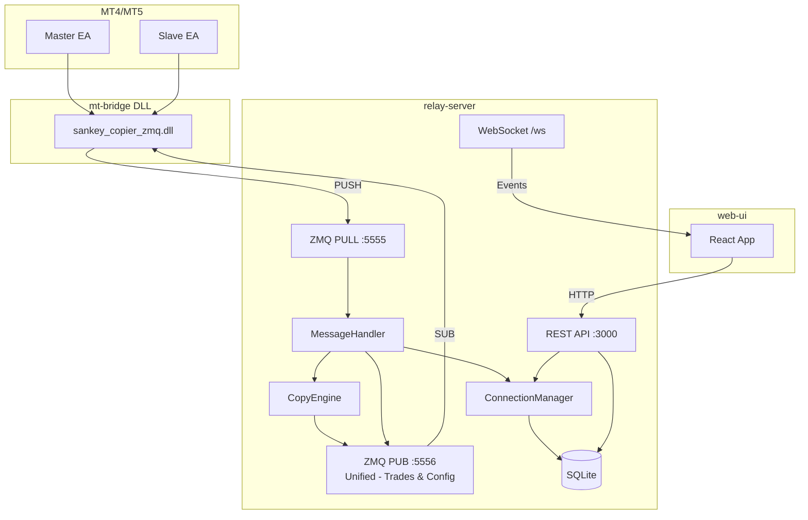
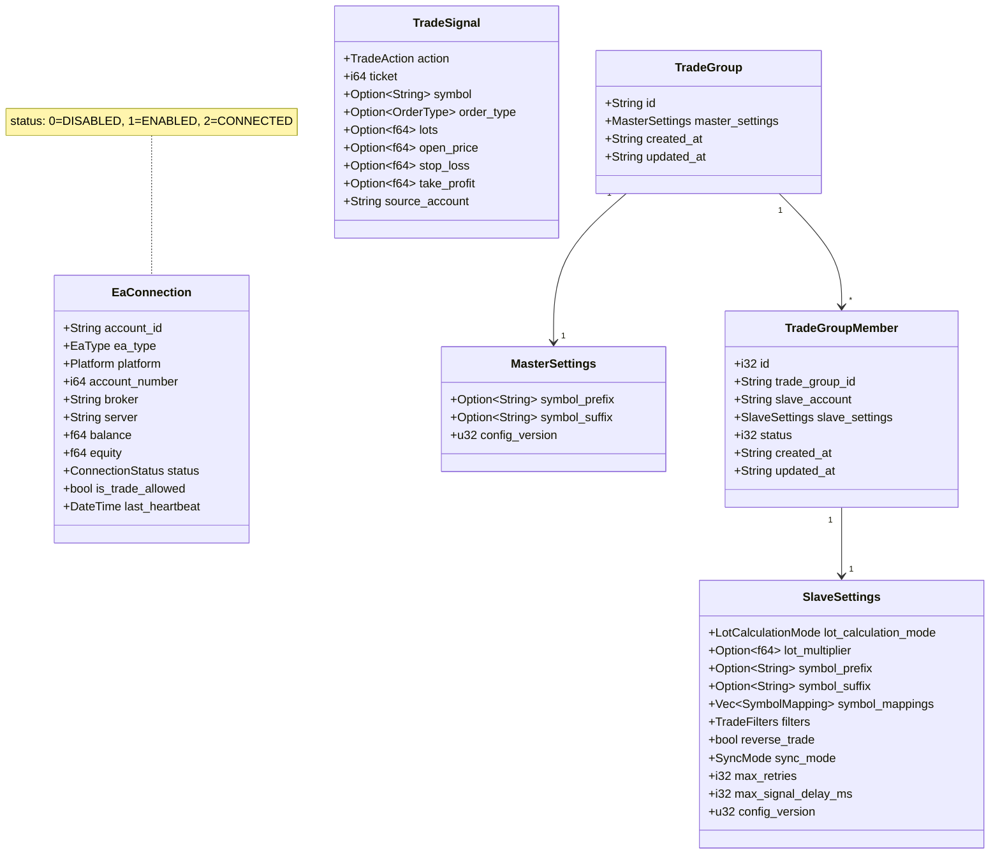
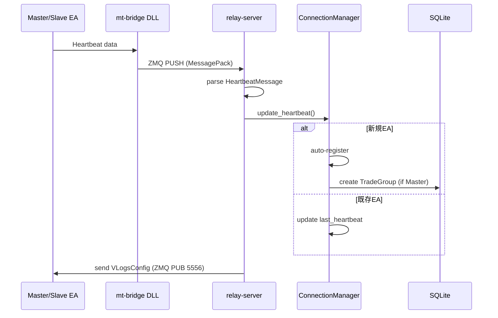
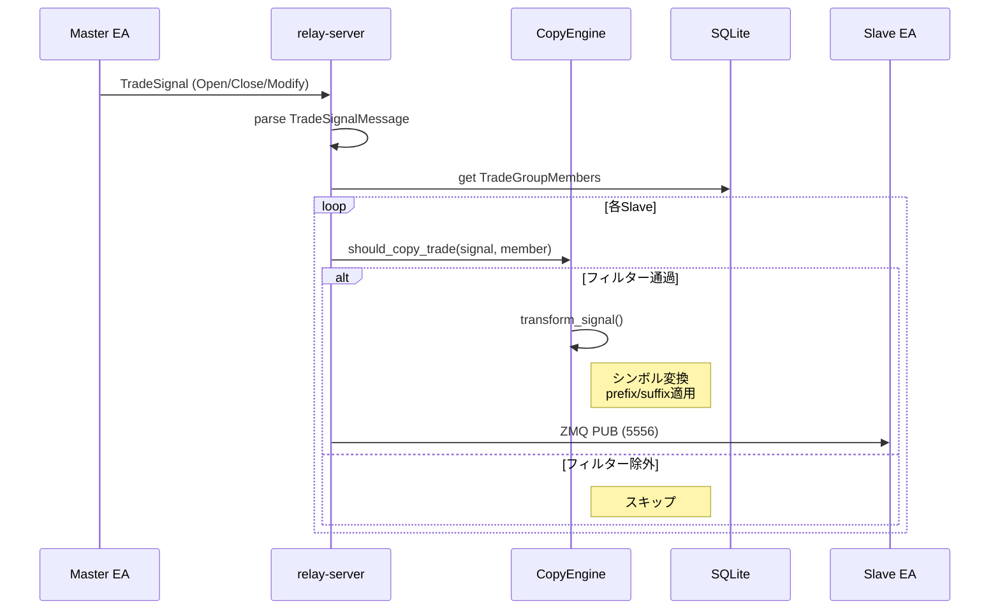
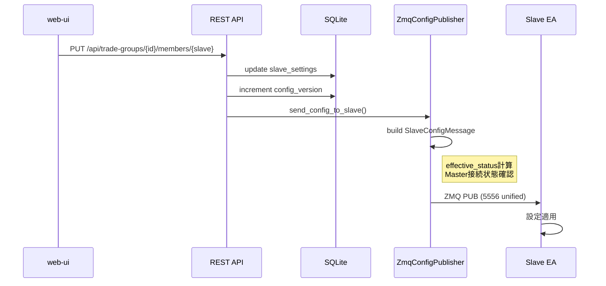
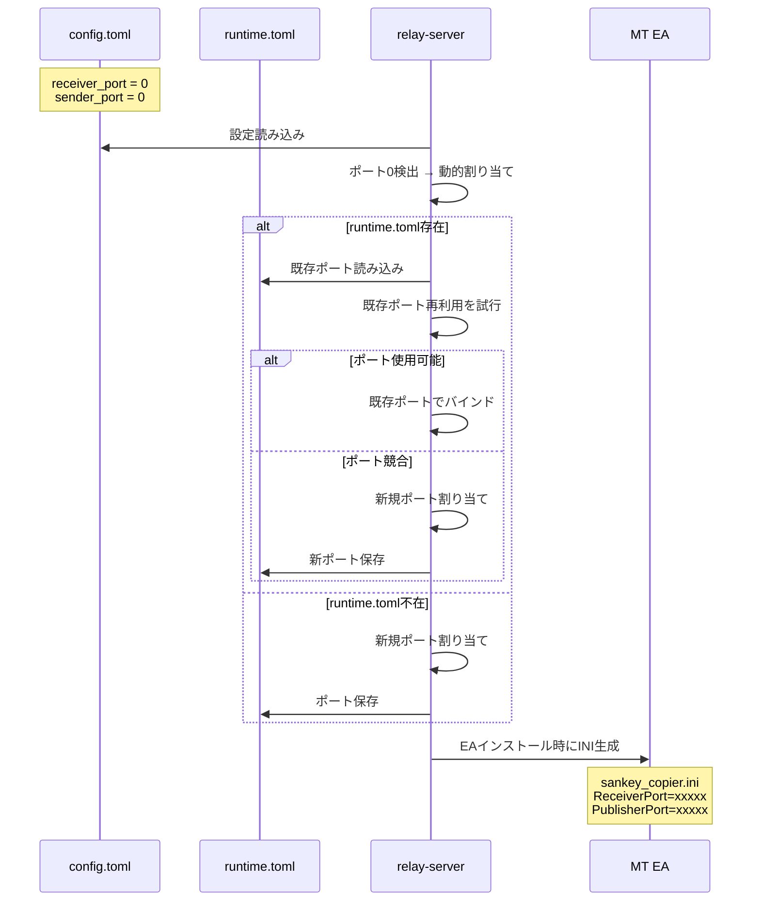

# relay-server

トレードコピーシステムの中核となるRust製サーバー。MT4/MT5のEAとweb-ui間の仲介役として、設定管理・トレードシグナルの中継・接続管理を行う。

## 責務

1. **EA接続管理**: Master/Slave EAのHeartbeatを受信し、接続状態を追跡
2. **設定配布**: web-uiからの設定変更をEAにリアルタイム配信
3. **トレードシグナル中継**: MasterからのトレードシグナルをフィルタリングしてSlaveに配信
4. **REST API提供**: web-uiへの設定・接続情報APIを提供
5. **WebSocket通知**: リアルタイムイベントをweb-uiにブロードキャスト

## アーキテクチャ



## ディレクトリ構造

```
relay-server/
├── src/
│   ├── main.rs                    # エントリポイント
│   ├── lib.rs                     # ライブラリ公開インターフェース
│   ├── config.rs                  # TOML設定管理
│   ├── cert.rs                    # TLS証明書管理
│   ├── api/                       # REST APIエンドポイント
│   │   ├── mod.rs                 # ルータ定義
│   │   ├── connections.rs         # EA接続情報API
│   │   ├── trade_groups.rs        # Master設定API
│   │   ├── trade_group_members.rs # Slave設定API
│   │   ├── websocket.rs           # WebSocket
│   │   └── ...
│   ├── models/                    # データモデル
│   │   ├── connection.rs          # EaConnection
│   │   ├── trade_group.rs         # TradeGroup (Master)
│   │   └── trade_group_member.rs  # TradeGroupMember (Slave)
│   ├── db/                        # データベース操作
│   │   ├── trade_groups.rs        # TradeGroup CRUD
│   │   ├── trade_group_members.rs # Member CRUD
│   │   └── config_distribution.rs # 設定配布ロジック
│   ├── zeromq/                    # ZeroMQ通信
│   │   ├── mod.rs                 # ZmqServer, ZmqPublisher
│   │   └── config_publisher.rs    # 設定配信
│   ├── connection_manager/        # EA接続管理
│   │   └── mod.rs                 # ConnectionManager
│   ├── engine/                    # コピーエンジン
│   │   └── mod.rs                 # CopyEngine
│   └── message_handler/           # ZMQメッセージ処理
│       ├── mod.rs                 # MessageHandler
│       ├── heartbeat.rs           # Heartbeat処理
│       ├── trade_signal.rs        # トレードシグナル処理
│       └── config_request.rs      # 設定リクエスト処理
├── config.toml                    # 本番設定
├── config.dev.toml                # 開発環境設定
└── Cargo.toml
```

## データモデル



## REST APIエンドポイント

| メソッド | パス | 説明 |
|---------|------|------|
| GET | `/api/connections` | 全EA接続情報取得 |
| GET | `/api/connections/:id` | 特定EA接続情報取得 |
| GET | `/api/trade-groups` | 全TradeGroup一覧 |
| GET | `/api/trade-groups/:id` | TradeGroup詳細取得 |
| PUT | `/api/trade-groups/:id` | Master設定更新 |
| DELETE | `/api/trade-groups/:id` | TradeGroup削除 |
| GET | `/api/trade-groups/:id/members` | Slave一覧取得 |
| POST | `/api/trade-groups/:id/members` | Slave追加 |
| PUT | `/api/trade-groups/:id/members/:slave_id` | Slave設定更新 |
| DELETE | `/api/trade-groups/:id/members/:slave_id` | Slave削除 |
| POST | `/api/trade-groups/:id/members/:slave_id/toggle` | Slave有効/無効切替 |
| GET | `/api/logs` | サーバーログ取得 |
| GET | `/api/mt-installations` | MTインストール検出 |

## WebSocketイベント

| イベント | 説明 |
|---------|------|
| `trade_received:{account}:{symbol}:{lots}` | トレード受信 |
| `trade_copied:{account}:{symbol}:{lots}:{member}` | トレード複製完了 |
| `ea_disconnected:{account}` | EA切断 |
| `trade_group_updated:{json}` | TradeGroup更新 |
| `member_added:{json}` | Member追加 |
| `member_updated:{json}` | Member更新 |
| `member_deleted:{id}` | Member削除 |

## ZeroMQ通信

### ポート構成

2ポートアーキテクチャ: Receiver (PULL) と Publisher (統合PUB) のみ使用。

| ポート | タイプ | 用途 |
|-------|-------|------|
| 5555 | PULL | EA→サーバー (Heartbeat, TradeSignal等) |
| 5556 | PUB | サーバー→EA (TradeSignal + Config 統合配信) |

### メッセージフォーマット

すべてのメッセージはMessagePack形式でシリアライズ。

```
PUB/SUB トピック形式: "{topic} {MessagePack payload}"
例: "config/IC_Markets_12345 <binary data>"
```

### トピックルーティング

2ポートアーキテクチャでは、統合PUBソケット(5556)から全メッセージを配信し、トピックでフィルタリングします。

#### トピック形式と用途

| トピック形式 | 用途 | 配信先 | 実装箇所 |
|------------|------|--------|---------|
| `config/{account_id}` | Master/Slave設定配布 | 特定EA<br>※account_id = master_accountまたはslave_account | `trade_groups.rs` L311, `trade_group_members.rs` L628 |
| `trade/{master_account}/{slave_account}` | トレードシグナル配信 | 特定Slave | `config_publisher.rs` L163 |
| `config/global` | VictoriaLogs設定等 | 全EA | `config_publisher.rs` L138 |

**例**:
- Master設定: `config/IC_Markets_123456` (account_id = master_account)
- Slave設定: `config/XM_789012` (account_id = slave_account)
- トレードシグナル: `trade/IC_Markets_123456/XM_789012`
- グローバル設定: `config/global`

**注**: 
- `account_id`は`{BrokerName}_{AccountNumber}`形式（例: `IC_Markets_123456`）
- Master/Slaveとも同じ`config/{account_id}`形式を使用（EA側で自身のaccount_idでフィルタリング）

#### 動的トピック生成（EA側）

EA側ではFFI関数を使用してトピックを動的に生成します (`mt-bridge/src/ffi.rs`):

```mql5
// Master/Slave設定トピック生成
ushort topic_buffer[256];
int len = build_config_topic(AccountID, topic_buffer, 256);
// 結果: "config/{AccountID}"
// AccountID形式: "IC_Markets_123456" (BrokerName_AccountNumber)

// トレードシグナルトピック生成 (Slave側)
int len = build_trade_topic(MasterAccountID, SlaveAccountID, topic_buffer, 256);
// 結果: "trade/{MasterAccountID}/{SlaveAccountID}"
// 例: "trade/IC_Markets_123456/XM_789012"

// グローバル設定トピック取得
int len = get_global_config_topic(topic_buffer, 256);
// 結果: "config/global"
```

#### ConfigMessageトレイト

Relay Server側では`ConfigMessage`トレイトでトピック生成を統一 (`sankey_copier_zmq` crate):

```rust
pub trait ConfigMessage: serde::Serialize {
    fn zmq_topic(&self) -> String;
}

impl ConfigMessage for MasterConfigMessage {
    fn zmq_topic(&self) -> String {
        format!("config/{}", self.account_id)
    }
}

impl ConfigMessage for SlaveConfigMessage {
    fn zmq_topic(&self) -> String {
        format!("config/{}", self.account_id)
    }
}
```


## 処理フロー

### Heartbeat処理



### トレードシグナル処理



### 設定更新フロー



## ステータス判定ロジック

### ステータス値の定義

| 値 | 名称 | 対象 | 説明 |
|----|------|------|------|
| -1 | NO_CONFIG | Master/Slave | 設定未受信またはリセット状態 |
| 0 | DISABLED | Master/Slave | 無効化（Web UI OFF または EA自動売買OFF） |
| 1 | ENABLED | Slave専用 | Slave有効だがMasterが未接続 |
| 2 | CONNECTED | Master/Slave | 完全に有効（トレード実行可能） |

### Masterのステータス判定

**判定要素**:
1. **Web UI Switch**: Web UI上でON/OFFが切り替えられているか
2. **EA自動売買許可**: MT4/MT5のEA側で自動売買が許可されているか (`is_trade_allowed`)

**判定ルール**:

| Web UI Switch | EA自動売買 | ステータス | 説明 |
|:-------------:|:----------:|:----------:|------|
| ✅ ON | ✅ ON | `CONNECTED (2)` | トレードシグナル送信可能 |
| ❌ OFF | - | `DISABLED (0)` | Web UIでOFF |
| ✅ ON | ❌ OFF | `DISABLED (0)` | EA自動売買がOFF |

**実装** (`relay-server/src/models/status.rs`):
```rust
pub fn calculate_master_status(input: &MasterStatusInput) -> i32 {
    if !input.web_ui_enabled || !input.is_trade_allowed {
        STATUS_DISABLED  // 0
    } else {
        STATUS_CONNECTED  // 2
    }
}
```

### Slaveのステータス判定

**判定要素**:
1. **Slave自体の条件**:
   - Web UI Switch (ON/OFF)
   - EA自動売買許可 (`is_trade_allowed`)
2. **接続Masterの状態**:
   - 接続している各Masterが `CONNECTED` か `DISABLED` か

**判定ルール**:

| Slave自体の条件 | 接続Masterの状態 | Slaveのステータス | 説明 |
|----------------|------------------|:----------------:|------|
| Switch❌ または 自動売買❌ | - | `DISABLED (0)` | Slave自体が無効 |
| Switch✅ かつ 自動売買✅ | **少なくとも1つのMasterが DISABLED** | `ENABLED (1)` | Slave準備完了だがMaster未接続 |
| Switch✅ かつ 自動売買✅ | **すべてのMasterが CONNECTED** | `CONNECTED (2)` | コピー取引実行可能 |

**実装** (`relay-server/src/models/status.rs`):
```rust
pub fn calculate_slave_status(input: &SlaveStatusInput) -> i32 {
    // Slave自体が無効な場合
    if !input.web_ui_enabled || !input.is_trade_allowed {
        return STATUS_DISABLED;  // 0
    }
    
    // Slave自体は有効だが、Masterの状態で判定
    if input.master_status == STATUS_CONNECTED {
        STATUS_CONNECTED  // 2
    } else {
        STATUS_ENABLED    // 1
    }
}
```

### N:N接続のサポート

このシステムはMasterとSlaveのN:N接続を完全にサポートします。

**例**: Slave Aが Master1, Master2, Master3 に接続している場合

| Master1 | Master2 | Master3 | Slave Aのステータス |
|:-------:|:-------:|:-------:|:------------------:|
| CONNECTED | CONNECTED | CONNECTED | `CONNECTED (2)` |
| CONNECTED | CONNECTED | DISABLED | `ENABLED (1)` |
| DISABLED | DISABLED | DISABLED | `ENABLED (1)` |

**ルール**: **すべてのMasterが `CONNECTED` の場合のみ Slaveは `CONNECTED (2)`、それ以外は `ENABLED (1)`**

### STATUS_NO_CONFIG (-1) の用途

1. **EA起動直後の初期状態**: 設定メッセージ未受信
2. **Member削除時のリセット通知**: EAに設定削除を通知
3. **設定エラー時のフォールバック**: 異常状態からのリカバリ

## CopyEngine フィルタリング

`should_copy_trade()`で以下を検証:
1. Slaveが`CONNECTED`状態か
2. `copy_pending_orders`設定（指値注文の場合）
3. `source_lot_min` / `source_lot_max`
4. `allowed_symbols` / `blocked_symbols`
5. `allowed_magic_numbers` / `blocked_magic_numbers`

`transform_signal()`で以下を変換:
1. Masterの`symbol_prefix`/`symbol_suffix`を削除
2. `symbol_mappings`を適用
3. Slaveの`symbol_prefix`/`symbol_suffix`を追加

## 設定ファイル

```toml
[server]
host = "0.0.0.0"
port = 3000

[database]
url = "sqlite://sankey_copier.db?mode=rwc"

# 2-port architecture: receiver (PULL) and sender (unified PUB)
[zeromq]
receiver_port = 5555
sender_port = 5556
timeout_seconds = 30

[cors]
disable = false
additional_origins = []

[logging]
enabled = true
directory = "logs"
rotation = "daily"

[tls]
cert_path = "certs/server.pem"
key_path = "certs/server-key.pem"
```

環境別設定の優先順:
1. `config.toml` (ベース)
2. `config.{CONFIG_ENV}.toml` (環境別)
3. `config.local.toml` (ローカル上書き)

## 動的ポート割り当て

ZeroMQポートを `0` に設定すると、OSが利用可能なポートを自動的に割り当てます。
これにより、ポート競合を回避し、複数インスタンスの同時実行が可能になります。

### 動作フロー



### runtime.toml

動的に割り当てられたポートは `runtime.toml` に永続化されます。
次回起動時に同じポートを再利用し、EAとの設定整合性を維持します。

```toml
# Auto-generated - DO NOT EDIT
# Dynamic port configuration for ZeroMQ

[zeromq]
receiver_port = 15555
sender_port = 15556
generated_at = "2024-01-15T10:30:00Z"
```

### 設定例

**固定ポート（デフォルト）**:
```toml
[zeromq]
receiver_port = 5555
sender_port = 5556
```

**動的ポート（自動割り当て）**:
```toml
[zeromq]
receiver_port = 0
sender_port = 0
```

### Web-UIでのポート表示

Settings画面のZeroMQ設定セクションで、現在使用中のポートと動的割り当て状態を確認できます。
- `is_dynamic: true` - 動的に割り当てられたポート
- `generated_at` - ポート生成日時（動的の場合のみ）

### EAとの連携

MTインストール時に `sankey_copier.ini` が生成され、EAはこのファイルからポート設定を読み込みます。
ポート変更時はEAの再インストールが必要です（Web-UI Installationsページから実行）。

## 関連コンポーネント

- [mt-bridge](./mt-bridge.md): EA↔サーバー通信用DLL
- [mt-advisors](./mt-advisors.md): MT4/MT5用EA
- [web-ui](./web-ui.md): 設定・監視用Webインターフェース
