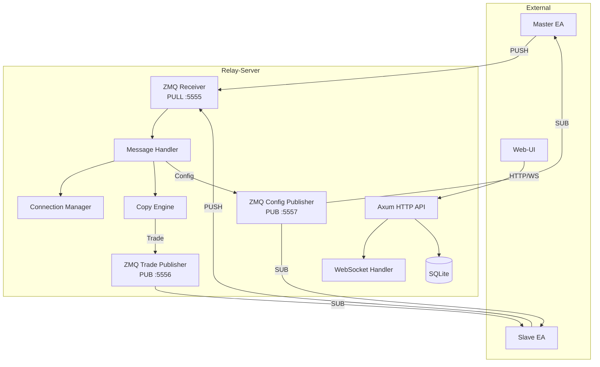
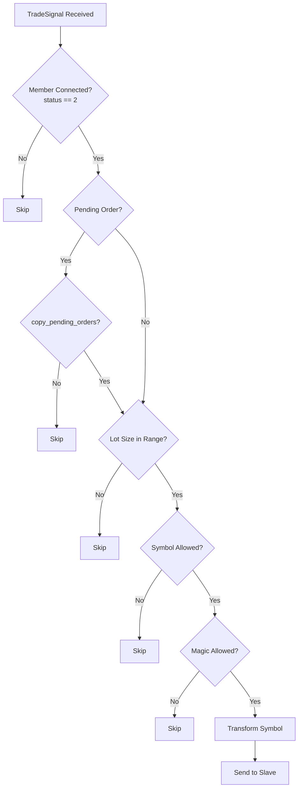
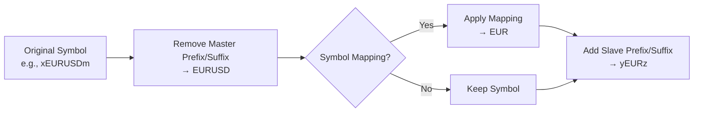
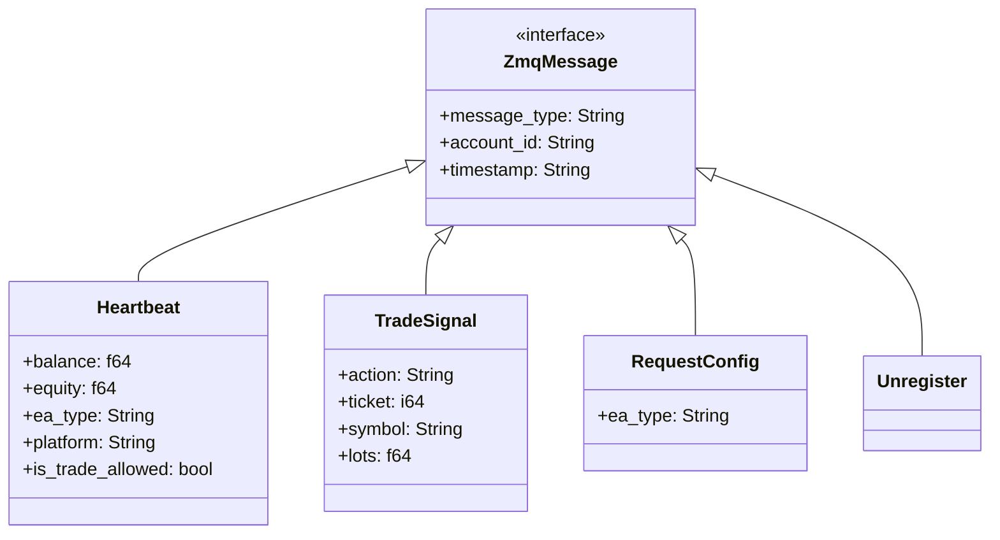
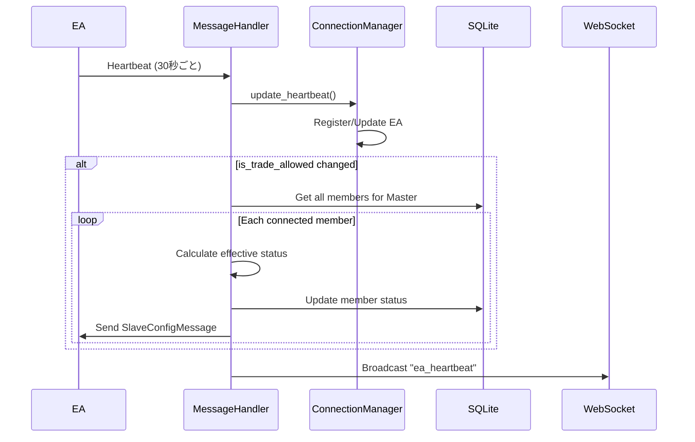
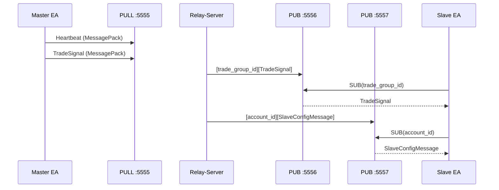
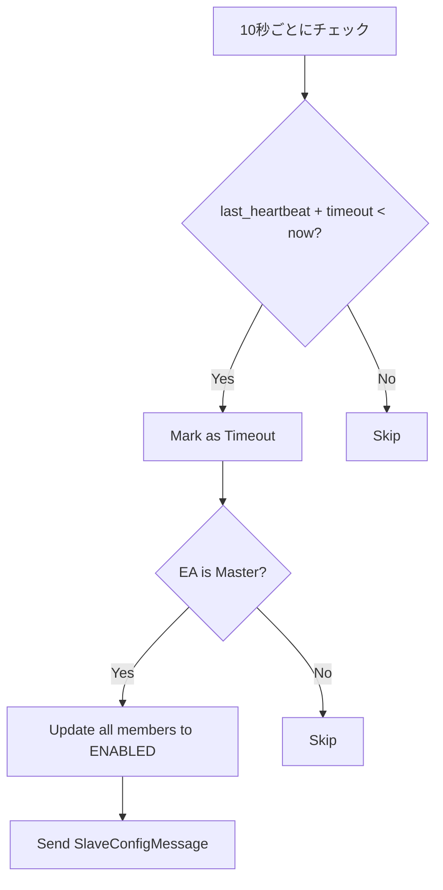

# Relay-Server

MetaTrader EAとWeb-UI間の通信を仲介するRust製バックエンドサーバー。

## Responsibilities

- **メッセージルーティング**: Master EAからのトレードシグナルをSlave EAへ配信
- **フィルタリング**: シンボル、マジックナンバー、ロットサイズによるシグナルフィルタ
- **シンボル変換**: マッピング、プレフィックス/サフィックスの適用
- **設定管理**: Web-UIからの設定をEAへ配信
- **接続管理**: EAのHeartbeat監視、タイムアウト検出
- **永続化**: SQLiteへのTradeGroup/Member設定保存

## Architecture



## Project Structure

```
relay-server/src/
├── main.rs                 # エントリポイント、サーバー起動
├── config.rs               # TOML設定読み込み
├── api/
│   ├── mod.rs              # ルーター定義、CORS/PNA設定
│   ├── connections.rs      # /api/connections エンドポイント
│   ├── trade_groups.rs     # /api/trade-groups エンドポイント
│   ├── trade_group_members.rs  # /api/trade-groups/:id/members
│   ├── websocket.rs        # WebSocket handler
│   ├── mt_installations.rs # MT検出・インストール
│   ├── victoria_logs_settings.rs
│   ├── error.rs            # RFC 9457 Problem Details
│   └── middleware.rs       # PNA headers
├── models/
│   ├── mod.rs              # TradeSignal, SymbolConverter
│   ├── trade_group.rs      # TradeGroup, MasterSettings
│   ├── trade_group_member.rs   # TradeGroupMember, SlaveSettings
│   ├── connection.rs       # EaConnection
│   └── global_settings.rs
├── engine/
│   └── mod.rs              # CopyEngine (フィルタリング・変換)
├── message_handler/
│   ├── mod.rs              # メッセージルーティング
│   ├── heartbeat.rs        # Heartbeat処理
│   ├── trade_signal.rs     # TradeSignal処理
│   ├── config_request.rs   # RequestConfig処理
│   └── unregister.rs
├── zeromq/
│   ├── mod.rs              # ZmqServer, ZmqSender
│   └── config_publisher.rs # Config配信
├── connection_manager/
│   └── mod.rs              # EA接続状態管理
├── db/
│   └── mod.rs              # SQLite操作
└── (utilities)
    ├── log_buffer.rs
    ├── cert.rs
    ├── victoria_logs.rs
    └── mt_detector.rs
```

## HTTP API Endpoints

### Connections API

| Method | Path | Handler | Description |
|--------|------|---------|-------------|
| GET | `/api/connections` | `list_connections` | 全EA接続一覧 |
| GET | `/api/connections/:id` | `get_connection` | 特定EA接続詳細 |

### Trade Groups API

| Method | Path | Handler | Description |
|--------|------|---------|-------------|
| GET | `/api/trade-groups` | `list_trade_groups` | 全Master一覧 |
| GET | `/api/trade-groups/:id` | `get_trade_group` | Master詳細 |
| PUT | `/api/trade-groups/:id` | `update_trade_group_settings` | Master設定更新 |
| DELETE | `/api/trade-groups/:id` | `delete_trade_group` | Master削除 (CASCADE) |

### Trade Group Members API

| Method | Path | Handler | Description |
|--------|------|---------|-------------|
| GET | `/api/trade-groups/:id/members` | `list_members` | Slave一覧 |
| POST | `/api/trade-groups/:id/members` | `add_member` | Slave追加 |
| GET | `/api/trade-groups/:id/members/:slave_id` | `get_member` | Slave詳細 |
| PUT | `/api/trade-groups/:id/members/:slave_id` | `update_member` | Slave設定更新 |
| DELETE | `/api/trade-groups/:id/members/:slave_id` | `delete_member` | Slave削除 |
| POST | `/api/trade-groups/:id/members/:slave_id/toggle` | `toggle_member_status` | ステータス切替 |

### Other APIs

| Method | Path | Description |
|--------|------|-------------|
| GET | `/ws` | WebSocket接続 |
| GET | `/api/logs` | サーバーログ取得 |
| GET | `/api/mt-installations` | MT検出 |
| POST | `/api/mt-installations/:id/install` | MTへインストール |
| GET | `/api/victoria-logs-config` | VLogs設定取得 |
| PUT | `/api/victoria-logs-settings` | VLogs有効化切替 |

## Data Models

### TradeGroup

```rust
struct TradeGroup {
    id: String,                    // Master account ID
    master_settings: MasterSettings,
    created_at: String,
    updated_at: String,
}

struct MasterSettings {
    symbol_prefix: Option<String>, // 削除するプレフィックス
    symbol_suffix: Option<String>, // 削除するサフィックス
    config_version: u32,
}
```

### TradeGroupMember

```rust
struct TradeGroupMember {
    id: i32,
    trade_group_id: String,        // Master account ID
    slave_account: String,
    slave_settings: SlaveSettings,
    status: i32,                   // 0=DISABLED, 1=ENABLED, 2=CONNECTED
    created_at: String,
    updated_at: String,
}
```

### SlaveSettings

```rust
struct SlaveSettings {
    // Lot Calculation (Slave EAで処理)
    lot_calculation_mode: LotCalculationMode, // "multiplier" | "margin_ratio"
    lot_multiplier: Option<f64>,

    // Trade Reversal (Slave EAで処理)
    reverse_trade: bool,

    // Symbol Processing (Relay-Serverで処理)
    symbol_prefix: Option<String>,
    symbol_suffix: Option<String>,
    symbol_mappings: Vec<SymbolMapping>,

    // Filtering (Relay-Serverで処理)
    filters: TradeFilters,
    source_lot_min: Option<f64>,
    source_lot_max: Option<f64>,
    copy_pending_orders: bool,

    // Open Sync Policy (Slave EAで処理)
    sync_mode: SyncMode,           // "skip" | "limit_order" | "market_order"
    limit_order_expiry_min: Option<i32>,
    market_sync_max_pips: Option<f64>,
    max_slippage: Option<i32>,

    // Trade Execution (Slave EAで処理)
    max_retries: i32,
    max_signal_delay_ms: i32,
    use_pending_order_for_delayed: bool,

    config_version: u32,
}
```

### TradeSignal

```rust
struct TradeSignal {
    action: TradeAction,           // Open | Close | Modify
    ticket: i64,
    symbol: Option<String>,
    order_type: Option<OrderType>, // Buy, Sell, BuyLimit, etc.
    lots: Option<f64>,
    open_price: Option<f64>,
    stop_loss: Option<f64>,
    take_profit: Option<f64>,
    magic_number: Option<i32>,
    comment: Option<String>,
    timestamp: DateTime<Utc>,
    source_account: String,
    close_ratio: Option<f64>,      // 0.0-1.0 for partial close
}
```

## Copy Engine: Filtering & Transformation

### Filtering Flow



### Symbol Transformation



**Code Reference**: `engine/mod.rs:98-116`, `models/mod.rs:78-120`

### Filtering Logic

| Filter | Code Location | Logic |
|--------|---------------|-------|
| Symbol Allowed | `engine/mod.rs:61-76` | `allowed_symbols`が空 or シンボルが含まれる |
| Symbol Blocked | `engine/mod.rs:61-76` | `blocked_symbols`にシンボルが含まれない |
| Magic Allowed | `engine/mod.rs:78-93` | `allowed_magic_numbers`が空 or マジックが含まれる |
| Magic Blocked | `engine/mod.rs:78-93` | `blocked_magic_numbers`にマジックが含まれない |
| Lot Range | `engine/mod.rs:43-59` | `source_lot_min` <= lot <= `source_lot_max` |
| Pending Order | `engine/mod.rs:26-41` | `copy_pending_orders == true` or market order |

## Message Handler

### Message Types



### Heartbeat Processing



**Code Reference**: `message_handler/heartbeat.rs:41-127`

### Status Calculation

```
if user_disabled (db_status == 0):
    effective_status = 0 (DISABLED)
else if user_enabled (db_status >= 1):
    if Master connected AND is_trade_allowed == true:
        effective_status = 2 (CONNECTED)
    else:
        effective_status = 1 (ENABLED)
```

**Code Reference**: `message_handler/config_request.rs:86-109`

## ZeroMQ Communication

### Socket Configuration

```toml
# config.toml
[zeromq]
pull_address = "tcp://*:5555"      # EA → Server
pub_address = "tcp://*:5556"       # Trade signals
pub_config_address = "tcp://*:5557" # Configuration
timeout_seconds = 30
```

### Message Protocol



### Config Message Structure

**SlaveConfigMessage** (sent via ZMQ PUB):
```rust
struct SlaveConfigMessage {
    // 全SlaveSettings fields
    + allow_new_orders: bool,      // status > 0
    + master_equity: Option<f64>,  // margin_ratio計算用
    + timestamp: String,
}
```

**Code Reference**: `api/trade_group_members.rs:564-619`

## Connection Manager

### State Management

```rust
struct ConnectionManager {
    connections: Arc<RwLock<HashMap<String, EaConnection>>>,
}

struct EaConnection {
    account_id: String,
    ea_type: EaType,           // Master | Slave
    platform: Platform,         // MT4 | MT5
    account_number: i64,
    broker: String,
    server: String,
    balance: f64,
    equity: f64,
    currency: String,
    leverage: i64,
    status: ConnectionStatus,  // Online | Offline | Timeout
    is_trade_allowed: bool,
    last_heartbeat: DateTime<Utc>,
    connected_at: DateTime<Utc>,
}
```

### Timeout Detection



**Code Reference**: `main.rs:332-372`, `connection_manager/mod.rs:110-145`

## WebSocket Events

| Event | Format | Trigger |
|-------|--------|---------|
| `trade_received` | `trade_received:MASTER_ID:SYMBOL:LOTS` | Master sends trade signal |
| `trade_copied` | `trade_copied:SLAVE_ID:SYMBOL:LOTS:MEMBER_ID` | Signal sent to Slave |
| `ea_heartbeat` | `ea_heartbeat:ACCOUNT_ID:BALANCE:EQUITY` | Heartbeat received |
| `ea_disconnected` | `ea_disconnected:ACCOUNT_ID` | EA timeout |
| `settings_updated` | `settings_updated:{JSON}` | Settings changed |
| `member_added` | `member_added:{JSON}` | New member created |
| `member_updated` | `member_updated:{JSON}` | Member settings updated |
| `member_status_changed` | `member_status_changed:{JSON}` | Status toggled |
| `member_deleted` | `member_deleted:{JSON}` | Member removed |
| `trade_group_updated` | `trade_group_updated:{JSON}` | Master settings updated |

## Database Schema

```sql
CREATE TABLE trade_groups (
    id TEXT PRIMARY KEY,           -- Master account ID
    master_settings TEXT NOT NULL, -- JSON
    created_at TEXT NOT NULL,
    updated_at TEXT NOT NULL
);

CREATE TABLE trade_group_members (
    id INTEGER PRIMARY KEY AUTOINCREMENT,
    trade_group_id TEXT NOT NULL,
    slave_account TEXT NOT NULL,
    slave_settings TEXT NOT NULL,  -- JSON
    status INTEGER NOT NULL DEFAULT 1,
    created_at TEXT NOT NULL,
    updated_at TEXT NOT NULL,
    FOREIGN KEY (trade_group_id) REFERENCES trade_groups(id) ON DELETE CASCADE,
    UNIQUE (trade_group_id, slave_account)
);

CREATE TABLE global_settings (
    key TEXT PRIMARY KEY,
    value TEXT NOT NULL
);
```

## Configuration

### config.toml

```toml
[server]
host = "0.0.0.0"
port = 3000

[tls]
cert_path = "certs/server.crt"
key_path = "certs/server.key"

[zeromq]
pull_address = "tcp://*:5555"
pub_address = "tcp://*:5556"
pub_config_address = "tcp://*:5557"
timeout_seconds = 30

[victoria_logs]
enabled = false
endpoint = "http://localhost:9428/insert/jsonline"
batch_size = 100
flush_interval_secs = 5
```

### Environment-specific Overrides

```
config.toml           # Base configuration
config.development.toml  # Development overrides
config.production.toml   # Production overrides
config.local.toml        # Local overrides (gitignored)
```

## Dependencies

| Crate | Version | Purpose |
|-------|---------|---------|
| tokio | 1.42 | Async runtime |
| axum | 0.7 | HTTP framework |
| tower-http | 0.6 | CORS, middleware |
| zmq | 0.10 | ZeroMQ bindings |
| sqlx | 0.8 | Async SQLite |
| serde / serde_json | 1.0 | Serialization |
| rmp-serde | 1.3 | MessagePack |
| tracing | 0.1 | Logging |
| chrono | 0.4 | Timestamps |
| axum-server | 0.7 | TLS support |

## Key Files Reference

| File | Lines | Key Functions |
|------|-------|---------------|
| `main.rs` | 116-437 | Server startup, task spawning |
| `api/trade_group_members.rs` | 564-619 | SlaveConfigMessage creation |
| `engine/mod.rs` | 14-124 | Filtering and transformation |
| `message_handler/heartbeat.rs` | 41-127 | Heartbeat processing |
| `message_handler/config_request.rs` | 86-109 | Status calculation |
| `connection_manager/mod.rs` | 110-145 | Timeout detection |
