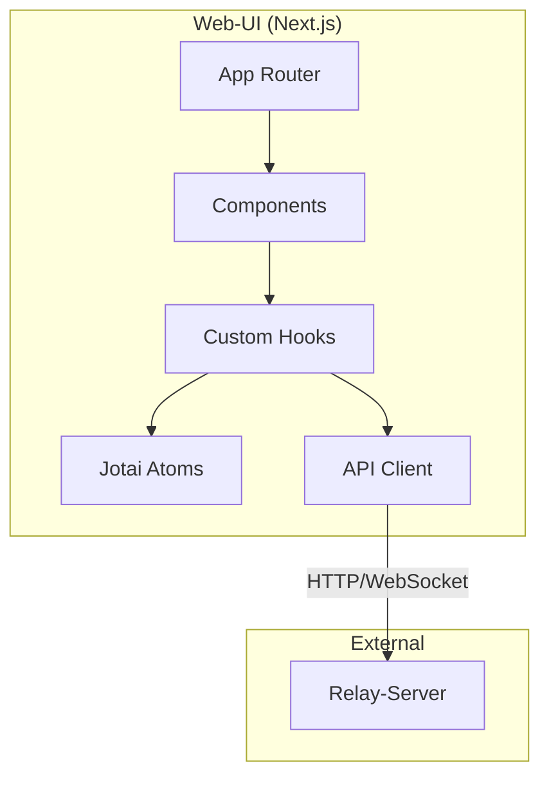
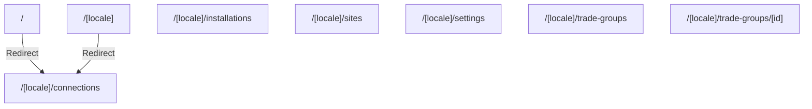
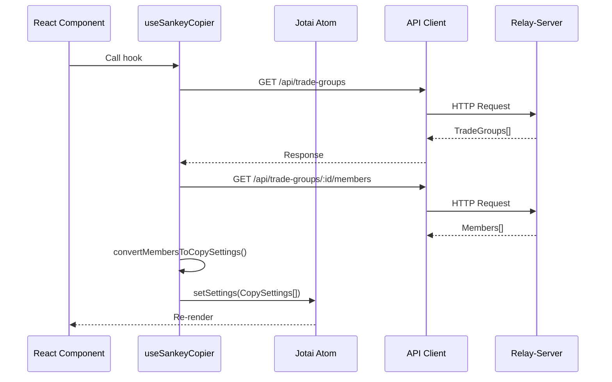
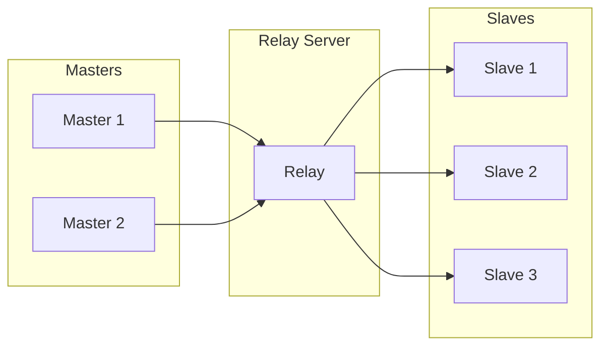
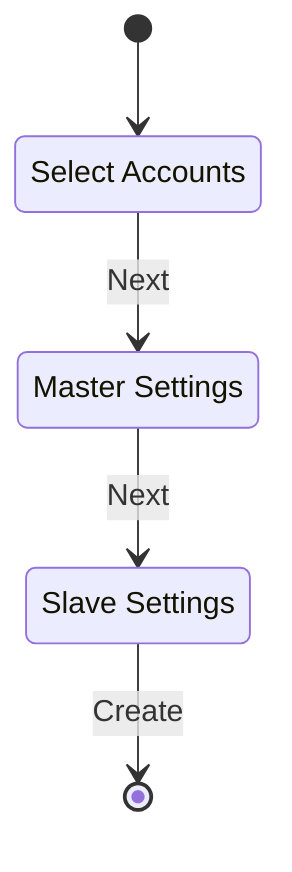
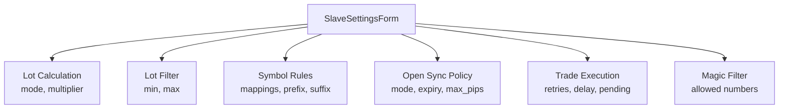
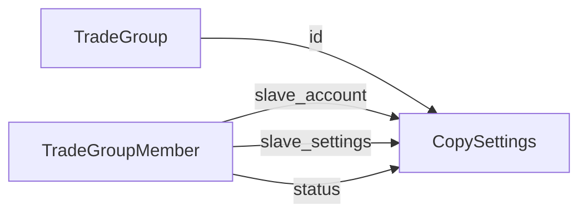

# Web-UI

コピー設定を管理するNext.js製フロントエンドアプリケーション。

## Responsibilities

- **接続管理**: Master/Slave EAの接続状態表示
- **設定UI**: コピー設定の作成・編集・削除
- **リアルタイム監視**: WebSocketによる状態更新
- **MTインストール**: DLL/EAのインストール管理
- **サイト管理**: 複数Relay-Serverの切り替え

## Architecture



## Technology Stack

| Category | Technology | Version |
|----------|------------|---------|
| Framework | Next.js | 16.0.1 |
| UI Library | React | 19 |
| State Management | Jotai | 2.15.1 |
| Styling | Tailwind CSS | 3.4.17 |
| UI Components | shadcn/ui | - |
| i18n | next-intlayer | - |
| Visualization | ReactFlow | - |

## Project Structure

```
web-ui/
├── app/[locale]/
│   ├── layout.tsx              # Root layout
│   ├── page.tsx                # Redirect to /connections
│   ├── connections/
│   │   └── page.tsx            # Main connections page
│   ├── installations/
│   │   └── page.tsx            # MT installations
│   ├── sites/
│   │   └── page.tsx            # Server management
│   ├── settings/
│   │   └── page.tsx            # VictoriaLogs settings
│   └── trade-groups/
│       ├── page.tsx            # Master accounts list
│       └── [id]/page.tsx       # Master settings detail
├── components/
│   ├── ConnectionsViewReactFlow.tsx
│   ├── CreateConnectionDialog.tsx
│   ├── EditConnectionDrawer.tsx
│   ├── MasterSettingsDrawer.tsx
│   ├── SlaveSettingsForm.tsx
│   ├── AppSidebar.tsx
│   ├── LayoutWrapper.tsx
│   ├── flow-nodes/
│   │   └── AccountNode.tsx
│   └── ui/                     # shadcn components
├── hooks/
│   ├── useSankeyCopier.ts      # Core settings hook
│   ├── useTradeGroups.ts
│   ├── useMasterConfig.ts
│   ├── useVLogsConfig.ts
│   ├── useSettingsValidation.ts
│   ├── useMtInstallations.ts
│   └── connections/
│       ├── useAccountData.ts
│       └── useConnectionHighlight.ts
├── lib/
│   ├── api-client.ts           # HTTP client
│   ├── atoms/
│   │   ├── settings.ts         # CopySettings atom
│   │   ├── connections.ts      # EaConnection atom
│   │   ├── site.ts             # Site selection
│   │   └── ui.ts               # UI state
│   └── types/
│       └── site.ts             # Site interface
├── types/
│   └── index.ts                # TypeScript interfaces
└── utils/
    └── tradeGroupAdapter.ts    # Format conversion
```

## Routes



| Route | Component | Purpose |
|-------|-----------|---------|
| `/[locale]/connections` | ConnectionsViewReactFlow | メイン画面、接続可視化 |
| `/[locale]/installations` | InstallationsPage | MT検出・インストール |
| `/[locale]/sites` | SitesPage | Relay-Server管理 |
| `/[locale]/settings` | SettingsPage | VictoriaLogs設定 |
| `/[locale]/trade-groups` | TradeGroupsPage | Master一覧 |
| `/[locale]/trade-groups/[id]` | TradeGroupDetailPage | Master設定編集 |

## API Communication

### API Client

```typescript
class ApiClient {
    constructor(baseUrl: string)

    get<T>(path: string): Promise<T>
    post<T>(path: string, body: unknown): Promise<T>
    put<T>(path: string, body: unknown): Promise<T>
    delete<T>(path: string): Promise<T>
}
```

**Code Reference**: `lib/api-client.ts:38-155`

### Endpoints Used

| Method | Path | Purpose |
|--------|------|---------|
| GET | `/api/connections` | EA接続一覧 |
| GET | `/api/trade-groups` | TradeGroup一覧 |
| GET | `/api/trade-groups/:id` | TradeGroup詳細 |
| PUT | `/api/trade-groups/:id` | Master設定更新 |
| GET | `/api/trade-groups/:id/members` | Member一覧 |
| POST | `/api/trade-groups/:id/members` | Member追加 |
| PUT | `/api/trade-groups/:id/members/:id` | Member更新 |
| DELETE | `/api/trade-groups/:id/members/:id` | Member削除 |
| POST | `/api/trade-groups/:id/members/:id/toggle` | ステータス切替 |
| GET | `/api/mt-installations` | MT検出 |
| POST | `/api/mt-installations/:id/install` | MTへインストール |
| GET | `/api/victoria-logs-config` | VLogs設定取得 |
| PUT | `/api/victoria-logs-settings` | VLogs有効化切替 |
| WS | `/ws` | リアルタイム更新 |

### Error Handling

RFC 9457 Problem Details形式。

```typescript
interface ProblemDetails {
    type: string;
    title: string;
    status: number;
    detail?: string;
    instance?: string;
}
```

**Code Reference**: `lib/api-client.ts:14-32`

## Type Definitions

### CopySettings (UI用統合型)

```typescript
interface CopySettings {
    id: number;
    status: number;                         // 0=OFF, 1=ON
    master_account: string;
    slave_account: string;

    // Lot Calculation
    lot_calculation_mode?: LotCalculationMode;
    lot_multiplier: number | null;

    // Trade Direction
    reverse_trade: boolean;

    // Symbol Rules
    symbol_mappings: SymbolMapping[];
    filters: TradeFilters;
    symbol_prefix?: string;
    symbol_suffix?: string;

    // Lot Filtering
    source_lot_min?: number | null;
    source_lot_max?: number | null;

    // Open Sync Policy
    sync_mode?: SyncMode;
    limit_order_expiry_min?: number | null;
    market_sync_max_pips?: number | null;
    max_slippage?: number | null;
    copy_pending_orders?: boolean;

    // Trade Execution
    max_retries?: number;
    max_signal_delay_ms?: number;
    use_pending_order_for_delayed?: boolean;
}
```

**Code Reference**: `types/index.ts:7-32`

### EaConnection

```typescript
interface EaConnection {
    account_id: string;
    ea_type: 'Master' | 'Slave';
    platform: 'MT4' | 'MT5';
    account_number: number;
    broker: string;
    account_name: string;
    server: string;
    balance: number;
    equity: number;
    currency: string;
    leverage: number;
    last_heartbeat: string;
    status: 'Online' | 'Offline' | 'Timeout';
    connected_at: string;
    open_positions?: number;
    is_trade_allowed: boolean;
}
```

**Code Reference**: `types/index.ts:46-66`

### Server-Side Types

```typescript
// Master account
interface TradeGroup {
    id: string;                    // Master account ID
    master_settings: MasterSettings;
    created_at: string;
    updated_at: string;
}

interface MasterSettings {
    symbol_prefix?: string | null;
    symbol_suffix?: string | null;
    config_version: number;
}

// Slave connection
interface TradeGroupMember {
    id: number;
    trade_group_id: string;        // Master account ID
    slave_account: string;
    slave_settings: SlaveSettings;
    status: number;                // 0=DISABLED, 1=ENABLED, 2=CONNECTED
    created_at: string;
    updated_at: string;
}

interface SlaveSettings {
    lot_calculation_mode: LotCalculationMode;
    lot_multiplier: number | null;
    reverse_trade: boolean;
    // ... all other settings
    config_version: number;
}
```

**Code Reference**: `types/index.ts:159-205`

## State Management

### Jotai Atoms

```mermaid
graph TD
    SITES[sitesAtom<br/>localStorage]
    SELECTED[selectedSiteAtom<br/>derived]
    CLIENT[apiClientAtom<br/>derived]

    SETTINGS[settingsAtom<br/>CopySettings[]]
    CONNECTIONS[connectionsAtom<br/>EaConnection[]]

    UI[UI Atoms<br/>hover, expand, etc.]

    SITES --> SELECTED
    SELECTED --> CLIENT
```

| Atom | Type | Storage | Purpose |
|------|------|---------|---------|
| `sitesAtom` | `Site[]` | localStorage | サーバー一覧 |
| `selectedSiteAtom` | `Site \| null` | derived | 選択中サーバー |
| `apiClientAtom` | `ApiClient` | derived | APIクライアント |
| `settingsAtom` | `CopySettings[]` | memory | コピー設定 |
| `connectionsAtom` | `EaConnection[]` | memory | EA接続状態 |
| `hoveredSourceIdAtom` | `string \| null` | memory | ホバー中Master |
| `selectedMasterAtom` | `string \| null` | memory | 選択中Master |

**Code Reference**: `lib/atoms/*.ts`

## Core Hooks

### useSankeyCopier

中心となるフック。設定と接続の管理。

```typescript
function useSankeyCopier() {
    // State
    const [settings, setSettings] = useAtom(settingsAtom);
    const [connections, setConnections] = useAtom(connectionsAtom);
    const [loading, setLoading] = useState(true);
    const [error, setError] = useState<Error | null>(null);

    // Methods
    const fetchSettings = async () => { ... };
    const fetchConnections = async () => { ... };
    const toggleEnabled = async (id: number, currentStatus: number) => { ... };
    const createSetting = async (data: CreateSettingsRequest) => { ... };
    const updateSetting = async (data: CopySettings) => { ... };
    const deleteSetting = async (id: number) => { ... };

    return {
        settings, connections, loading, error, wsMessages,
        toggleEnabled, createSetting, updateSetting, deleteSetting,
    };
}
```

**Code Reference**: `hooks/useSankeyCopier.ts:1-331`

### Data Flow



### WebSocket Integration

```typescript
useEffect(() => {
    const wsUrl = `wss://${selectedSite.url}/ws`;
    const ws = new WebSocket(wsUrl);

    ws.onmessage = (event) => {
        const message = event.data;

        if (message.startsWith('member_')) {
            fetchSettings();  // Refresh on member changes
        }
        if (message.startsWith('ea_')) {
            fetchConnections();  // Refresh on connection changes
        }
    };

    return () => ws.close();
}, [selectedSite]);
```

**Code Reference**: `hooks/useSankeyCopier.ts:98-165`

### useTradeGroups

```typescript
function useTradeGroups() {
    const [tradeGroups, setTradeGroups] = useState<TradeGroup[]>([]);
    const [loading, setLoading] = useState(true);
    const [error, setError] = useState<Error | null>(null);

    const fetchTradeGroups = async () => { ... };

    return { tradeGroups, loading, error, fetchTradeGroups };
}
```

**Code Reference**: `hooks/useTradeGroups.ts:1-40`

### useMasterConfig

```typescript
function useMasterConfig() {
    const getMasterConfig = async (accountId: string) => { ... };
    const updateMasterConfig = async (accountId: string, data: MasterSettings) => { ... };
    const deleteMasterConfig = async (accountId: string) => { ... };

    return { getMasterConfig, updateMasterConfig, deleteMasterConfig, loading, error };
}
```

**Code Reference**: `hooks/useMasterConfig.ts:1-144`

### useSettingsValidation

```typescript
function useSettingsValidation(formData: FormData, connections: EaConnection[]) {
    const [isValid, setIsValid] = useState(false);
    const [errors, setErrors] = useState<string[]>([]);
    const [warnings, setWarnings] = useState<string[]>([]);

    // Validates:
    // - Accounts selected
    // - Accounts not same
    // - Lot multiplier valid
    // - No duplicate connections
    // - Master is online

    return { isValid, errors, warnings };
}
```

**Code Reference**: `hooks/useSettingsValidation.ts:1-170`

## Components

### ConnectionsViewReactFlow

ReactFlowによる接続可視化。



**Props:**
```typescript
interface Props {
    connections: EaConnection[];
    settings: CopySettings[];
    onToggle: (id: number, status: number) => void;
    onCreate: (data: CreateSettingsRequest) => void;
    onUpdate: (data: CopySettings) => void;
    onDelete: (id: number) => void;
}
```

**Code Reference**: `components/ConnectionsViewReactFlow.tsx`

### CreateConnectionDialog

3ステップのウィザード形式。



1. **Step 1**: Master/Slave選択
2. **Step 2**: Master設定 (symbol_prefix/suffix)
3. **Step 3**: Slave設定 (全CopySettings)

**Code Reference**: `components/CreateConnectionDialog.tsx`

### SlaveSettingsForm

全コピー設定の入力フォーム。



**Sections:**
| Section | Fields |
|---------|--------|
| Copy Settings | lot_calculation_mode, lot_multiplier, reverse_trade |
| Lot Filter | source_lot_min, source_lot_max |
| Symbol Rules | symbol_mappings, symbol_prefix, symbol_suffix |
| Open Sync Policy | sync_mode, limit_order_expiry_min, market_sync_max_pips, max_slippage, copy_pending_orders |
| Trade Execution | max_retries, max_signal_delay_ms, use_pending_order_for_delayed |
| Magic Filter | allowed_magic_numbers |

**Code Reference**: `components/SlaveSettingsForm.tsx:1-449`

### EditConnectionDrawer

既存設定の編集用ドロワー。

```typescript
interface Props {
    open: boolean;
    onOpenChange: (open: boolean) => void;
    onSave: (data: CopySettings) => void;
    onDelete: (id: number) => void;
    setting: CopySettings | null;
}
```

**Code Reference**: `components/EditConnectionDrawer.tsx`

### MasterSettingsDrawer

Master設定と配下のSlave一覧を表示。

**Code Reference**: `components/MasterSettingsDrawer.tsx`

## Data Conversion

### TradeGroup/Member → CopySettings



```typescript
function convertMembersToCopySettings(
    tradeGroup: TradeGroup,
    members: TradeGroupMember[]
): CopySettings[] {
    return members.map(member => ({
        id: member.id,
        status: member.status > 0 ? 1 : 0,  // Normalize to 0/1
        master_account: tradeGroup.id,
        slave_account: member.slave_account,
        ...member.slave_settings,
    }));
}
```

**Code Reference**: `utils/tradeGroupAdapter.ts:21-62`

### CopySettings → SlaveSettings

```typescript
function convertCopySettingsToSlaveSettings(settings: CopySettings): SlaveSettings {
    return {
        lot_calculation_mode: settings.lot_calculation_mode || 'multiplier',
        lot_multiplier: settings.lot_multiplier,
        reverse_trade: settings.reverse_trade,
        symbol_prefix: settings.symbol_prefix,
        symbol_suffix: settings.symbol_suffix,
        symbol_mappings: settings.symbol_mappings,
        filters: settings.filters,
        // ... all other fields
        config_version: 0,  // Server will increment
    };
}
```

**Code Reference**: `utils/tradeGroupAdapter.ts:69-92`

## Configuration Settings Detail

### Settings Processed by Relay-Server

UIで設定後、Relay-Serverで処理される。

| Setting | UI Input | Relay-Server Processing |
|---------|----------|-------------------------|
| `symbol_mappings` | Array of source→target | マッピング適用 |
| `symbol_prefix` | String | 追加 |
| `symbol_suffix` | String | 追加 |
| `allowed_symbols` | Comma-separated | フィルタリング |
| `blocked_symbols` | Comma-separated | フィルタリング |
| `allowed_magic_numbers` | Comma-separated | フィルタリング |
| `blocked_magic_numbers` | Comma-separated | フィルタリング |
| `source_lot_min` | Number | フィルタリング |
| `source_lot_max` | Number | フィルタリング |
| `copy_pending_orders` | Boolean | フィルタリング |

### Settings Passed to Slave EA

Relay-Serverは保存・配信のみ、EAが実際に処理。

| Setting | UI Input | EA Processing |
|---------|----------|---------------|
| `lot_calculation_mode` | Select | ロット計算モード選択 |
| `lot_multiplier` | Number | ロット倍率計算 |
| `reverse_trade` | Toggle | Buy↔Sell反転 |
| `sync_mode` | Select | 同期方法決定 |
| `limit_order_expiry_min` | Number | リミット有効期限 |
| `market_sync_max_pips` | Number | 価格許容差チェック |
| `max_slippage` | Number | スリッページ制御 |
| `max_retries` | Number | リトライ回数 |
| `max_signal_delay_ms` | Number | 遅延チェック |
| `use_pending_order_for_delayed` | Toggle | 遅延時ペンディング |

## Site Management

### Site Interface

```typescript
interface Site {
    id: string;
    name: string;
    url: string;      // Relay-Server URL
    default: boolean;
}
```

### Storage

`localStorage`に永続化。

```typescript
const sitesAtom = atomWithStorage<Site[]>(
    STORAGE_KEYS.SITES,
    [DEFAULT_SITE]
);

const selectedSiteAtom = atom((get) => {
    const sites = get(sitesAtom);
    return sites.find(s => s.default) || sites[0];
});

const apiClientAtom = atom((get) => {
    const site = get(selectedSiteAtom);
    return site ? new ApiClient(`https://${site.url}`) : null;
});
```

**Code Reference**: `lib/atoms/site.ts:7-29`

## MT Installation Management

### MtInstallation Type

```typescript
interface MtInstallation {
    id: string;
    name: string;
    type: 'MT4' | 'MT5';
    platform: '32-bit' | '64-bit';
    path: string;
    executable: string;
    version: string | null;
    components: InstalledComponents;
}

interface InstalledComponents {
    dll: boolean;
    master_ea: boolean;
    slave_ea: boolean;
}
```

**Code Reference**: `types/index.ts:123-132`

### useMtInstallations

```typescript
function useMtInstallations() {
    const fetchInstallations = async () => {
        // GET /api/mt-installations
    };

    const installToMt = async (id: string) => {
        // POST /api/mt-installations/:id/install
    };

    return { installations, loading, error, fetchInstallations, installToMt };
}
```

**Code Reference**: `hooks/useMtInstallations.ts:1-70`

## Localization

### Supported Languages

- English (en)
- Japanese (ja)

### Implementation

next-intlayerによるファイルベースi18n。

```
app/[locale]/connections/
├── page.tsx
└── page.content.ts    # Translation strings
```

**Code Reference**: `app/[locale]/layout.tsx:36-42`

## Key Files Reference

| File | Lines | Purpose |
|------|-------|---------|
| `types/index.ts` | 1-205 | 全TypeScript型定義 |
| `lib/api-client.ts` | 38-238 | HTTPクライアント |
| `hooks/useSankeyCopier.ts` | 1-331 | コア状態管理フック |
| `components/SlaveSettingsForm.tsx` | 1-449 | 設定フォーム |
| `components/CreateConnectionDialog.tsx` | - | 接続作成ウィザード |
| `utils/tradeGroupAdapter.ts` | 1-152 | 形式変換関数 |
| `lib/atoms/site.ts` | 1-29 | サイト管理Atom |

## No Authentication

現在の実装には認証機能がない。

- AWS Cognito連携なし
- ログイン/サインアップなし
- JWTトークンなし
- アクセス制御はネットワークレベルで行う想定
