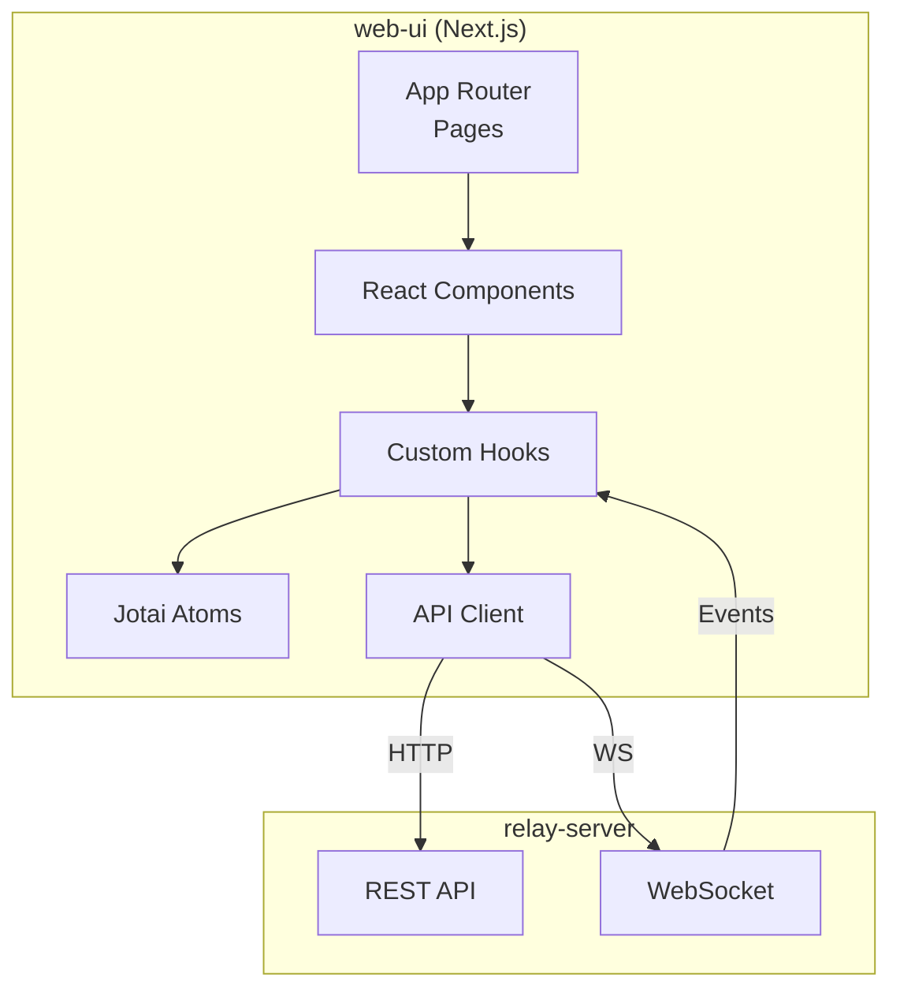
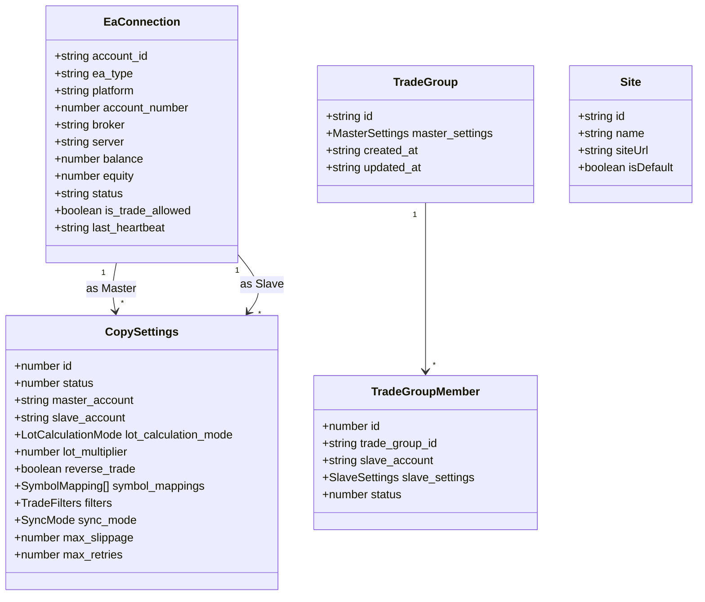
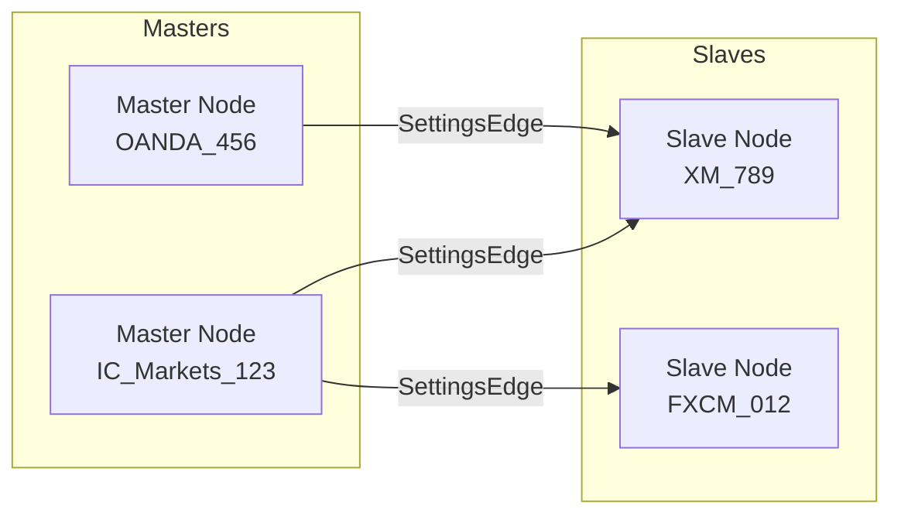
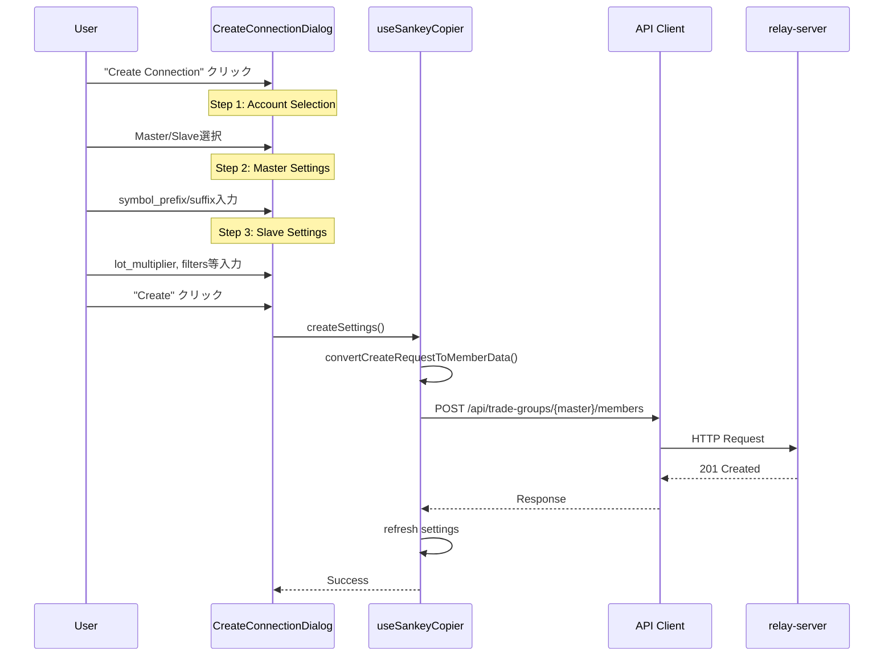
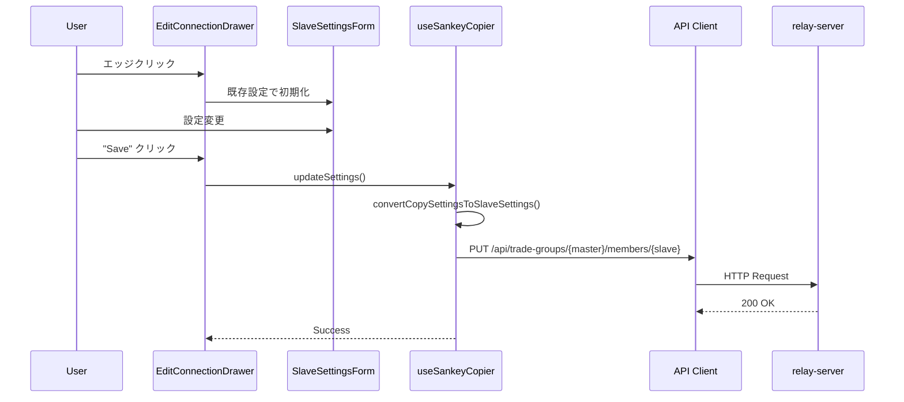
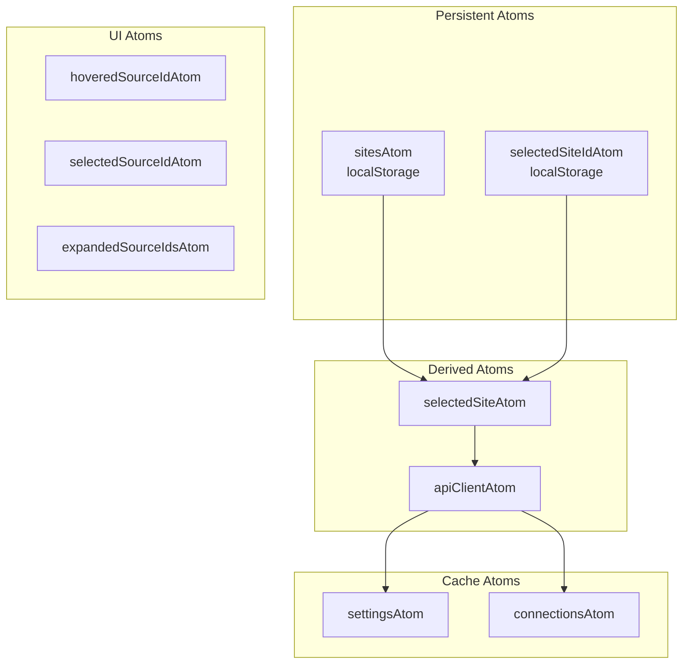
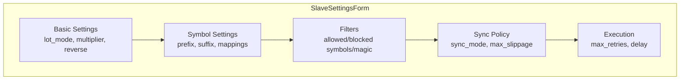

# web-ui

トレードコピーシステムの設定・監視用Webインターフェース。React + Next.jsで構築され、React Flowによるビジュアル接続管理を提供する。

## 責務

1. **接続可視化**: Master/Slave EAの接続状態をグラフ形式で表示
2. **設定管理**: コピー設定の作成・編集・削除
3. **リアルタイム監視**: WebSocketによるライブステータス更新
4. **MT管理**: MT4/MT5インストールの検出とコンポーネント配置
5. **ログ表示**: VictoriaLogsからのログ閲覧

## アーキテクチャ



## ディレクトリ構造

```
web-ui/
├── app/
│   └── [locale]/                 # 多言語対応 (en, ja)
│       ├── layout.tsx            # メインレイアウト
│       ├── page.tsx              # ルート (リダイレクト)
│       ├── connections/          # 接続管理ページ
│       ├── trade-groups/         # TradeGroup管理ページ
│       │   └── [id]/             # TradeGroup詳細
│       ├── installations/        # MTインストール管理
│       ├── sites/                # サーバー接続設定
│       └── settings/             # VictoriaLogs設定
├── components/
│   ├── ui/                       # shadcn UIコンポーネント
│   ├── flow-nodes/               # React Flowノード
│   ├── flow-edges/               # React Flowエッジ
│   ├── connections/              # 接続表示用コンポーネント
│   ├── CreateConnectionDialog.tsx
│   ├── EditConnectionDrawer.tsx
│   ├── MasterSettingsDrawer.tsx
│   ├── SlaveSettingsDrawer.tsx
│   ├── SlaveSettingsForm.tsx
│   └── ConnectionsViewReactFlow.tsx
├── hooks/
│   ├── useSankeyCopier.ts        # メインロジック
│   ├── useFlowData.ts            # React Flowデータ生成
│   ├── useTradeGroups.ts         # TradeGroup API
│   ├── useMasterConfig.ts        # Master設定管理
│   └── useSettingsValidation.ts  # バリデーション
├── lib/
│   ├── api-client.ts             # REST/WS クライアント
│   ├── atoms/                    # Jotai状態管理
│   │   ├── site.ts               # サイト選択
│   │   ├── settings.ts           # 設定キャッシュ
│   │   ├── connections.ts        # 接続キャッシュ
│   │   └── ui.ts                 # UI状態
│   └── types/
│       └── site.ts
├── types/
│   └── index.ts                  # TypeScript型定義
└── utils/
    └── tradeGroupAdapter.ts      # API形式変換
```

## 技術スタック

| カテゴリ | 技術 |
|---------|------|
| フレームワーク | Next.js 16, React 19, TypeScript |
| UI | shadcn/ui, Tailwind CSS, Lucide Icons |
| 可視化 | React Flow (@xyflow/react) |
| 状態管理 | Jotai |
| 通信 | Native Fetch API, WebSocket |
| 国際化 | Intlayer |

## データモデル



## ページ構成

| パス | 説明 |
|------|------|
| `/[locale]/connections` | 接続管理 (React Flow可視化) |
| `/[locale]/trade-groups` | TradeGroup一覧 |
| `/[locale]/trade-groups/[id]` | TradeGroup詳細編集 |
| `/[locale]/installations` | MTインストール管理 |
| `/[locale]/sites` | サーバー接続設定 |
| `/[locale]/settings` | VictoriaLogs設定 |

## 接続ビュー (React Flow)



### AccountNode
- Master/Slaveアカウント情報を表示
- ステータスインジケーター (Online/Offline/Timeout)
- 残高・証拠金表示
- クリックで詳細ドローアを開く

### SettingsEdge
- Master↔Slave間の接続線
- ステータス色 (有効: 緑, 無効: グレー)
- クリックで設定編集ドローアを開く

## コピー設定フロー

### 設定作成



### 設定更新



## 設定の処理分担

### relay-serverが処理 (DB保存・配布)

| 設定 | 説明 |
|------|------|
| `symbol_prefix` / `symbol_suffix` | シンボル変換 (Master/Slave両方) |
| `symbol_mappings` | シンボルマッピング |
| `status` | 有効/無効状態 |
| `filters` | シンボル・マジックナンバーフィルター |
| `config_version` | 設定バージョン (自動インクリメント) |

### EA側が処理 (トレード実行時)

| 設定 | 説明 |
|------|------|
| `lot_calculation_mode` | Multiplier / MarginRatio |
| `lot_multiplier` | ロット倍率 |
| `reverse_trade` | 売買方向反転 |
| `source_lot_min` / `source_lot_max` | ソースロット範囲 |
| `sync_mode` | 同期モード |
| `max_slippage` | 最大スリッページ |
| `max_retries` | 最大リトライ回数 |
| `max_signal_delay_ms` | 最大シグナル遅延 |

## API通信

### REST API

```typescript
// lib/api-client.ts
class ApiClient {
    constructor(baseUrl: string);

    // Connections
    getConnections(): Promise<EaConnection[]>;

    // Trade Groups
    getTradeGroups(): Promise<TradeGroup[]>;
    getTradeGroup(id: string): Promise<TradeGroup>;
    updateTradeGroup(id: string, settings: MasterSettings): Promise<void>;

    // Members
    getMembers(groupId: string): Promise<TradeGroupMember[]>;
    addMember(groupId: string, data: CreateMemberData): Promise<void>;
    updateMember(groupId: string, slaveId: string, settings: SlaveSettings): Promise<void>;
    deleteMember(groupId: string, slaveId: string): Promise<void>;
    toggleMember(groupId: string, slaveId: string): Promise<void>;

    // Installations
    getMtInstallations(): Promise<MtInstallation[]>;
    installToMt(id: string): Promise<void>;

    // VictoriaLogs
    getVLogsConfig(): Promise<VLogsConfig>;
    toggleVLogs(enabled: boolean, logLevel?: string): Promise<void>;
}
```

### WebSocket

```typescript
// リアルタイムイベント購読
const ws = new WebSocket(`${wsUrl}/ws`);

ws.onmessage = (event) => {
    const data = event.data;

    if (data.startsWith('trade_')) {
        // トレードイベント
        refreshConnections();
    } else if (data.startsWith('member_')) {
        // 設定変更イベント
        refreshSettings();
    } else if (data.startsWith('settings_')) {
        // グローバル設定変更
        refreshConfig();
    }
};
```

## 状態管理 (Jotai)



## バリデーション

`useSettingsValidation`で以下を検証:

1. Master/Slave選択必須
2. 同一アカウント選択禁止
3. `lot_multiplier`: 0.01 ～ 100
4. 重複設定チェック
5. オンライン状態確認
6. `is_trade_allowed`確認

## コンポーネント構成

### 主要ダイアログ/ドローア

| コンポーネント | トリガー | 用途 |
|----------------|---------|------|
| `CreateConnectionDialog` | "Create" ボタン | 新規設定作成 (3ステップ) |
| `EditConnectionDrawer` | エッジクリック | 設定編集 |
| `MasterSettingsDrawer` | Masterノードクリック | Master設定 + Slave管理 |
| `SlaveSettingsDrawer` | Slave行クリック | Slave詳細編集 |

### フォームコンポーネント



## マルチサイト対応

複数のrelay-serverに接続可能:

```typescript
interface Site {
    id: string;
    name: string;
    siteUrl: string;       // e.g., "https://localhost:3000"
    isDefault: boolean;
}
```

サイト切り替え時:
1. `selectedSiteIdAtom`を更新
2. `apiClientAtom`が新しいURLで再生成
3. 設定・接続データを再取得

## 国際化

Intlayerによる多言語対応:
- 対応言語: English (en), Japanese (ja)
- URLパス: `/en/connections`, `/ja/connections`

## エラーハンドリング

RFC 9457 Problem Details対応:

```typescript
interface ProblemDetails {
    type: string;
    title: string;
    status: number;
    detail: string;
    instance?: string;
}

// API Client内でパース
try {
    const response = await fetch(url);
    if (!response.ok) {
        const problem = await response.json() as ProblemDetails;
        throw new ApiError(problem);
    }
} catch (e) {
    // エラー表示
    toast.error(e.detail);
}
```

## 関連コンポーネント

- [relay-server](./relay-server.md): バックエンドAPI
- [mt-bridge](./mt-bridge.md): EA通信DLL
- [mt-advisors](./mt-advisors.md): MT4/MT5 EA
