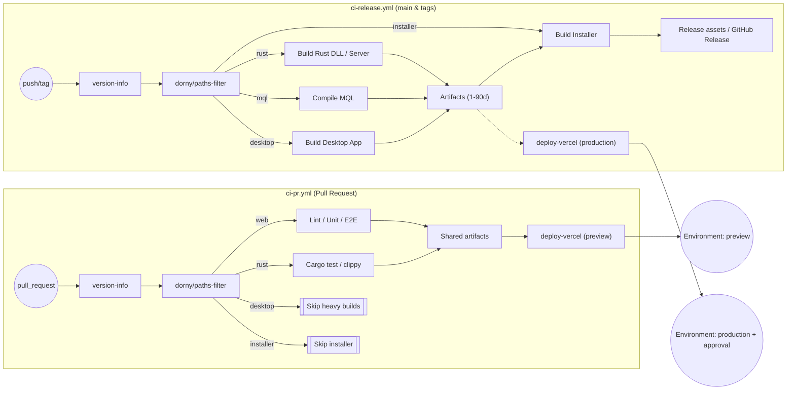
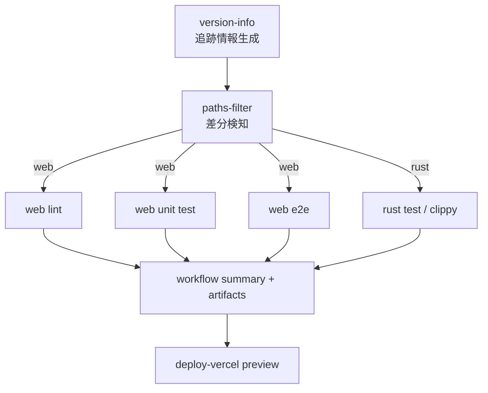
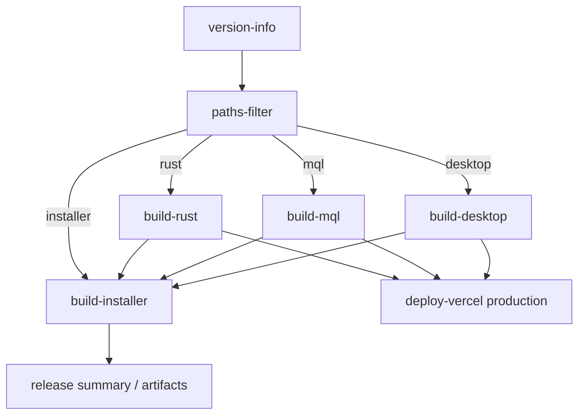

# Workflow Refactor Plan

## 1. 背景と目的
- 現在の `.github/workflows/build.yml` は PR 検証・本番リリース・ベータ配布を単一パイプラインで処理しており、不要なジョブ（Windows ビルドや Inno Setup）が PR でも起動している。
- `version-info` ジョブで生成する `package_version` / `file_version` / `build_info` は全アーティファクトの追跡に必須であり、**すべての派生ワークフローで最初に実行・参照される**構造を維持したまま、パイプライン全体を再設計する。
- 目的は (1) 実行時間・消費リソースの削減、(2) 失敗時の切り分けを容易にする観測性向上、(3) デプロイとリリースのガバナンス強化、の3点。

## 2. 現状整理
- **イベント**: `pull_request`, `push(main)`, `tags(v*)`, `workflow_dispatch`。
- **メインジョブ**: `version-info` → `detect-web-changes` → (Rust / MQL / Desktop / Installer) → `deploy-vercel`。
- **再利用ワークフロー**: `build-rust.yml`, `build-web.yml`, `build-mql.yml`, `build-desktop.yml`, `build-installer.yml`, `deploy-vercel.yml`。
- **アーティファクト受け渡し**: すべてGitHub Artifacts（保持期間 1〜90日）。
- **コメント/通知**: Vercel コメントは権限制限のため削除済み。その他の自動通知は未整備。

## 3. 課題
1. PR でも Windows Runner を多段稼働させており、待ち時間とコストが大きい。
2. 差分検知が Web UI のみ。Rust/MQL/Desktop が未変更でも常にビルドされる。
3. デプロイ・リリースの権限境界が曖昧で、`secrets: inherit` に依存している。
4. 失敗時の情報がバラバラで、PR 画面からログ解読が煩雑。
5. 手動トリガ (`workflow_dispatch`) の入力と条件フラグ (`build_target`) が直感的ではなく、差分と整合しない。

## 4. 改善方針（ゼロベース案）

### 4.0 全体像（Mermaid）

上記のように、`version-info` を全ワークフローの最初に配置しつつ、PR と main/tag で求められるジョブを分離する。`paths-filter` の結果で必要ジョブのみを起動し、生成アーティファクトは次段階（Vercel / Installer など）で再利用する。

### 4.1 パイプライン層の再構築
- **Workflow 分割**
  - `ci-pr.yml`: PR 検証専用。Linux 中心で lint/test/build（必要最小限のアーティファクト生成）。
  - `ci-release.yml`: main push / tag 用。Windows ビルドや Installer、署名、リリース作成を担当。
  - `deploy-vercel.yml`: `workflow_run`(ci-pr success) と `push main` の双方から呼び出し可能にする。`environment: preview/production` を定義。
- **共通ジョブ**: すべての Workflow の先頭に `version-info` を配置し、出力を `needs.version-info.outputs.*` で受け渡す。

### 4.2 差分検知と条件実行
- `dorny/paths-filter@v3` で `web`, `rust`, `mql`, `desktop`, `installer`, `docs` などのキーを出力。
- 各 reusable workflow 呼び出しで `if: needs.changes.outputs.rust == 'true'` のように条件付け。
- `workflow_dispatch` では「強制実行対象」を上書きできる入力を提供。

### 4.3 成果物の再利用とキャッシュ
- **Web**: `build-web` ジョブで `.vercel/output` や `.next/standalone` を生成し、Vercel/デスクトップ/インストーラで `actions/download-artifact` し再利用。
- **Rust**: `cargo-chef` と `sccache` を導入し、コンパイルキャッシュを Linux/Windows 間で共有（Azure Cache も検討）。
- **Installer**: デフォルトでは main/tag（もしくは release workflow）でのみ実行し、PR ではスキップ。ただし、インストーラ検証が必要な PR では `workflow_dispatch` 入力や `ci-pr.yml` の `force-installer` フラグで任意に有効化できるようにし、検証結果を PR 上で共有する。アーティファクト保持期間は PR=1日、main=14日、リリース=90日。

- Web: `lint`, `unit`, `e2e(Playwright)` を独立ジョブ化し、`fail-fast: false` で並列実行。
- Rust: `cargo test --workspace` と `clippy` を Linux Runner で別ジョブ化。Windows ビルド前に早期失敗を検出。`mt-bridge`（ZeroMQ DLL）は PR でも必ず 32bit/64bit の両方をビルドし、DLL/Symbol 差分とテスト結果をアーティファクトに残す。
- **MQL**: PR でも常に EA（MT4/MT5）のビルドを実施し、バイナリ差分・ログをアーティファクト化してレビュー可能にする。`paths-filter` で `mt-advisors/` 配下に変更があれば優先的に走らせ、キャッシュされた MetaTrader 環境を利用して実行時間を最小化。
- デプロイ: `environments.preview` / `environments.production` を活用し、`production` は手動承認必須。シークレットは environment-scoped に移行。

### 4.5 観測性と運用
- 各ジョブ完了後に `actions/github-script` で `workflow summary` を生成（バージョン情報、アーティファクトURL、デプロイURL）。
- `concurrency` を PR 向け Workflow に設定し、古い実行を自動キャンセル。
- 失敗時には `actions/upload-artifact` で `logs/<job>.zip` を収集。将来的に Slack / Teams 通知を追加。

### 4.6 ジョブ依存関係（想定）
#### PR 向け `ci-pr.yml`

#### main/tag 用 `ci-release.yml`

矢印は `needs` 依存関係を示し、`version-info` の出力が全ジョブに伝播することを図示している。

## 5. 実装ロードマップ
| フェーズ | 目的 | 主な作業 | 成果物 |
| --- | --- | --- | --- |
| Phase 0 | 現状維持のまま計画合意 | 本ドキュメント承認、ステークホルダ合意 | 承認済みプラン |
| Phase 1 | PR 用 CI 切り出し | `ci-pr.yml` 新設、`build.yml` を `ci-release.yml` に改名し main/tag 限定化、`version-info` 共通化 | 新 Workflow 動作実績 |
| Phase 2 | 差分検知 & キャッシュ強化 | `paths-filter` 導入、アーティファクト再利用、Rust/Web キャッシュ導入 | 時間短縮レポート |
| Phase 3 | デプロイ/環境ガバナンス | `deploy-vercel` 分離、environment 承認、シークレット整理 | 安全なデプロイ運用 |
| Phase 4 | 観測性/通知 | Workflow summary、ログ収集、通知連携 | 失敗時TTR短縮 |

## 6. 影響範囲とリスク
- **影響**: GitHub Actions 設定全般、Vercel/環境シークレット、リリース工程。PR #56 以降のCI/CDフローに直接影響。
- **リスク**:
  - Workflow 分割時の依存ミス（特に `needs`／`outputs`）。
  - `paths-filter` 判定漏れで必要ジョブが動かない可能性。
  - 権限再設計に伴うデプロイ失敗。
- **緩和策**: すべてのステップで dry-run workflow を用意し、`workflow_dispatch` で逐次検証。分割直後は main でも旧 Workflow を並走させ、結果を比較。

## 7. 成功指標
- PR 実行時間を 15 分以内（現状 30 分超）。
- main push 時の成功率 95%以上を維持。
- 不要ジョブが走った割合を月次で計測し、10%未満に抑制。
- デプロイURL共有とリリースノート生成を自動化（手動手順ゼロ）。

## 8. 次のアクション
1. 本ドキュメントへのフィードバックを集約し、承認を得る。
2. Phase 1 の分割作業を新ブランチ（例: `feat/ci-split`）で実施。
3. `paths-filter` 導入前に対象ディレクトリと変更検知要件を洗い出す。
4. Vercel / GitHub Environments のアクセス権限を棚卸しし、環境変数を environment scope へ移行する。
